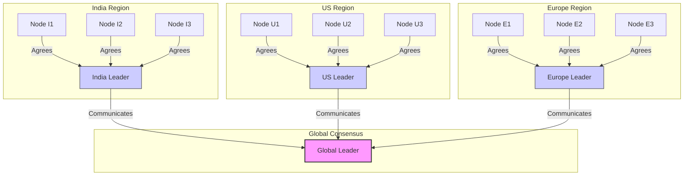

# 20 Whitepapers That Changed The World [For Senior Software Engineers] (1080P30) - Part 1

# 20 White Papers Every Backend Engineer Must Know

_screenshots/frame_00-00-00.jpg)

This video introduces 20 essential white papers for backend engineers, particularly those in senior or staff-level positions. Reading these papers provides crucial insights into:

*   **Implementation Details:** Understanding how complex systems are built.
*   **Practical Aspects:** Gaining knowledge of real-world system design challenges.
*   **Trade-offs:** Learning the rationale behind design choices, which often stem from product requirements.

_screenshots/frame_00-00-22.jpg)

## Case Study: Memcached at Meta - Sharding vs. Redundancy

A significant challenge faced by Meta (Facebook) with their modified open-source Memcached system was **scaling**. This involved deploying numerous Memcached nodes. Beyond routing complexities, a key decision involved choosing between sharding and redundancy.

_screenshots/frame_00-01-06.jpg)

### Sharding

*   **Concept:** The entire key space is divided into distinct sets. Each set is then assigned to a specific group of servers.
*   **Application:** Distributes data and load across different server groups.

### Redundancy

*   **Concept:** The same key space is handled simultaneously by multiple servers.
*   **Potential Issues:**
    *   **Eventual Consistency:** Data across redundant servers may not be immediately consistent.
    *   **Cost:** Managing multiple servers for a small, duplicated key space can be expensive and inefficient.

### Meta's Trade-off Decision

For Facebook's use case, redundancy was deemed less suitable than sharding due to the nature of their **aggregate queries**.

*   **Aggregate Queries:** Client requests often involve complex data retrieval. For example, a user's profile request might simultaneously fetch:
    *   Profile information
    *   Friend connections
    *   Likes on posts
    *   News feed data
*   **Impact on Sharding:** Such queries inherently hit multiple shards. In this scenario, further splitting the key space (sharding) would only exacerbate the complexity and performance issues, making redundancy a less viable option despite its own challenges. The system needed a way to handle these composite queries efficiently, which drove the design choice.

---

## Top 20 White Papers

### 20. Monolith: A Real-Time Recommendation System (TikTok)

*   **Source:** TikTok engineers.
*   **Problem Addressed:** Traditional recommendation algorithms often struggle to provide high-quality real-time recommendations, which tend to be inferior to batch-processed recommendations.
*   **Solution:** Monolith developed a method to embed user and item features efficiently for real-time recommendations to millions of users.
*   **Key Concept: Feature Embeddings**
    *   **Idea:** Represent users and items as points in a high-dimensional N-dimensional space.
    *   **Dimensions:** Each dimension corresponds to a specific feature or attribute.
        *   Example: For a user named Gorov:
            *   X-axis: Age
            *   Y-axis: Gender
            *   Z-axis: Country (e.g., India)
            *   Alpha-axis: Probability of watching chess videos
            *   ...and so on for N dimensions.
    *   **Proximity:** Users (or items) that are "close" to each other in this N-dimensional space tend to share similar characteristics, preferences, or behaviors.
    *   **Recommendation Principle:** If Gorov is a point in this space, other points (users or items) near him are likely good candidates for recommendations.
    *   **Challenge:** The core engineering problem is to efficiently create these embeddings and use them to generate real-time recommendations at TikTok's massive scale.

_screenshots/frame_00-01-50.jpg)
*Refer to the "Monolith Online Training Architecture" diagram (Figure 1 in the original paper) for a detailed view of the system's components and data flow.*

### 19. Flexy Raft (Meta)

*   **Source:** Meta (Facebook).
*   **Background:** The Raft consensus algorithm relies on a quorum, where a majority of nodes must agree on a particular value to achieve consensus.
*   **Problem with Traditional Raft at Scale:**
    *   **Scalability:** As the number of nodes increases, achieving a majority agreement becomes significantly more challenging and resource-intensive.
    *   **Global Distribution:** In globally distributed systems, requiring a global majority is impractical. For example, servers in India would need to coordinate and agree with servers in the US and Europe, leading to high latency and complexity.
*   **Flexy Raft Solution:** Introduces a hierarchical, tree-like structure for consensus, moving away from a flat global quorum.
    *   **Local Consensus:** Nodes within a specific region (e.g., India) establish consensus locally and elect a regional leader.
    *   **Hierarchical Communication:** Regional leaders then communicate with leaders from other regions (e.g., US leader, Europe leader) to achieve broader, roughly consistent agreement across the global system.
    *   **Benefit:** This approach improves scalability and reduces latency by localizing much of the consensus traffic, while still maintaining overall consistency.

---

### 19. Flexy Raft (Meta) (Continued)

*   **Further Details:** FlexyRaft is particularly interesting for understanding how distributed consensus can be adapted for massive, globally distributed systems. It provides insights into the internal workings of Raft and, by extension, other consensus algorithms like Paxos.
*   **Relevance:** Essential for engineers dealing with large-scale distributed systems where traditional quorum mechanisms become bottlenecks.

_screenshots/frame_00-03-41.jpg)
*The screenshot above provides an excerpt from the FlexyRaft paper, discussing dynamic quorums and replica configurations.*

### 18. Spanner (Google)

*   **Focus:** Distributed consensus, strong consistency guarantees, and transactional capabilities in a geo-distributed database.
*   **Key Innovation:** Spanner is renowned for its engineering feat of maintaining highly synchronized clocks across its global infrastructure. This precise time synchronization is crucial for providing strong consistency and transactional integrity across geographically dispersed data centers.
*   **Fault Tolerance:** Designed to withstand extreme failures, ensuring high availability even under severe fault conditions.
*   **Relevance:** A must-read for understanding how to build highly available, strongly consistent, and transactional databases that operate globally, emphasizing fault tolerance and clock synchronization.

_screenshots/frame_00-04-03.jpg)
*The screenshot illustrates the Spanner software stack, showing components like Paxos, tablets, and Colossus, as well as a diagram depicting directories as units of data movement in Paxos groups.*

_screenshots/frame_00-04-24.jpg)
*This screenshot shows a table of operation microbenchmarks for Spanner, detailing latency and throughput for different transaction types and replica counts.*

### 17. MindSweeper (Meta)

*   **Focus:** Root Cause Analysis (RCA) system.
*   **Purpose:** Identifies the underlying causes of problems, particularly after anomaly detection.
*   **Anomaly Detection Concept:**
    *   **Simple Graphs:** For smooth, linear, or parabolic graphs, differentiation can flatten them, revealing underlying trends.
    *   **Complex Graphs with Anomalies:** For highly complex graphs with irregular patterns, multiple differentiations (e.g., three) can highlight problematic points or anomalies.
*   **Root Cause Identification:** Once an anomaly is detected, MindSweeper identifies its cause by:
    *   **Correlation:** Looking for factors highly correlated with the anomalous graph.
    *   **Contributing Factors:** A change in a contributing factor is likely the cause of the observed anomaly in business metrics.
    *   **Example:** If sales are low, the root cause might be a decrease in website landings rather than a direct sales issue.
*   **Value Proposition:** Automates RCA, which is crucial for medium to large organizations dealing with complex systems where manual analysis is impractical. For startups, manual RCA might suffice, but automation becomes essential at scale.

_screenshots/frame_00-04-35.jpg)
*The screenshot displays an excerpt from the MindSweeper paper abstract, detailing its approach to identifying root causes using telemetry and statistical patterns.*

### 16. Cassandra

*   **Focus:** Distributed NoSQL database.
*   **Architecture:** Utilizes a cluster architecture and the gossip protocol for peer-to-peer communication and state synchronization.
*   **Trade-offs:** Known for allowing engineers to choose between consistency and availability (tunable consistency), catering to various application needs.
*   **Note:** While widely used and valuable for open-source ecosystems, the speaker suggests it feels like an open-source clone of Amazon DynamoDB and might not be the most groundbreaking white paper in terms of novel concepts. However, its practical relevance and widespread adoption make it a worthwhile read for engineers.

### 15. FoundationDB (Apple)

*   **Focus:** Highly consistent and scalable NoSQL key-value data store.
*   **Key Feature:** Employs novel testing techniques to ensure transactional integrity and strong consistency in a distributed environment.
*   **Data Model:** A key-value data store, which is a popular type of NoSQL database.
*   **Relevance:** Important for understanding how to achieve strong consistency and transactional guarantees in scalable NoSQL systems, especially given Apple's reputation for robust engineering.

### 14. Amazon Aurora (Amazon)

*   **Focus:** Database architecture pattern used by Amazon for managing databases, emphasizing extreme scale and high availability.
*   **Key Design Considerations:**
    *   **Scalability:** Designed for enormous scale, allowing seamless addition and removal of nodes.
    *   **High Availability:** Ensures databases remain operational even during failures.
    *   **Abstraction:** Hides underlying complexity from clients while offering necessary customizability. This balances ease of use for smaller entities (like startups) with powerful features.
*   **Relevance:** Provides insights into the trade-offs and architectural decisions made by Amazon to deliver a highly scalable, available, and manageable database service.

### 13. Pregel (Google)

*   **Focus:** Graph processing system by Google.
*   **Purpose:** Designed for large-scale graph computations.

---

### 13. Pregel (Google) (Continued)

*   **Functionality:** Not just for maintaining graphs, but primarily for finding patterns within them.
*   **Applications:** Powers algorithms like PageRank for identifying and ranking important websites.
*   **Processing:** Typically operates in batch mode.
*   **Historical Significance:** An older Google system that offers fundamental insights into graph processing, especially how Google's search engine optimization (SEO) might work behind the scenes.
*   **Relevance:** Highly practical for engineers interested in large-scale data analysis and understanding the core principles of graph algorithms.

_screenshots/frame_00-07-18.jpg)
*This screenshot shows an excerpt from the Pregel paper, highlighting its introduction and general terms, emphasizing distributed computing and graph algorithms.*

### 12. Dapper (Google)

*   **Focus:** Distributed tracing system.
*   **Problem Addressed:** In systems with hundreds of microservices, tracing a single request to understand its journey and identify performance bottlenecks or failures is extremely difficult.
*   **Role in RCA:** Dapper is a foundational step for root cause analysis (RCA) by providing visibility into request flows.
*   **Key Concepts:**
    *   **Sampling:** Due to immense scale, logging every detail of every request is impractical. Dapper employs sampling to select a subset of requests for tracing.
    *   **Event-Triggered Logging:** Instead of logging every line, specific "trigger points" within a request's execution log events to capture significant actions or states.
    *   **Inter-system Code Reviews:** Integrating with Dapper requires careful consideration from engineers to ensure their service doesn't negatively impact other services at Google. This implies a form of "inter-system code review" beyond traditional code reviews.
*   **Relevance:** Essential for understanding how to monitor and debug complex distributed systems at scale.

_screenshots/frame_00-08-09.jpg)
*The screenshot presents "Figure 5: An overview of the Dapper collection pipeline," illustrating how trace data is collected and stored, and discusses security and privacy considerations related to logging payload information.*

### 11. Chubby (Google)

*   **Focus:** Distributed lock service, similar to Apache ZooKeeper.
*   **Purpose:** Provides fundamental distributed primitives like distributed locks and leader election.
*   **Internal Mechanism:** Internally uses Paxos for consensus, though the paper focuses on the practical implementation aspects rather than the theoretical details of Paxos.
*   **Practical Aspects:**
    *   **Lock Management:** Often utilizes a file system metaphor for managing locks.
    *   **Notifications:** Sends notifications when locks are acquired or released.
*   **Relevance:** Critical for building any large-scale distributed system that requires coordination, mutual exclusion, or leader election. Provides practical insights into the challenges and solutions for implementing such a system.
*   **Note:** For a high-level understanding of Paxos, refer to dedicated resources.

_screenshots/frame_00-09-10.jpg)
*This screenshot shows a slide titled "The Problem of Distributed Consensus" with "Distributed Consensus Algorithm - Paxos" highlighted, indicating that Paxos is a series of repeatable steps to reach a consensus, and mentions that an associated lesson is available.*

### 10. Megastore (Google)

*   **Focus:** A Google data store offering relational database semantics (RDBMS-like features) on top of a NoSQL backend.
*   **Characteristics:**
    *   Highly scalable
    *   Highly reliable
    *   Provides ACID transactions
*   **Key Innovation:** Demonstrates how to build a system that offers the benefits of RDBMS (like relational modeling and ACID properties) while leveraging the scalability and reliability of a NoSQL data store.
*   **Internal Architecture:** Uniquely uses BigTable (a NoSQL data store) as its underlying storage layer.
*   **Engineering Challenge:** The paper highlights the complexities of mapping relational database concepts (e.g., indexes, transactions, schema) onto a non-relational foundation, providing deep insights into database internals.
*   **Relevance:** Valuable for understanding advanced database design, particularly for engineers interested in hybrid database solutions or building RDBMS-like functionality on NoSQL systems.

### 9. BigTable (Google)

*   **Focus:** A fundamental NoSQL data store developed by Google.
*   **Impact:** Powers many core Google systems, including the search engine.
*   **Key Features:**
    *   **Multi-versioning:** Stores multiple versions of data (e.g., older and newer versions of a webpage) within the same data store.
    *   **Scalability and Consistency:** Introduced concepts like "Hot Shards" and mechanisms for maintaining consistency across multiple shards, which are now common practices in distributed database design.
*   **Historical Significance:** A pioneering NoSQL solution developed at a time when NoSQL databases were not widely adopted. Its intelligent design and practical solutions were groundbreaking.
*   **Relevance:** Essential reading for anyone studying NoSQL databases, distributed storage, and large-scale data management. It provides the foundational ideas behind many modern NoSQL systems.

_screenshots/frame_00-10-22.jpg)
*The screenshot displays an excerpt from a paper, likely about BigTable, discussing its reliance on Chubby for distributed locks, its use of Paxos for replica consistency, and its tablet location mechanism, suggesting a three-level hierarchy for storing tablet information.*

---

### 9. BigTable (Google) (Continued)

*   **Practicality:** A very practical database solution that addressed the needs of large-scale data storage when NoSQL was not yet mainstream.

_screenshots/frame_00-10-43.jpg)
*This screenshot, related to BigTable, discusses speeding up tablet recovery and exploiting immutability, highlighting technical details about log management and compaction processes for fault tolerance.*

### 8. MapReduce (Google)

*   **Core Architecture:** One of the most fundamental architectural patterns for data processing in distributed systems.
*   **Problem Addressed:** Efficiently processing vast amounts of data for analytics, recommendations, and archival purposes using commodity hardware, especially over a decade ago.
*   **Innovation:** Google's MapReduce solution was highly novel and intelligent, enabling distributed processing of large datasets.
*   **Impact:** Immediately inspired open-source solutions like Apache Hadoop and Apache Spark, which use MapReduce or variations of it internally.
*   **Relevance:** A must-read for all engineers, especially data engineers. Its concepts of mapping, filtering, and reducing are now integrated into many programming languages (e.g., Java streams). Understanding this architecture is crucial for anyone working with large-scale data processing.

_screenshots/frame_00-11-30.jpg)
*The screenshot displays section 6, "Experience," from a MapReduce paper, detailing its use in large-scale machine learning, clustering, data extraction, and indexing, along with a table showing MapReduce job statistics.*

### 7. Google File System (GFS)

*   **Significance:** Arguably the world's most popular technical white paper for software engineers.
*   **Purpose:** Describes Google's method for storing data, which is not limited to traditional file data.
*   **Foundation:** Serves as a fundamental building block for other Google systems, such as BigTable.
*   **Influence:** Heavily inspired the Hadoop Distributed File System (HDFS), demonstrating tremendous similarities. GFS was developed first, and Hadoop drew inspiration from it, providing an essential open-source alternative.
*   **Qualities:** The paper is well-written, easy to understand, and clearly explains the trade-offs made to ensure consistency and performance.
*   **Relevance:** A must-read for engineers to understand distributed storage, fault tolerance, and fundamental file system design in a large-scale environment.

_screenshots/frame_00-11-39.jpg)
*This screenshot shows the title page of "The Google File System" paper by Sanjay Ghemawat, Howard Gobioff, and Shun-Tak Leung from Google, with section 7 highlighting the abstract and introduction.*

### 6. TAO (The Associations and Objects) (Meta)

*   **Focus:** An in-memory graph database developed by Meta (Facebook).
*   **Context:** Essential for managing Meta's massive social network, which inherently has a graph structure (users, connections, content).
*   **Problem Addressed:** Traditional approaches like adjacency lists are not scalable for social network graphs of Meta's size.
*   **Solution:** TAO provides a dedicated in-memory graph database optimized for these needs.
*   **Engineering Marvel:** The paper details the practical considerations and amazing solutions for maintaining consistency and high availability in such a large-scale, real-time graph database.
*   **Relevance:** Highly recommended for engineers interested in graph databases, social network architectures, and distributed systems design for massive, dynamic datasets.

### 5. Memcached (Facebook)

*   **Focus:** An in-memory key-value caching system, heavily optimized by Facebook for their specific needs.
*   **Key Aspect:** The paper highlights the practicality of Facebook's engineering decisions, focusing on numerous trade-offs and optimizations.
*   **Examples of Trade-offs:**
    *   **TCP vs. UDP:** The choice depends on the specific use case and requirements (e.g., reliability vs. speed).
    *   **Sharding vs. Replication:** As discussed earlier, the decision is context-dependent. Facebook chose replication in certain scenarios to manage aggregate queries efficiently.
*   **Value:** Provides deep insights into real-world caching strategies, performance optimizations, and the practical implications of design choices in a large-scale production environment.
*   **Relevance:** Considered one of the top five essential papers for backend engineers due to its emphasis on practical, high-impact engineering.

_screenshots/frame_00-13-42.jpg)
*This screenshot shows an excerpt from a paper, likely about Memcached, discussing how writes from a master requiring storage might have consequences and how an invalidation arriving before a write could lead to issues.*

### 4. Monarch (Google)

*   **Focus:** Google's time-series database.
*   **Significance:** Ranked highly due to its practical nature and effectiveness in managing time-series data at Google's scale.
*   **Relevance:** Important for engineers dealing with monitoring, logging, and other time-series data applications, offering insights into practical solutions for this specific data type.

---

### 4. Monarch (Google) (Continued)

*   **Extreme Reliability:** Designed to operate with very high reliability, even when other critical systems, including the main database, are down. Its purpose is to monitor the health of other systems, so it must remain operational under the worst conditions.
*   **Engineering Challenge:** To achieve this, Monarch stores all its time-series data in memory. At Google's scale, this amounts to petabytes of data, presenting a significant engineering challenge in terms of memory management and performance.
*   **Value:** The white paper is highly regarded for its detailed explanation of how Google achieves such robust and resilient monitoring capabilities.

_screenshots/frame_00-14-00.jpg)
*The screenshot illustrates "4.1 Data Collection Overview" from the Monarch paper, detailing how time-series data is ingested, routed, and stored across various components, including routers and leaf routers, emphasizing the distributed nature of its data collection.*

### 3. Gorilla DB (Facebook)

*   **Nature:** An in-memory time-series database, often described as a cache, developed by Facebook.
*   **Comparison to Monarch:** Both Google (Monarch) and Facebook (Gorilla) independently developed highly scalable time-series databases to address similar monitoring needs.
*   **Architectural Philosophy:**
    *   **Facebook's Approach:** Often prioritizes performance and practicality, making design choices that resonate well with startups or organizations seeking highly optimized, real-world solutions. Facebook's Gorilla paper emphasizes that recently timed events are often the most important.
    *   **Google's Approach (Monarch):** Does not make the same assumption about recent events, leading to different architectural trade-offs and engineering marvels.
*   **Persistence "Cheat":** Internally, Gorilla uses OpenTSDB for persistence, which the speaker notes as a clever way to handle data durability without reinventing the wheel for that specific aspect.
*   **Relevance:** A valuable read for understanding how to build highly performant, in-memory time-series solutions, especially in environments where speed and practicality are paramount.

### 2. DynamoDB (Amazon)

*   **Impact:** One of the most impactful papers in the world, describing the foundation of Amazon's highly available, performant, and scalable NoSQL database service, DynamoDB, which is offered globally via AWS.
*   **Key Features:**
    *   **High Availability:** Designed for extreme availability, ensuring continuous operation.
    *   **High Performance:** Delivers exceptional read and write performance.
    *   **Impressive Consistency:** Offers strong consistency guarantees despite its distributed nature.
*   **Underlying Algorithms:** Employs advanced research-level algorithms and data structures, including:
    *   **Merkle Trees:** For efficient data synchronization and consistency checking across nodes.
    *   **Consistent Hashing:** For distributing data across a cluster and handling node additions/removals seamlessly.
*   **Relevance:** A must-read for anyone interested in distributed databases, NoSQL architectures, and the engineering principles behind highly resilient and scalable cloud services.

### 1. Zanzibar (Google)

*   **Title:** Google's Consistent, Global Authorization System.
*   **Significance:** Ranked as potentially the best paper to read due to its profound practical optimizations. It has also been open-sourced.
*   **Core Concept vs. Implementation:** The fundamental algorithm, data schema, and APIs for authorization are surprisingly concise (hardly one page). The true brilliance of the paper lies in the layers of **optimization upon optimization** built around this core concept.
*   **Key Optimizations:** The paper delves into mind-blowing aspects such as:
    *   **Rate Limiting:** Sophisticated strategies to manage and limit requests to the authorization system.
    *   **Fault Tolerance:** Robust mechanisms to ensure the system remains operational and consistent even during failures.
*   **Practicality:** While most companies might not need to build such a system from scratch (they could use Google Cloud Platform's offerings, which likely use Zanzibar internally, or other existing solutions), the engineering principles and optimizations discussed are invaluable.
*   **Relevance:** Essential for engineers designing or working with large-scale authentication and authorization systems. It provides deep insights into building extremely reliable, consistent, and performant security infrastructure. The speaker notes that some concepts from Zanzibar informed their own explanations on rate limiting.

_screenshots/frame_00-15-53.jpg)
*The screenshot displays the title and abstract of the paper "Zanzibar: Google's Consistent, Global Authorization System," by a team of authors from Google, Google LLC, and Humu, Inc. It introduces Zanzibar as a global system for storing and evaluating access control lists.*

---

### 1. Zanzibar (Google) (Continued)

*   **Theory Meets Practicality:** Zanzibar exemplifies how theoretical concepts for authorization systems are transformed into highly optimized, practical solutions capable of operating at Google's immense scale (billions of users and requests daily).
*   **Value for Engineers:** It's considered a must-read for every engineer to understand the depth of engineering required to build and maintain such a critical global system.
*   **Performance Metrics (as seen in the paper excerpt):**
    *   **Latency (Section 4.2):** Zanzibar aims for a latency budget of a few hundreds of milliseconds for total response time to support viable interactive services.
        *   Latency measurement is influenced by caching, de-duplication, and the behavior of client jobs.
    *   **Availability (Section 4.3):** Defined as the fraction of successful service answers.
        *   Google measures availability by sampling valid requests and replaying them with "probers."
        *   Zanzibar has maintained availability above 99.999% over three years of operation.

_screenshots/frame_00-16-49.jpg)
*The screenshot provides sections 4.2 "Latency" and 4.3 "Availability" from the Zanzibar paper, detailing how these critical performance metrics are managed and measured for the system.*

---

## Conclusion and Further Reading

This list covers 20 essential white papers for backend engineers, ranging from fundamental data processing architectures to highly specialized distributed systems. These papers offer deep insights into:

*   **Trade-offs:** The rationale behind complex engineering decisions.
*   **Practicality:** Real-world implementation challenges and solutions.
*   **Scale:** How to design systems for massive user bases and data volumes.
*   **Ease of Understanding:** Many papers are well-written and accessible.

A blog post containing this organized list and links to the papers is available (link in description). Engineers are encouraged to read these papers and share their favorite ones, along with a brief description of why they found them impactful (e.g., trade-offs, practicality, scale, or clarity). Discussions on interesting points are welcome in the comments.
</REFINEDNOTES>

---

