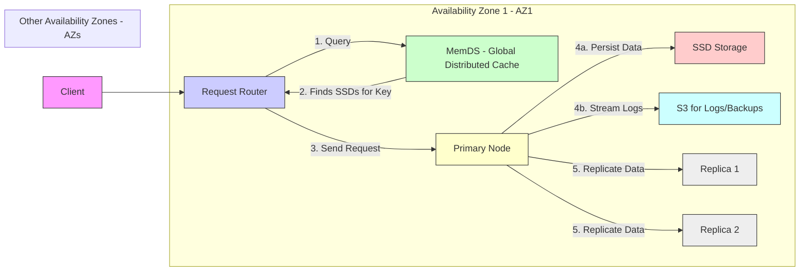

# Amazon Dynamodb： A Scalable, Predictably Performant, And Fully Managed Nosql Database Service (1080P25) - Part 1

# Amazon DynamoDB: A Deep Dive

_screenshots/frame_00-00-00.jpg)

This section explores Amazon DynamoDB, a prominent NoSQL data store, based on a 2022 whitepaper.

## Overview

_screenshots/frame_00-00-12.jpg)

DynamoDB is a highly popular NoSQL data store, boasting over 1 million customers. Its success stems from its ease of setup and auto-scaling capabilities. It is designed to handle immense scale and data volumes:

*   **Peak Load:** Processes approximately 79.8 million requests per second.
*   **Daily Requests:** Handles easily about 10 trillion requests daily.
*   **Data Storage:** Capable of storing petabytes of data, even for a single client.

## Key Features

DynamoDB distinguishes itself with several powerful features, challenging common NoSQL stereotypes.

_screenshots/frame_00-01-14.jpg)

1.  **NoSQL with ACID Guarantees:**
    *   Unlike many NoSQL databases, DynamoDB supports ACID (Atomicity, Consistency, Isolation, Durability) transactions.
    *   The "C" (Consistency) in ACID specifically refers to **serializable isolation**, meaning concurrent transactions appear to execute sequentially.
2.  **Flexible Consistency Models:**
    *   DynamoDB provides both **eventual consistency** (a common NoSQL characteristic) and **strong consistency** options, allowing users to choose based on their application requirements.
3.  **Predictable Performance (Low Variance):**
    *   A core design principle and cultural bias at Amazon is to ensure predictable behavior, especially regarding latency.
    *   This means that if a process is slow, it should consistently be slow, rather than exhibiting high variance (e.g., sometimes 100ms, sometimes 5 seconds).
    *   Low variance is critical for user experience; a consistently slow but predictable page load (e.g., 5 seconds) is often more tolerable than highly unpredictable load times.

_screenshots/frame_00-02-03.jpg)
*The graph above illustrates the emphasis on low variance in latency (P50 and P99) across different operations per second (ops/sec), highlighting DynamoDB's commitment to predictable performance.*

## High-Level Request Flow

_screenshots/frame_00-02-15.jpg)

The architecture of DynamoDB separates concerns like request routing and storage, though these components often reside within the same Availability Zone (AZ).

**Request Processing Steps:**

1.  **Client to Request Router:** A client initiates a request, which is directed to a Request Router. Ideally, the client connects to a Request Router in the same AZ as the primary replica for the requested key.
2.  **Request Router Queries MemDS:** The Request Router first queries `MemDS`, a global distributed cache.
3.  **MemDS Locates Key:** `MemDS` determines which SSDs (Solid State Drives) hold the data for the requested key.
4.  **Request to Primary Node:** The Request Router then forwards the request to the primary node responsible for that key. This primary node is typically located in the same AZ.
5.  **Data Persistence and Replication:**
    *   The primary node persists the data to its local SSD storage.
    *   Concurrently, the primary node forwards the data to two other replicas for that key, ensuring data durability and availability. These replicas might be in the same or different AZs.
    *   **S3 Integration:** Data changes are also streamed as logs to Amazon S3. This provides a robust mechanism for backups and further replication, ensuring data integrity and disaster recovery capabilities.

---

### DynamoDB Streams and Change Data Capture

DynamoDB Streams provide a mechanism for capturing changes to data and enabling various downstream processes.

*   **Change Data Capture (CDC):** The logs generated by data changes are streamed, allowing clients to consume these changes.
*   **Data Streaming:** Facilitates real-time data processing and integration with other services.
*   **Indexing:** Streams are crucial for creating and maintaining indexes, particularly Global Secondary Indexes (GSIs).
    *   GSIs are built using stream data and are eventually consistent.
    *   They allow querying data using attributes that are not the primary partition or sort key (e.g., retrieving all users in a specific department by `department ID`). A copy of the relevant data from the original tables is maintained in the GSI, sorted by the GSI's keys.

### Read Consistency Models in Action

DynamoDB offers both eventual and strong consistency for read operations, with different implications for data freshness.

_screenshots/frame_00-04-07.jpg)

#### Put Request Flow (Review)

1.  A client sends a `Put` request (e.g., `Put (Key, Value)`).
2.  The `Request Router` receives the request.
3.  The `Request Router` identifies the primary node for the given key (potentially using `MemDS` cache).
4.  The primary node persists the data.
5.  The primary node then replicates the data to its replicas.

#### Get Request with Eventual Consistency

*   When a `Get` request is made with eventual consistency, the `Request Router` may send the request to *any* available replica, including the primary or a secondary replica, for load balancing purposes.
*   **Potential for Stale Data:** If the data has been updated on the primary but not yet replicated to the chosen replica, the client might receive slightly stale (old) data.
*   **Data "Resurrection":** It's possible to read data that was previously deleted if the tombstone (deletion marker) has not yet been replicated to the replica serving the read request. This means a deleted item might temporarily "reappear."

#### Get Request with Strong Consistency

*   When a `Get` request explicitly demands strong consistency, the `Request Router` is guaranteed to send the request *only to the primary node*.
*   Since all write operations are first persisted by the primary, reading directly from the primary ensures that the client receives the most current and consistent value of the data.

### Leader Election and Replica Architecture

DynamoDB employs a sophisticated architecture for managing primary nodes (leaders) and replicas to ensure high availability and performance.

*   **Leader Election:** Leaders (primaries) are elected using **Multi-Paxos**, a robust consensus algorithm derived from Paxos.
*   **Leader Node Structure:** A leader node (e.g., `SSD` in AZ-2 in the diagram) maintains:
    *   A **B-tree:** Used for sorting and efficiently indexing all keys it manages.
    *   **Logs:** Records of all changes, vital for replication and recovery.

_screenshots/frame_00-04-43.jpg)

*   **Replica Node Variations:** Not all replicas are identical to the leader.
    *   Some replicas might also maintain a **B-tree and logs** (a materialized view of the data).
    *   Other replicas might only store **logs**. These "log-only" replicas are sufficient for durability and persistence but are not optimized for direct reads.
        *   Reading from a log-only replica would be significantly slower (potentially O(N) where N is the number of log entries to process).
        *   Having log-only replicas helps reduce the computational load on these nodes, thereby improving overall write throughput across the system, as they don't need to constantly maintain a B-tree index.

### Log Propagation and Formal Verification

*   **Streams Service:** The logs from the primary nodes are continuously propagated to the DynamoDB Streams service.
*   **Replication Dependency:** This log propagation is fundamental for DynamoDB's database replication mechanisms.
*   **Formal Verification (TLA+):** To ensure the absolute reliability of change propagation, Amazon uses **TLA+** (Temporal Logic of Actions) for formal verification. This rigorous method mathematically proves that the distributed system's behavior, especially concerning data changes, is correct and adheres to its specifications, guaranteeing that changes will be propagated reliably.

### The Complexity of MemDS Cache

The `MemDS` global distributed cache, though seemingly a small component in the overall design, is exceptionally complex.

*   **Critical Path:** `MemDS` sits directly in the critical path of nearly every request. Any latency or unreliability in `MemDS` would directly impact the performance of all DynamoDB operations. Its design must therefore prioritize extreme speed, high availability, and fault tolerance.

---

### The Critical Role of MemDS Cache

_screenshots/frame_00-08-04.jpg)

The `MemDS` cache is a crucial component in the DynamoDB request path.

*   **Function:** Whenever a `Request Router` needs to persist or fetch data from an SSD, it first queries `MemDS` to identify the primary node and relevant replicas.
*   **High Hit Rate:** `MemDS` typically boasts a 99.7% cache hit rate, meaning almost all requests successfully find the necessary metadata in the cache, leading to very fast response times (e.g., 1 millisecond).
*   **Fallback:** In the rare event of a cache miss, the system falls back to querying the underlying data store, which is significantly slower.

#### Impact of Cache Failure (Cold Cache)

_screenshots/frame_00-08-25.jpg)

A failure or cold start of `MemDS` poses a significant challenge to predictable performance.

*   **Hit Rate Drop:** If `MemDS` becomes unavailable or needs to be repopulated (a "cold cache"), its hit rate plummets from 99.7% to 0%.
*   **Performance Degradation:**
    *   **Example:** If 997 out of 1000 requests were previously served by the cache in 1 millisecond, and 3 requests hit the data store taking 10 milliseconds, the average latency would be very low.
    *   **Cold Cache Scenario:** If all 1000 requests now have to hit the data store, taking 10 milliseconds each, the average request time drastically increases.
    *   **Throughput Reduction:** This means the system can handle only a fraction (e.g., one-tenth) of the requests it could previously, leading to a severe drop in throughput.
*   **System Overload:** The `Request Routers` would become overloaded, causing the entire request path to slow down and potentially leading to system instability or failure.

#### AWS's Approach to Mitigate Cache Variance

_screenshots/frame_00-09-06.jpg)

To combat the inherent variance introduced by caches and maintain predictable performance, AWS implements a unique strategy:

*   **Continuous DB Querying:** Even when a client's request results in a `MemDS` cache hit, the cache *still periodically queries the underlying database* for the latest data.
*   **Rationale:**
    *   **Consistent Workload:** This seemingly counter-intuitive approach ensures that the cache nodes are consistently performing a certain amount of work, whether there's a hit or a miss.
    *   **Accurate Monitoring and Scaling:** By maintaining a baseline workload, AWS can accurately monitor the cache's performance and scale it up or down proactively. If cache nodes only did work on misses, their load would be highly variable and unpredictable, making scaling decisions difficult.
    *   **Avoiding "Shock":** This prevents sudden "shocks" to the system where a cold cache would suddenly require a massive influx of new servers (e.g., from 1 to 20 servers instantly) that cannot be provisioned quickly enough.
*   **Alignment with AWS Culture:** This strategy embodies AWS's core principle of reducing variance and increasing reliability, even if it means doing "more work than necessary" in some cases. The goal is a "boring system" with highly predictable behavior.

### DynamoDB Data Schema

_screenshots/frame_00-10-19.jpg)

DynamoDB's data schema is simple yet powerful, relying on a combination of partition and sort keys.

*   **Partition Key (Hash Key):**
    *   **Purpose:** Used for horizontal scaling of DynamoDB tables.
    *   **Mechanism:** When data is `Put` or `Get`, a hash function is applied to the partition key to determine which physical partition (or storage node) the data belongs to.
    *   **Analogy:** Similar to how a hash map distributes elements across buckets.
*   **Sort Key (Range Key - Optional):**
    *   **Purpose:** Provides an additional dimension for organizing data within a partition.
    *   **Mechanism:** Data within a partition is sorted by the sort key.
    *   **Benefits:**
        *   **Efficient Searches:** Enables quick searching for specific elements using binary search within a partition.
        *   **Range Queries:** Makes range queries highly efficient (e.g., "get all items with a sort key between X and Y").
    *   **Analogy:** Similar to an index in a relational database, allowing for ordered retrieval and filtering.
</REFINEDNOTES>

---

### Primary Key Composition

_screenshots/frame_00-11-33.jpg)

In DynamoDB, the combination of the **Partition Key** and the **Sort Key** forms the unique **Primary Key** for each item in a table.

*   **Primary Key = Partition Key + Sort Key**
*   This composite key ensures that each item can be uniquely identified.

#### Example: Reddit Posts Table Design

Consider a Reddit-like application storing user posts:

*   **Partition Key:** `Post ID` (e.g., `Post_2` for a specific region like India).
*   **Sort Key:** `Timestamp` (when the post was made).

**Access Patterns Enabled:**

*   **Retrieve Posts by Time Range within a Partition:** If all posts from India are routed to a partition identified by a `Post ID` prefix (e.g., `Post_India`), you can quickly query that specific partition for all posts made within the last seven days using the `Timestamp` sort key. This involves querying multiple partitions if the `Post ID` is not region-specific and then aggregating results.

#### Advanced Design Patterns: Composite and Secondary Indexes

DynamoDB encourages modeling tables to fit specific access patterns, often using composite keys and indexes to avoid expensive joins inherent in NoSQL databases.

1.  **Composite Index (Combined Keys):**
    *   **Scenario:** To find the latest posts made by a specific user (requiring `User ID` and `Timestamp`).
    *   **Design:** Combine `User ID` and `Post ID` into a single **Partition Key** (e.g., `user1_post`, `user6_post`), and use `Timestamp` as the **Sort Key**.
    *   **Benefit:** Enables efficient queries like "get posts by user 6 between timestamp 60 and 90."

    _screenshots/frame_00-12-40.jpg)
    *The table above illustrates a composite partition key `User ID + Post ID` with `Timestamp` as the sort key, facilitating queries for a specific user's posts within a time range.*

2.  **Local Secondary Indexes (LSIs):**
    *   **Purpose:** To support different sort orders for the same partition key.
    *   **Characteristics:**
        *   Uses the *same* partition key as the base table.
        *   Uses a *different* sort key.
        *   Stored *locally* within the same partition as the base table.
        *   Provides **strong consistency** with the base table data.
        *   A table can have up to 20 Local Secondary Indexes.
    *   **Example:**
        *   **Base Table:** `Partition Key = Post ID`, `Sort Key = Timestamp` (for time-based queries).
        *   **LSI:** `Partition Key = Post ID`, `Sort Key = Like Count` (to find most popular posts for a given `Post ID`).

3.  **Global Secondary Indexes (GSIs):**
    *   **Purpose:** To support query patterns that require a *different partition key* than the base table.
    *   **Characteristics:**
        *   Uses a *different partition key* than the base table.
        *   Can use a *different sort key* (optional).
        *   Essentially an *entire copy* of a subset of the base table's data, re-partitioned and re-indexed.
        *   **Eventually consistent:** Changes from the original partition are streamed to update the GSI, leading to eventual consistency.
    *   **Example:**
        *   **Base Table:** `Partition Key = User ID + Post ID`, `Sort Key = Timestamp` (for user's posts).
        *   **GSI:** `Partition Key = Comment ID + Post ID`, `Sort Key = Timestamp` (to fetch the latest comments for a specific post). This allows efficient queries for comments without involving the user ID from the base table's partition key.

#### Denormalization and Single-Table Design

DynamoDB's design philosophy encourages:

*   **Denormalization and Data Duplication:** It's acceptable to duplicate data across tables or indexes to optimize for specific access patterns.
*   **Avoidance of Joins:** The NoSQL nature of DynamoDB is designed to avoid complex and expensive join operations common in relational databases. Users are encouraged to think in terms of key-value pair access.
*   **Single-Table Design:** Often, an entire application's data can be managed within a single DynamoDB table by strategically using partition keys, sort keys, and various indexes to accommodate diverse access patterns.

### Rate Limiting and Capacity Booking (RCUs/WCUs)

_screenshots/frame_00-14-56.jpg)

DynamoDB operates on a capacity-based model, where users pay for the throughput they provision. This is managed through Read Capacity Units (RCUs) and Write Capacity Units (WCUs).

*   **Concept:** "You only pay for what you ask." This allows users to provision specific read/write throughput for their tables.
*   **Read Capacity Unit (RCU):**
    *   **Definition:** One RCU allows for one strongly consistent read per second for an item up to 4 KB in size.
    *   **Example:** Reading a 4 KB row once every second consumes 1 RCU. If an item is 8 KB, it consumes 2 RCUs.
    *   **Eventual Consistency:** For eventually consistent reads, one RCU allows for *two* reads per second for an item up to 4 KB.
*   **Write Capacity Unit (WCU):**
    *   **Definition:** One WCU allows for one write per second for an item up to 1 KB in size.
    *   **Example:** Writing a 1 KB row once every second consumes 1 WCU. If an item is 2 KB, it consumes 2 WCUs.

_screenshots/frame_00-15-07.jpg)
*The image shows a table with a 4KB data size, indicating that reading it once per second equates to 1 RCU, illustrating the unit of capacity booking.*

*   **Underlying Infrastructure:** DynamoDB abstracts away the physical infrastructure. Instead of users buying entire nodes (e.g., a node with 10,000 units), they provision capacity units, and AWS manages the underlying hardware and scaling. This allows for fine-grained resource allocation and cost optimization.

---

### Granular Capacity Provisioning and Throttling

_screenshots/frame_00-15-19.jpg)

DynamoDB allows customers to provision capacity at a granular level, sharing underlying physical nodes among many users.

*   **Shared Nodes:** A single physical node, which might have a total capacity of 10,000 RCUs, can serve hundreds of different customers.
*   **Customer Provisioning:** A customer might provision only 100 RCUs from that node, leaving the remaining 9,900 RCUs for other customers.
*   **Throttling for Fairness:** To prevent one customer from monopolizing resources and impacting others, DynamoDB implements throttling.
    *   If a customer provisioned for 1 RCU attempts to consume 100 RCUs, their requests will be throttled.
    *   This ensures that all customers receive the capacity they've paid for, and no single customer's burst of activity unfairly impacts others.
*   **Write Capacity Units (WCUs):** Similar principles apply to WCUs, where 1 WCU allows for 1 KB of data written per second.

### Burst Capacity and Fair Throttling with Token Bucket

Customers often experience variable traffic patterns (e.g., peak usage during specific hours). Traditional fixed capacity provisioning can lead to either wasted capacity or throttling during peak times. DynamoDB addresses this with a token bucket algorithm.

*   **The Problem:**
    *   Consider a service like Zomato with peak traffic during lunch and dinner (e.g., 500 RCUs needed for 4 hours) and low traffic the rest of the day (minimal RCU usage).
    *   If they provision 500 RCUs constantly, they waste capacity for most of the day.
    *   If they provision a lower, consistent amount (e.g., 200 RCUs), they get throttled during peak times.
    *   Manually scaling up and down is cumbersome.

*   **DynamoDB's Solution: Token Bucket Algorithm**
    *   DynamoDB employs a **token bucket** mechanism for rate limiting, providing a "burst capacity" feature.
    *   **Token Accumulation:** When a customer provisions capacity (e.g., 200 RCUs) but is not fully utilizing it, unused capacity is "saved" as tokens in a virtual bucket.
    *   **Burst Window:** This bucket typically stores up to **five minutes** worth of unused capacity.
        *   Example: For 200 RCUs over 5 minutes (5 minutes * 60 seconds/minute = 300 seconds), the bucket can accumulate 200 RCUs * 300 seconds = 60,000 RCU tokens.
    *   **Burst Usage:** During peak times, customers can "burst" beyond their provisioned RCU rate by consuming these accumulated tokens.
        *   Instead of being limited to 200 reads per second, they can temporarily perform up to 60,000 reads within that 5-minute window, until the tokens are depleted.

_screenshots/frame_00-17-43.jpg)
*The diagram illustrates the token bucket concept, showing how 200 RCUs can accumulate 60,000 tokens over a 5-minute burst period.*

_screenshots/frame_00-18-07.jpg)
*This screenshot further emphasizes the calculation of 60,000 RCU tokens from 200 RCUs over 5 minutes, highlighting the burst capacity.*

*   **Benefits for Customers:**
    *   **Cost-Effective:** Customers can provision for average usage and leverage bursts without overpaying for constant peak capacity.
    *   **Improved Experience:** Reduces frustrating throttling events, as "wasted" capacity is effectively repurposed.
    *   **Higher Adoption:** This customer-centric approach to capacity management contributes to DynamoDB's high adoption rates.

### Challenges for AWS with Burst Capacity

While beneficial for customers, burst capacity adds complexity for AWS's internal management:

*   **Dynamic Resource Allocation:** AWS must dynamically manage the distribution of data across nodes and replicas to accommodate these unpredictable bursts.
*   **Replica-Level Throttling:** Throttling is not just applied at the overall customer level but also across replicas.
    *   Example: If a customer provisions 100 RCUs, but this is distributed across 3 replicas, the total effective capacity might be 300 RCUs (100 per replica).
    *   AWS allows for flexible consumption across these replicas. If one replica handles 200 RCUs and the other two handle 50 RCUs each (total 300 RCUs), this is permitted, as long as the overall provisioned capacity is not exceeded. This further optimizes resource utilization and ensures flexibility during bursts.

_screenshots/frame_00-19-07.jpg)
*The image shows the example of 100 RCUs, and then expands to 300 RCUs across three replicas, indicating how AWS handles distributed capacity and allows flexible utilization among replicas during bursts.*

---

### Distributed Burst Capacity and Global Throttling

_screenshots/frame_00-19-19.jpg)

DynamoDB's burst capacity mechanism extends to how capacity is utilized across replicas, offering flexibility and ensuring efficient resource use.

*   **Replica-Level Consumption:** If a customer provisions a certain amount of capacity (e.g., 100 RCUs), and this capacity is distributed across multiple replicas (e.g., three replicas, each potentially offering 100 RCUs for a total of 300 RCU potential throughput), AWS allows for flexible consumption across these replicas.
*   **No Throttling for Local Spikes:** Even if one replica temporarily handles a disproportionately high load (e.g., 200 RCUs) while others handle less (e.g., 50 RCUs each), no throttling will occur as long as the *total global consumption* does not exceed the customer's overall provisioned capacity (including any burst tokens available).
*   **Global Capacity Limit:** Throttling only happens if the aggregate consumption across all replicas for a customer surpasses their total provisioned capacity (plus any available burst capacity). This ensures optimal utilization of resources and prevents unnecessary throttling due to uneven load distribution among replicas.

### Conclusion: Why DynamoDB Stands Out

DynamoDB is a highly regarded system due to its unique approach and powerful features:

*   **Contrarian NoSQL:** It challenges the traditional view of NoSQL databases by offering ACID transactions, specifically with serializable isolation, alongside flexible consistency models (eventual and strong).
*   **Popularity and Scale:** Its widespread adoption (over 1 million customers) is a testament to its ease of use, auto-scaling capabilities, and ability to handle petabytes of data and trillions of daily requests.
*   **Predictable Performance:** A core tenet of Amazon's design philosophy, embodied in DynamoDB, is the creation of "boring systems" with extremely low performance variance. This predictability in latency and behavior is crucial for reliable user experience.
*   **Customer Control:** DynamoDB provides fine-grained control over capacity provisioning (RCUs/WCUs) and offers features like burst capacity, allowing customers to optimize costs and performance for their specific access patterns and traffic profiles.

---

