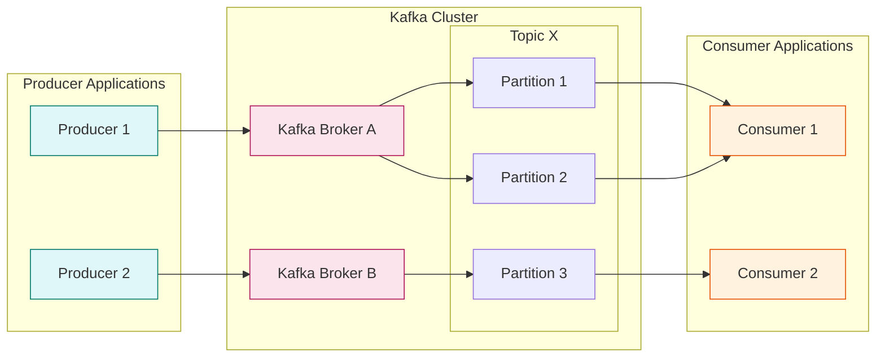
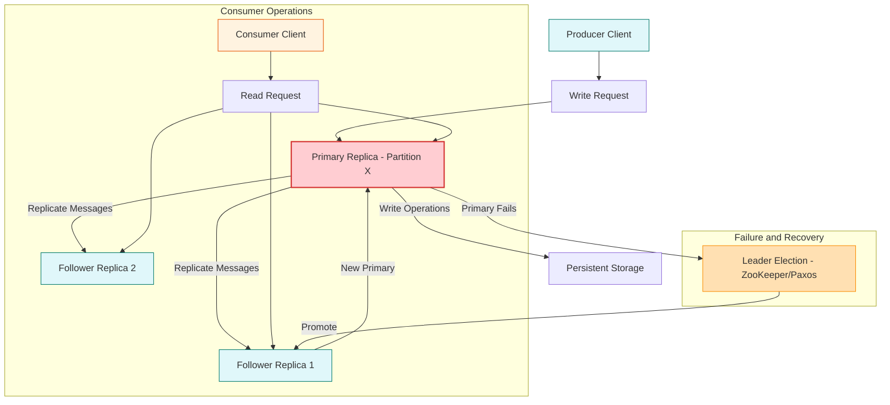

# Apache Kafka： A Distributed Messaging System For Log Processing (1080P25) - Part 1

# Apache Kafka: An Introduction

_screenshots/frame_00-00-01.jpg)

Apache Kafka, developed by LinkedIn in 2011, is a highly popular and scalable open-source distributed streaming platform. It is widely adopted by many organizations due to its robustness and ability to handle high-throughput, fault-tolerant data streams.

_screenshots/frame_00-00-21.jpg)

## Core Functionality and Use Cases

Kafka primarily serves two major use cases:

### 1. Message Queue
Kafka functions as a distributed message queue, facilitating communication between publishers and subscribers.
*   **Publisher-Subscriber Model:** Publishers send messages to Kafka, and subscribers consume these messages.
*   **Scalability for Broadcasts:** It addresses the challenge of broadcasting messages to a large number of recipients (e.g., millions of followers on Instagram).
    *   **Example (Instagram):** If Brad Pitt publishes a message, Kafka efficiently distributes it to all his followers, ensuring reliability and scalability for this high-volume task.
    *   _screenshots/frame_00-00-42.jpg)
*   **Reliability:** Kafka provides a reliable solution for message delivery, which is crucial for systems that cannot afford message loss.
*   **Battle-Tested:** Being an open-source solution that has been in use for a long time, it is considered robust and "battle-tested" in production environments.

### 2. Event Streaming
Kafka is a powerful platform for event streaming, enabling the capture, processing, and storage of event streams from various sources and their transportation to different destinations.
*   **Event-Based Systems:** It's particularly useful for applications built around events.
*   **Event Log Replay:** Kafka can maintain an event log, allowing the replay of events to reconstruct the state of a data store.
    *   **Example (Facebook Profile):**
        1.  User adds a profile picture (Event 1).
        2.  User adds their address (Event 2).
        3.  User adds their email address (Event 3).
    *   These are distinct events. By replaying this sequence of events in a new data store, the final state of the new store will be identical to the original one. This eliminates the need for direct database copies, as the data store's state can be reliably recreated from the event log.
    *   **Guarantee:** Kafka ensures that the state derived from replaying events will be consistent across different data stores.

## Kafka Architecture Components

Kafka is composed of three primary components:

### 1. Producers
*   **Role:** Applications that generate and send messages to Kafka.
*   **Client:** Producers use Kafka clients to interact with the Kafka cluster.
*   **Publishing:** They publish messages to specific *topics*.

### 2. Topics
*   **Definition:** A category or feed name to which messages are published.
*   **Partitions:** Topics can be divided into multiple *partitions* to handle large volumes of messages and enable parallel processing.
    *   Producers send messages to various partitions within a particular topic.
    *   _screenshots/frame_00-01-53.jpg) (This image with '1', '2', '3' visually represents partitions within a topic, indicating horizontal scaling).
*   **Message Retention:** Messages within partitions are retained for a configurable period (e.g., two weeks or more), depending on storage capacity and data retention policies.

### 3. Consumers (Implicit)
*   **Role:** While not explicitly detailed in this segment, consumers (or subscribers) are the applications that read messages from topics. They subscribe to topics and process the messages published by producers.

## Why Kafka? The Architecture's Rationale

The Kafka architecture, which involves producers, topics, partitions, and underlying brokers, might appear complex. However, this design offers significant advantages over a simpler, direct producer-to-consumer communication model.

### 1. Scalability
*   **Isolation of Concerns:** Producers can quickly write messages to Kafka (brokers) and then continue with their application logic without waiting for consumers to process them. This asynchronous nature decouples producers and consumers, allowing them to scale independently.
*   **High Throughput:** Kafka brokers are designed to handle high volumes of incoming messages efficiently, acting as a buffer and a highly available storage layer.

### 2. Reduced Duplication and Engineering Efficiency
*   **Centralized Logic:** Without Kafka, each producer application would need to implement its own logic for:
    *   Message persistence (storing messages reliably)
    *   Retries for failed deliveries
    *   Handling slow or unavailable consumers
*   **Cost Savings:** By extracting these common, cross-cutting functionalities into a single, specialized system like Kafka, organizations save significant engineering time and money, as code duplication is minimized across various applications.

### 3. Message Ordering Guarantee
*   **Partition-Level Ordering:** Kafka guarantees that messages within a *single partition* for a given topic will be ordered sequentially.
    *   When a message is sent, it is directed to *one* specific partition.
    *   All messages within that particular partition are stored and delivered to consumers in the exact order they were received by that partition.

### Architectural Flow (Simplified)

---

### Message Ordering and Location

*   **Ordering Guarantee:** While messages might be processed out of order *across different partitions*, Kafka guarantees strict ordering of messages *within a single partition*.
*   **Location:** Topics and their partitions are housed within Kafka message brokers, which are essentially Kafka servers. A single physical server can host thousands of partitions.

_screenshots/frame_00-03-53.jpg)

The image above visually represents a Kafka server containing multiple partitions (partition-1, partition-2, partition-3), illustrating how these logical units are managed within a physical server.

### Consumer Architecture: Pull Model

*   **Mechanism:** Kafka employs a *pull architecture* for consumers. This means consumers actively request (pull) messages from Kafka brokers, rather than brokers pushing messages to consumers.
*   **Rationale:**
    *   **Simpler Kafka Servers:** This design offloads the responsibility of managing message delivery rates and consumer states from the brokers to the consumers, making the Kafka servers simpler and more robust.
    *   **Consumer Control:** Consumers can control their consumption rate, allowing them to process messages at their own pace and manage their own message offsets (the index of the last message successfully pulled).

_screenshots/frame_00-03-31.jpg)

This diagram shows the fundamental interaction: Producers send messages via clients to Kafka Servers (brokers), and Consumers pull messages from these servers.

### Horizontal Scaling and Automated Recovery

*   **Scalability:** For large-scale distributed systems like Kafka, all components—producers, brokers, and consumers—must scale horizontally. This means adding more instances of each component to handle increasing load.
*   **Failure Management:** At LinkedIn's scale, processing 7 trillion messages per day, even a 0.1% server failure rate translates to 7 billion potential failures. Such a volume of failures necessitates *automated recovery mechanisms* rather than manual intervention.

### Partition Replication for Fault Tolerance

*   **Redundancy:** To ensure fault tolerance and high availability, Kafka maintains replicas of every partition.
    *   For example, if `Topic T1` has `Partition P1`, there will be two or more replicas of `P1` on different Kafka servers.
*   **Continuity on Failure:** If one partition instance fails, consumers can seamlessly continue consuming messages from its replicas, preventing service interruption.

_screenshots/frame_00-04-50.jpg)

This image illustrates the concept of replication, showing a primary Kafka partition and its replica, ensuring data redundancy.

### Addressing Data Inconsistency: The Primary-Replica Model

**Problem with Multiple Writeable Replicas:**
Consider a scenario where a producer can write to any replica of a partition:
1.  A producer writes messages 1, 2, 3, and 4 to `partition-2`.
2.  The producer then tries to write message 5 to `partition-2`, but it fails.
3.  The producer retries, writing message 5 to `partition-1`, which accepts it.
4.  A consumer pulling from `partition-2` receives messages 1, 2, 3, and 4.
5.  If `partition-2` then fails, the consumer is forced to switch to `partition-1`.
6.  The consumer requests messages starting from offset 4 (as it received 1-4 from `partition-2`).
7.  However, `partition-1` only has messages 1, 2, 3, and 5 (message 4 was never written to it).
8.  This leads to data inconsistency: `partition-1` is missing message 4, and the consumer cannot continue correctly.

_screenshots/frame_00-07-06.jpg)

The screenshot visually demonstrates this inconsistency problem: `partition-2` has messages 1, 2, 3, 4, while `partition-1` has message 5, potentially leading to a missing message (4) if a consumer switches.

**Solution: Single Primary Replica (Leader) with Read Replicas (Followers)**

To avoid data inconsistency, Kafka enforces a primary-replica (also known as leader-follower) architecture for each partition:
*   **Primary Replica (Leader):** There is only one designated primary replica for each partition. This primary replica is responsible for handling *all write operations*.
*   **Read Replicas (Followers):** Multiple read replicas exist for each partition.
    *   They serve read requests, reducing the load on the primary.
    *   They continuously pull messages from the primary replica to stay in sync.
*   **Consistency Guarantee:** By having a single point for writes, Kafka ensures that all replicas eventually achieve consistency, and consumers are guaranteed a consistent view of the message log.

### Primary Replica Failure and Leader Election

*   **Challenge:** If the primary replica fails, all write operations for that partition would halt, creating a single point of failure.
*   **Solution: Automated Leader Election:** Kafka addresses this by automatically promoting one of the read replicas to become the new primary.
*   **Coordination Service:** This leader election process is managed by **Apache ZooKeeper**, which utilizes the **Paxos algorithm** to ensure consensus and fault-tolerant coordination.
*   **Eligibility for Election:** Only replicas that are *in sync* with the original primary are eligible to participate in the leader election.
    *   **In-Sync Criterion:** A common rule is that a replica is considered "in sync" if it has received a message from the primary within a recent, configurable timeframe (e.g., the last 10 seconds). This ensures that the newly elected leader will have the most up-to-date data.

---

### High Water Mark for Data Consistency

*   **Mechanism:** Kafka uses a "high water mark" to ensure data consistency across replicas and prevent consumers from seeing uncommitted or unreplicated messages.
*   **How it Works:** A consumer will only be able to consume messages that have been successfully replicated to *all* in-sync replicas.
    *   If a message (e.g., message 3) is present on the primary replica but has not yet been replicated to all other in-sync replicas, consumers will not be able to pull it.
    *   They will wait until message 3 is replicated everywhere before it becomes available for consumption.
*   **Benefit:** This mechanism guarantees strong data consistency, ensuring that consumers always read a consistent and fully replicated state of the partition log.

_screenshots/frame_00-07-28.jpg)

The image above depicts two Kafka partition replicas. The top one shows messages 1, 2, 3, 4, 5, while the bottom one only has 1, 2. The high water mark concept would mean that a consumer could currently only reliably consume up to message 2, as message 3, 4, 5 are not yet replicated to all partitions.

### Bandwidth Optimization: Message Batching

*   **Challenge:** Sending trillions of messages individually (e.g., LinkedIn's 7 trillion messages/day) is extremely inefficient and expensive in terms of network bandwidth.
*   **Solution: Batching:** Kafka optimizes bandwidth usage by batching messages.
    *   **Producer Side:** Producers group multiple messages together into a single batch (e.g., up to a maximum size of 50 KB) before sending them to the Kafka brokers. This increases throughput by reducing overhead per message.
    *   **Consumer Side:** Consumers can also request messages in batches (e.g., "give me the next 50 KB of messages"). The broker then sends a batch of messages that fit within that size limit.
*   **Benefit:** Batching significantly improves the efficiency of data transfer and overall system throughput.

### Broker Responsibilities and Consumer-Managed Logic

*   **Kafka Broker Role:** Kafka brokers are designed to be relatively lean. Their primary responsibility is to manage message offsets (pointers to the current read position in a partition).
*   **Producer/Consumer Role:** Application-specific logic, including retries for message delivery and processing, is largely handled by the producers and consumers themselves. This design principle contributes to Kafka's scalability and robustness.

### Message Delivery Guarantees

Kafka offers different delivery guarantees, each with varying complexities and use cases:

#### 1. At-Least-Once Delivery

_screenshots/frame_00-08-48.jpg)

*   **Definition:** This guarantee ensures that a message will be delivered to the consumer at least one time. It means a message might be delivered multiple times, but it will never be lost.
*   **Example:** A user registration system sending a verification email. You expect to receive at least one email; if the first attempt fails, retries will ensure it eventually gets delivered.
*   **Implementation in Kafka:**
    *   **Consumer Processing:**
        1.  A consumer pulls a message.
        2.  It processes the message successfully.
        3.  It then sends an acknowledgment to Kafka, asking to increment its offset (commit the offset).
        4.  If processing fails (e.g., server crash) *before* the offset is committed, upon restart, the consumer will request its "next message" based on the *last committed offset*.
        5.  Kafka will then re-deliver the message that was being processed when the failure occurred, ensuring it's processed "at least once."
    *   **Offset Storage:** Offsets can be stored either in the Kafka broker itself or in ZooKeeper, which makes them fault-tolerant.

*   **Inverse Behavior (Optional):** For low-priority messages (e.g., user notifications), a consumer might choose to send an acknowledgment and increment the offset *immediately upon receiving* a message, regardless of whether processing succeeds.
    *   **Trade-off:** This provides "at-most-once" delivery, where messages might be lost if processing fails after acknowledgment but before completion. It prioritizes speed and non-blocking behavior over strict delivery guarantees for less critical data.

#### 2. Exactly-Once Delivery

_screenshots/frame_00-10-18.jpg)
_screenshots/frame_00-10-08.jpg)

*   **Definition:** This is the most stringent guarantee, ensuring that each message is delivered to a consumer and processed *exactly once*, with no duplicates and no omissions.
*   **Complexity:** Achieving exactly-once delivery is significantly more complex than at-least-once.
*   **Challenge:** With multiple replicas for a partition, if a consumer pulls a message from one replica, that message must not be delivered to any other consumer, even if it's available on other replicas.
*   **Kafka's Approach (Concepts):** Kafka supports exactly-once delivery through two key mechanisms:
    1.  **Transactions:** This allows a series of operations (reads, writes) to be treated as a single atomic unit. Either all operations succeed, or none do. This is crucial for ensuring that messages are consumed and produced exactly once, even across multiple partitions or topics.
    2.  **Idempotent Producers:** (Not explicitly mentioned but implied by "transactions" in Kafka's context) Idempotent producers ensure that retrying a message send operation does not result in duplicate messages being written to Kafka, which is a prerequisite for exactly-once semantics. This is achieved by assigning a unique ID to each producer and a sequence number to each message, allowing the broker to detect and discard duplicates.

*   **How Transactions Work (Simplified):**
    *   A consumer might read messages from one topic, perform some processing, and then produce new messages to another topic.
    *   An exactly-once transaction would ensure that both the consumption of the input messages and the production of the output messages either both succeed or both fail together. This prevents partial state updates and ensures data integrity.

---

### Exactly-Once Delivery (Continued)

*   **Implementation:** Achieving exactly-once delivery in Kafka is complex and relies on transactions, which typically involve a distributed two-phase commit protocol.
    *   **Distributed Two-Phase Commit:** This protocol ensures that all Kafka servers (brokers) hosting partition replicas are in sync regarding the transaction's state. While expensive, it's necessary for strict exactly-once semantics.
*   **Key Idea:** For exactly-once delivery, if a consumer pulls a message from any replica of a partition, that message must not be delivered to any other consumer.

_screenshots/frame_00-10-39.jpg)

The image above highlights "Two-Phase Commit" in the context of Kafka and consumers, reinforcing its role in achieving exactly-once delivery across distributed Kafka instances.

### Consumer Groups for Scalable Consumption

To manage message consumption efficiently and avoid duplicate processing across multiple consumers, Kafka introduces the concept of **Consumer Groups**.

*   **Problem Statement:** Without proper coordination, if multiple consumers pull from the same partition, they might end up consuming and processing the same messages, leading to redundant work (e.g., sending the same viral message multiple times to followers).
*   **Solution: Consumer Groups:**
    *   **Exclusive Partition Assignment:** Within a consumer group, each consumer is exclusively assigned to a distinct set of topic partitions.
    *   **No Stepping on Toes:** This ensures that consumers within the same group do not process the same messages, as each message from a partition is handled by only one consumer in that group.
    *   **Example:**
        *   If "Famous Influencer" topic receives messages from Sunil Shetty and Varun Dhawan.
        *   Consumer 1 is assigned a specific partition and processes Sunil Shetty's message.
        *   Consumer 2 will not touch that same partition. It might be assigned a different partition (possibly on another broker) where Gaurav Sen or Akshaye Khanna are sending messages.
    *   **Broker and Partition Scalability:** The distribution of partitions across brokers (brokers can have multiple partitions of the same topic) and the scaling of brokers themselves are independent of consumer group assignments. Brokers can scale up or down without affecting the consumer group's guarantee of exclusive partition ownership.
*   **Guarantee:** Consumers within a group are guaranteed to exclusively pull messages from distinct partitions, preventing redundant processing.

### Kafka Optimizations

#### 1. Zero-Copy Optimization

*   **Problem:** Traditional data transfer from disk to network socket involves multiple data copies and context switches between kernel and user space.
    1.  Data is read from the disk into the OS kernel's page cache.
    2.  Data is copied from the page cache to the application's user-space buffer.
    3.  Data is copied from the user-space buffer back into the kernel's socket buffer.
    4.  Data is copied from the socket buffer to the network interface card (NIC).
*   **Kafka's Solution: Zero-Copy:** Kafka leverages the `sendfile()` system call (available in Linux and other Unix-like operating systems).
    *   **Direct Transfer:** This call allows data to be transferred directly from the file system cache to the network socket buffer, *without* passing through the application's user-space buffer.
    *   **Benefits:**
        *   **Reduced CPU Cycles:** Eliminates unnecessary data copying and context switches.
        *   **Increased Throughput:** Messages are sent almost twice as fast.
        *   **Lower Memory Usage:** Avoids intermediate application-level buffers.
        *   **Reduced I/O Calls:** Streamlines the data path.

_screenshots/frame_00-13-04.jpg)

This diagram illustrates the traditional approach where messages are pulled into an application cache, then written to a socket for the consumer. The red arrows show the data movement.

_screenshots/frame_00-13-15.jpg)

This diagram shows the optimized "Zero-Copy" approach where messages are sent directly from the file system to the consumer, bypassing the application cache. The efficiency gain is evident.

*   **Impact on Java Garbage Collection:**
    *   Zero-copy avoids creating temporary byte arrays or `ByteBuffer` objects in the Java Virtual Machine (JVM) heap for each message.
    *   This is crucial because Java's garbage collector (especially older generations) can be inefficient at collecting short-lived objects from linked lists, which can lead to frequent and costly garbage collection pauses.
    *   By minimizing heap allocations for message transfer, zero-copy significantly reduces GC overhead, improving Kafka's performance and stability.
    *   **Note on "Young and Old Generation" / "Nepotism":** This refers to generational garbage collection, where objects are moved between "young" and "old" memory spaces. Short-lived objects (like those created for message buffering) are typically collected in the young generation. If they survive too long or are part of complex data structures, they can get promoted to the old generation, making collection more expensive. Zero-copy mitigates this by avoiding such objects entirely.

---

### Kafka Optimizations (Continued)

#### 1. Zero-Copy Optimization (Continued)

*   **Addressing Java Garbage Collection Issues:**
    *   The zero-copy optimization also helps mitigate a common performance bottleneck in Java applications: inefficient garbage collection (GC).
    *   **Traditional GC Problem:** When data is copied into an application's cache (user-space buffer) in Java, these data objects reside on the Java heap.
        *   Java's generational garbage collectors divide the heap into "young" and "old" generations.
        *   Newly created objects are initially in the young generation. If they survive multiple GC cycles, they are promoted to the old generation.
        *   The problem, sometimes referred to as "nepotism" (a metaphorical term for objects being incorrectly retained or promoted), occurs when dead or unused objects (like temporary message buffers) are promoted to the old generation.
        *   Collecting objects from the old generation is typically more expensive and time-consuming, leading to longer GC pauses that can impact application performance and latency.
        *   This issue is particularly pronounced with data structures like `LinkedLists` where objects might be scattered, making efficient collection difficult.
    *   **Zero-Copy Solution:** By using `sendfile()` and bypassing the application's user-space cache entirely, Kafka avoids creating these temporary message objects on the Java heap.
        *   This significantly reduces the load on the garbage collector, preventing the accumulation of "dead objects in the safe zone" (old generation) that would otherwise consume memory and increase GC times.
        *   The direct transfer from the file system to the network socket eliminates the need for Java objects to hold the message data during transit within the broker, thus completely circumventing this GC problem.

_screenshots/frame_00-14-24.jpg)

The overlay in the image visually highlights the concept of "Garbage Collection" and "Java GC" in relation to the zero-copy diagram, illustrating how this optimization directly addresses the performance challenges associated with Java's memory management during message transfer.

### Conclusion: The Power of Apache Kafka

*   Apache Kafka is a highly popular and effective distributed system designed to empower applications to reliably and scalably send and receive messages.
*   While the core use case of message passing seems simple, implementing it at the immense scale Kafka operates (e.g., trillions of messages daily) presents significant engineering challenges.
*   Developed in 2011 by a principal engineer at LinkedIn, many of Kafka's architectural concepts and optimizations (like partition-based ordering, consumer groups, and zero-copy) were groundbreaking at the time and have since become industry standards for distributed messaging and event streaming.
*   Kafka's design provides a robust, high-throughput, and fault-tolerant platform for critical data pipelines and real-time applications.
</REFINEDNOTES>

---

