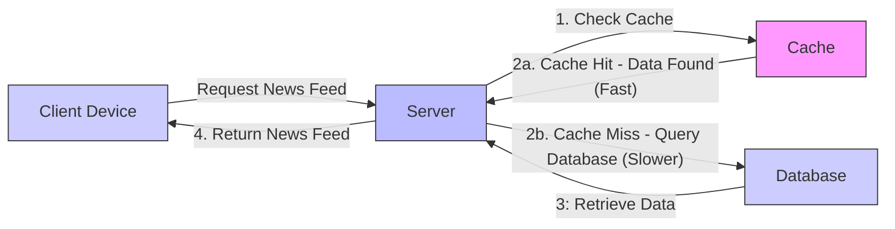

# Caching In Distributed Systems： A Friendly Introduction (1080P30) - Part 1

# Caching: Reducing Repeatable Work Through Storage

_screenshots/frame_00-00-00.jpg>)

Caching is a foundational concept in computer science, integral to the design and performance of virtually any large-scale distributed system. Caches are often deployed in multiple locations within a system, particularly in critical sections, to enhance efficiency.

This chapter will explore:

- The definition of caching.
- The benefits of implementing caching.
- Potential drawbacks associated with caching.
- Strategies and trade-offs to mitigate these drawbacks.

## Illustrative Example: Instagram News Feed

Consider a user requesting their news feed on Instagram. The process involves several steps and associated latencies:

1.  **User Request:** The client (user's device) sends a request to the server for the news feed.
2.  **Server Query:** The server receives the request and queries the database. This query typically involves:
    - Identifying all users the requesting user follows.
    - Retrieving the latest posts from those followed users.
3.  **Database Response:** The database processes the query and sends the relevant data back to the server.
4.  **Server Response:** The server compiles the news feed data and sends it back to the client.

_screenshots/frame_00-01-26.jpg>)

### Latency Breakdown Example

Let's quantify the time taken for each step in a hypothetical scenario:

- **Client to Server (Request):** 100 milliseconds (ms)
- **Server to Database (Query):** 10 ms
- **Database to Server (Response):** 10 ms
- **Server to Client (Response):** 100 ms

**Total Time:** 100 ms + 10 ms + 10 ms + 100 ms = **220 ms**

### Optimization Opportunities

To optimize this system, two primary communication segments can be targeted:

1.  **Client to Server Communication:** This involves network latency between the user's device and the server.
2.  **Server to Database Communication:** This involves the latency of data retrieval from the database.

While both are crucial, in backend engineering, the focus for caching often lies on **Server to Database communication**. Although in this specific example, the server-database interaction (20 ms total) is less impactful than client-server communication (200 ms total), it represents a significant bottleneck for database-intensive operations and is a common target for backend optimization. Client-side optimizations, though important, will be covered in other contexts.

### The Caching Solution

A key observation in many systems is that **similar users often request similar data**. For instance, two young software engineers in India who both like football might receive very similar news feeds.

_screenshots/frame_00-02-04.jpg>)

This observation leads to an optimization opportunity using caching:

1.  **First Request (Cache Miss):**
    - When a user (e.g., from a specific cohort) requests data for the first time, the server queries the database.
    - The generated news feed is then stored in the server's local memory (the cache).
    - The response is sent back to the client.
2.  **Subsequent Requests (Cache Hit):**
    - When another similar user (or the same user requesting again) asks for their news feed, the server first checks its local memory (cache).
    - If the relevant data is found in the cache, the server retrieves it directly from memory.
    - The stored result is immediately sent back as a response, bypassing the database query.

**The core idea behind caching is to reduce repeatable work through storage.** Instead of performing the same computation or querying the database repeatedly for identical or very similar data, the result is stored in a faster, more accessible location.

### Benefits of Caching

- **Faster Response Times:** Caches are typically much faster to query than databases because they are often implemented using in-memory storage and are geographically or logically closer to the application server.
- **Reduced Database Load:** By serving requests from the cache, the load on the database is significantly reduced, allowing the database to handle more complex or unique queries efficiently.
- **Improved System Throughput:** Faster responses and reduced database load contribute to a higher overall throughput for the system.

**Example of Performance Improvement:**
If a cache query and response take 1 ms each (total 2 ms) instead of 10 ms each (total 20 ms) for the database interaction, and all queries can be answered by the cache:

- New Total Time: 100 ms (client-server) + 2 ms (server-cache) + 100 ms (server-client) = 202 ms.
- This represents a saving of 18 ms (220 ms - 202 ms), which is approximately a **10% reduction** in total response time.

### Caching Layers

The concept of caching can be extended to various layers of a system:

- **Backend Caching:** As discussed, caching data between the application server and the database.
- **Client-Side Caching:** Even mobile devices can cache data. For example, if a user repeatedly scrolls through their news feed or revisits it after a short period, the mobile application can store the fetched feed locally to provide an instant display without re-fetching from the server.

---

### Client-Side Caching Benefits

_screenshots/frame_00-03-12.jpg>)

Extending the caching concept to the client (e.g., a mobile phone) can further reduce latency. If a user has already fetched their news feed from the network, the mobile application can store this feed in a local "mini-cache" on the phone.

- **Scenario:** A user scrolls their news feed, puts the phone down, and then returns to the app.
- **Without client cache:** The app would make another network request, taking ~200 ms for client-server communication.
- **With client cache:** The app can retrieve the news feed from local storage, potentially reducing the response time from ~200 ms to just ~2 ms.

This demonstrates the significant latency reduction caching offers by reusing already fetched data.

## Limitations and Drawbacks of Caching

While caching offers substantial benefits, it's not a magic bullet. There are inherent limitations and drawbacks that must be addressed. At a high level, caching primarily reduces latency by leveraging additional storage.

### Storage Capacity vs. Database Size

A natural question arises: why not cache the entire database in memory?

- **Small Systems/Static Data:** For smaller systems or static data sets (e.g., in the gigabyte range), caching the entire dataset in memory can be feasible and highly effective, especially if the data is frequently queried.
- **Large Databases:** For large databases containing terabytes or petabytes of data, fitting the entire dataset into memory is generally impossible or prohibitively expensive. Even if a terabyte of data _could_ be cached, the cost would be immense.

Therefore, caching strategies focus on optimizing what data is stored. The goal is to cache the most frequently accessed or "hot" parts of the database in memory, increasing the likelihood that a user's query can be served directly from the cache (a "cache hit").

### Cache Hit Ratio and Impact

The effectiveness of a cache is often measured by its **cache hit ratio** – the percentage of requests served by the cache versus those that require querying the database.

- If only a small percentage of queries (e.g., 10%) are served by the cache, the overall latency improvement will be minimal (e.g., saving only 2-4 ms in the previous example).
- Engineers must predict which data will be frequently queried and proactively store it in the cache. This requires understanding user behavior and data access patterns.

## Key Challenges in Caching: Cache Policy

To effectively manage a cache, two critical questions must be answered, forming the basis of a **Cache Policy**:

_screenshots/frame_00-05-08.jpg>)

### 1. How do I manage writes (updates) to the cache?

Since the cache holds a copy of data from the database, any updates to the underlying data source (the database) must be reflected in the cache to maintain consistency. This leads to several strategies (write policies) for handling updates:

- **Simultaneous Update:** Update both the database and the cache at the same time.
- **Delayed Update:** Update the database first, then update the cache later (or invalidate the cache entry).
- **Cache-first Update:** Update the cache first, then write to the database.

The choice of strategy depends on factors like consistency requirements, performance needs, and fault tolerance. These write policies will be discussed in detail in upcoming lessons.

### 2. What data do I evict (kick out) from the cache when it's full?

Cache memory is limited, while the database is much larger. When the cache is full and new, highly demanded data needs to be stored (e.g., a viral video), some existing data must be removed to make space.

_screenshots/frame_00-06-32.jpg>)

This eviction process requires a specific algorithm, often referred to as a **cache eviction policy**. These policies determine which data item to remove to optimize future cache performance. Common eviction policies include:

- **Least Recently Used (LRU):** Evicts the item that has not been accessed for the longest period.
- **Least Frequently Used (LFU):** Evicts the item that has been accessed the fewest times.
- **Other Policies:** Many other policies exist, including more advanced machine learning-based approaches, to predict which items are least likely to be needed soon.

As a software engineer, understanding LRU and LFU is particularly important. These eviction policies will be explored further in this chapter.

## Benefits vs. Drawbacks

While the benefits of caching—such as saved computation and low latency—are clear and appealing, it is crucial to understand the drawbacks. Analyzing these drawbacks is essential for making informed trade-offs and designing robust caching systems.

---

## Drawbacks of Caching

Despite its benefits, caching introduces complexities and potential issues that need careful management.

### 1. Cache Miss Overhead

A primary drawback occurs when the cache does not contain the requested data (a "cache miss").

- **Process with Cache Miss:**
  1.  A request arrives at the server.
  2.  The server checks the cache.
  3.  The cache indicates the data entry is missing.
  4.  The server then queries the database to retrieve the data.
  5.  The data is returned from the database to the server, and then to the client.
- **Result:** The entire process includes an **additional, wasteful computation** of checking the cache, which adds latency without providing any benefit. In a worst-case scenario (100% cache misses), the cache becomes an extra hop that _increases_ latency.

### 2. Cache Thrashing

_screenshots/frame_00-07-42.jpg>)

Cache thrashing occurs when the cache frequently evicts useful data only to re-fetch it shortly thereafter. This often happens due to a mismatch between cache size, access patterns, and eviction policy.

- **Example Scenario:**

  - Cache size: 3 elements.
  - Access sequence: 1, 2, 3, 4, 1, 2...
  - **Initial State:** Cache is empty.
  - **Request 1:** Query for '1'. '1' is not in cache. Fetch from DB, store '1' in cache. Cache: `[1]`
  - **Request 2:** Query for '2'. '2' is not in cache. Fetch from DB, store '2' in cache. Cache: `[1, 2]`
  - **Request 3:** Query for '3'. '3' is not in cache. Fetch from DB, store '3' in cache. Cache: `[1, 2, 3]`
  - **Request 4:** Query for '4'. '4' is not in cache. Cache is full.
    - Assuming **Least Recently Used (LRU)** eviction policy: '1' is the least recently used. Evict '1'.
    - Fetch '4' from DB, store '4' in cache. Cache: `[2, 3, 4]`
  - **Request 1 (again):** Query for '1'. '1' is not in cache. Cache is full.
    - Assuming LRU: '2' is now the least recently used. Evict '2'.
    - Fetch '1' from DB, store '1' in cache. Cache: `[3, 4, 1]`
  - **Request 2 (again):** Query for '2'. '2' is not in cache. Cache is full.
    - Assuming LRU: '3' is the least recently used. Evict '3'.
    - Fetch '2' from DB, store '2' in cache. Cache: `[4, 1, 2]`

- **Consequence:** In this thrashing scenario, the system performs a lot of useless work—frequent evictions and loads into the cache—without reducing latency. Instead, latency increases due to constant cache misses, and memory usage becomes wasteful.

### 3. Eventual Consistency

_screenshots/frame_00-06-42.jpg>)

This is a widely recognized problem in distributed systems and caching. If the cache stores a copy of data, that copy must be updated along with the original source of truth. In most system designs, the database is considered the **source of truth** (holding the latest, most accurate data). The cache, by definition, holds a potentially _stale_ or _working copy_.

- **The Problem:** The data in the cache might not always be the absolute latest version available in the database.
- **Example (YouTube Likes):**
  - A YouTube video's like count is stored in the database.
  - The cache might be configured to update this count only every minute or hour.
  - This reduces the load on the database for every single like, but users might see an outdated (stale) like count in the cache.
- **Implications:**
  - For non-critical data (like social media likes), a slight delay in consistency is often acceptable.
  - For critical data (like financial transactions), seeing stale entries can lead to significant problems and must be carefully managed.
- **Resolution:** The cache will _eventually_ become consistent with the database, but the timing of this consistency is determined by the chosen cache write policy and invalidation strategies. This concept is central to understanding distributed system design.

## Cache Placement Strategies

_screenshots/frame_00-09-53.jpg>)

Deciding where to physically place the cache is another crucial design consideration. Different placements offer distinct advantages and are often used in combination in large-scale production systems.

_screenshots/frame_00-10-29.jpg>)

### 1. In-Memory Cache (Application-Level Cache)

- **Location:** Resides directly within the application server's memory.
- **Implementation:** Can be as simple as a hash map or similar data structure running alongside the application code.
- **Pros:**
  - Extremely fast access, as it's local to the application process.
  - No network overhead.
- **Cons:**
  - Memory is limited to the server's RAM.
  - Data is lost if the application server restarts.
  - Difficult to share cache data across multiple application instances (unless a distributed in-memory cache solution is used).
  - Cache logic is coupled with application code; changes require redeploying the application.

### 2. Database-Level Cache

- **Location:** Integrated directly into the database server itself.
- **Mechanism:** The database system caches commonly used queries or data blocks in its own memory.
- **Pros:**
  - Managed automatically by the database, reducing application-level complexity.
  - Often optimized for database access patterns.
- **Cons:**
  - Still resides on the database server, potentially competing for resources with database operations.
  - Less flexible for custom caching logic.

### 3. Global Cache (External Cache Server)

- **Location:** A dedicated, external system (e.g., Redis, Memcached) that acts solely as a cache server. It's independent of the application servers and the database.
- **Mechanism:** Application services query this cache server via API calls (e.g., `GET`, `PUT`).
- **Pros:**
  - **Independent Scalability:** The cache can scale horizontally independently of the application or database.
  - **Decoupling:** Cache logic can be updated or changed without redeploying application code.
  - **Technology Agnostic:** Can be written in a different programming language or use specialized caching software.
  - **Shared Cache:** Multiple application instances or services can share the same cache, improving cache hit ratios across the entire system.
- **Cons:**
  - Introduces network latency for cache lookups, as it's an external service.
  - Adds another component to manage and monitor.

### Combination Approach

In most large-scale production systems, a combination of all three caching strategies is typically employed to leverage their respective strengths and optimize performance across different layers. For example:

- **In-memory cache** for very hot, short-lived data within an application instance.
- **Database-level cache** for query plan or block caching.
- **Global cache** for shared, frequently accessed data across microservices.

---

### Integrated Caching Architecture

_screenshots/frame_00-10-42.jpg>)

In a typical large-scale production system, a multi-layered caching approach is often adopted, combining different placement strategies:

- **Client-Side Cache:** Caching data directly on the user's device (e.g., mobile phone) for immediate access to previously fetched content.
- **In-Memory Server Cache:** Each application server instance may have its own local, in-memory cache for frequently accessed data within its process.
- **Global/Distributed Cache:** An external, dedicated cache server (or cluster of servers) that can be accessed by multiple application services.
- **Database-Level Cache:** Databases often have internal, built-in caches to store frequently accessed query results or data blocks, operating as a "black box" that applications typically don't directly control.

As a software engineer, while all these layers contribute to overall system performance, the primary concern for large-scale distributed systems will typically be the **distributed (global) cache**.

### Advantages of Distributed Caches

The emphasis on distributed caches for large systems stems from several key benefits:

- **Independent Scalability:** A distributed cache can scale horizontally (adding more cache servers) independently of the application servers or the database. This allows it to handle increasing load without impacting other components.
- **Independent Deployment:** Changes or updates to the cache's algorithms or infrastructure do not require redeploying the application servers, leading to greater agility and less downtime.
- **Shared Resource:** Multiple services or application instances can utilize the same distributed cache, centralizing cached data and improving cache hit ratios across the entire system. This avoids redundant caching of the same data by different services.
- **Technology Flexibility:** A distributed cache can be implemented using specialized caching software (e.g., Redis, Memcached) or in a different programming language, optimized specifically for caching performance.

## Conclusion: Introduction to Caching

To summarize the introductory concepts of caching:

- **Time Savings:** Caching fundamentally saves time and reduces latency by minimizing repeatable work, such as database queries or complex computations, through temporary storage.
- **Importance of Cache Policy:** The effectiveness of a cache heavily relies on its **caching policy**. This policy dictates:
  - How writes (updates) are managed to maintain data consistency.
  - Which data is evicted when the cache reaches its capacity.
- **Importance of Cache Placement:** The strategic placement of caches (client, in-memory, database, or global) significantly impacts performance, scalability, and maintainability.

The optimal choices for caching policy and placement are critical and depend entirely on the specific requirements and characteristics of the system being designed.

---
