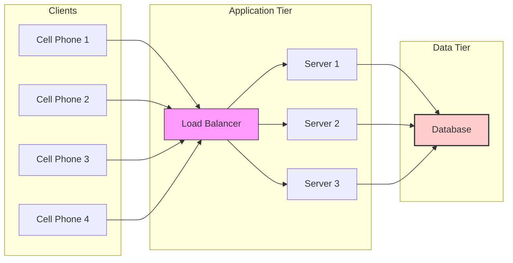

# Distributed Consensus And Data Replication Strategies On The Server (1080P25) - Part 1

# Master-Slave Architecture

The Master-Slave architecture is a common pattern used to address single points of failure and improve system reliability and scalability, particularly with databases.

## Problem Scenario: Single Point of Failure

Consider a typical system architecture as depicted in the diagram:
*   **Clients:** Multiple cell phones sending requests.
*   **Load Balancer:** Distributes requests from clients to application servers.
*   **Application Servers (S1, S2, S3):** Process requests.
*   **Single Database:** Stores all critical data.

_screenshots/frame_00-00-00.jpg)

This setup, while common, presents a critical vulnerability: the **single database is a single point of failure (SPOF)**.

*   **Impact of SPOF:** If the database crashes, the entire business operation halts because all application requests depend on data retrieved from it.
*   **Identification:** Any single component in a system diagram (e.g., a load balancer or a database) should immediately be flagged as a potential SPOF.

## Solution: Data Replication

To mitigate the risk of a database crash, the simplest solution is to **replicate the data**.

*   **Concept:** Create a copy of the database's data.
*   **Hardware Consideration:** This copy should ideally be stored on a separate hardware component (e.g., a different RAID card or server) to prevent both the original and the copy from failing simultaneously.

_screenshots/frame_00-01-48.jpg)

## Data Replication Methods

There are two primary ways to maintain data consistency between the original database and its copy:

### 1. Asynchronous Replication

*   **Mechanism:** The original database processes transactions and updates its data independently. It then, at a later time, sends updates to the copy. The original database does not wait for the copy to acknowledge the update before proceeding.
*   **Advantages:**
    *   **Low Load:** Places minimal additional load on the original database, as it doesn't wait for replication acknowledgments.
    *   **Performance:** Can offer better write performance for the primary database.
*   **Disadvantages:**
    *   **Out of Sync:** The copy (replica) will inevitably be out of sync with the original database for a period.
    *   **Data Inconsistency on Crash:** If the original database crashes before an update is replicated to the copy, that specific transaction might be lost on the copy, leading to inconsistent data.
    *   **Use Case:** Acceptable in scenarios where some data inconsistency or loss is tolerable for a short period (e.g., analytics databases, eventually consistent systems).

### 2. Synchronous Replication

*   **Mechanism:** The original database (now referred to as the **Master**) processes a transaction and then waits for the copy (now referred to as the **Slave**) to acknowledge that it has successfully received and applied the update. Only after the slave's acknowledgment does the master commit the transaction.
*   **Enforcement:** This strict consistency is typically enforced through application code or database configuration.
*   **Process:**
    1.  The Master receives a command (e.g., "add 100 to user ID1").
    2.  The Master records this command in its transaction log.
    3.  The Master sends this command to the Slave.
    4.  The Slave applies the command to its own data.
    5.  The Slave sends an acknowledgment back to the Master.
    6.  The Master commits the transaction.
*   **Advantages:**
    *   **High Consistency:** Ensures that the Master and Slave databases are always in a consistent state.
    *   **Zero Data Loss:** In case of a Master crash, the Slave has all committed transactions, preventing data loss.
*   **Disadvantages:**
    *   **Increased Latency/Load:** The Master has to wait for the Slave's acknowledgment, which adds latency to write operations and increases the load on the Master.
    *   **Performance Impact:** Can negatively impact the write performance of the primary database.
*   **Assumption:** For the Slave to maintain the same consistent state, it assumes that all commands are applied in the exact same serial order as they were on the Master.

## Master-Slave Terminology

The original database that receives all write operations and replicates them is called the **Master**. The copy or replica database that receives and applies these replicated changes is called the **Slave**.

_screenshots/frame_00-02-42.jpg)

### Comparison of Replication Methods

| Feature            | Asynchronous Replication                               | Synchronous Replication                                  |
| :----------------- | :----------------------------------------------------- | :------------------------------------------------------- |
| **Consistency**    | Eventual consistency; potential for temporary inconsistency | Strong consistency; Master and Slave are always consistent |
| **Data Loss on Crash** | Possible data loss if Master crashes before sync       | Zero data loss for committed transactions                |
| **Master Load**    | Lower                                                  | Higher (due to waiting for acknowledgments)              |
| **Write Latency**  | Lower                                                  | Higher                                                   |
| **Complexity**     | Simpler to implement                                   | More complex to implement and manage                     |
| **Use Cases**      | Analytics, read-heavy workloads, tolerant of minor data loss | Financial systems, critical data, strict consistency requirements |

## Architectural Diagram: Initial Setup (SPOF)


*The diagram above illustrates the initial system architecture with a single database, highlighting it as a potential single point of failure.*

---

## Master-Slave Architecture (Continued)

The Master-Slave architecture defines distinct roles for database instances:

*   **Master:** Handles all write operations and replicates them to slaves.
*   **Slave:** Receives replicated data from the master and handles read operations. It does not directly accept write operations from application servers.

_screenshots/frame_00-03-01.jpg)

### Handling Write Operations on Slaves

A crucial question arises: What happens if an application server tries to send a write operation directly to a slave? For example, if Server S3 attempts to "add 200 rupees to User ID2" on the slave.

There are two main approaches to this problem:

1.  **Strict Master-Slave Enforcement (Typical):**
    *   **Rule:** Slaves are explicitly configured to *never* accept write operations directly from application servers.
    *   **Mechanism:** Any write request directed to a slave is either rejected or redirected to the master.
    *   **Benefit:** Maintains a clear separation of concerns, simplifies data consistency, and prevents conflicts.
    *   **Implication:** Only the master can initiate changes that propagate throughout the system.

2.  **Elevating Slave to Master (Master-Master Architecture):**
    *   **Concept:** If a slave is allowed to accept write operations, it effectively takes on the role of a master.
    *   **Result:** The system transitions from a Master-Slave relationship to a **Master-Master architecture**, where both nodes can accept write operations.

## Master-Master Architecture

In a Master-Master architecture, multiple database instances are configured to act as masters, meaning each can accept read and write operations independently.

*   **Key Principle:** Any database copy that accepts write operations is considered a master.
*   **Replication:** Changes made on one master are propagated to the other masters, ensuring data synchronization. This typically involves bidirectional replication.

### Perceived Advantages of Master-Master

The Master-Master architecture appears to offer several benefits:

*   **Load Balancing for Writes:** Since both nodes can accept write operations, the write load can be distributed across them.
*   **High Availability:** If one database (master) crashes, the other database (master) can seamlessly take over all operations, including reads and writes, without requiring manual failover. This creates a highly resilient system.
*   **Resilience:** The system seems robust against single-node failures.

### The Split-Brain Problem

Despite its apparent advantages, the Master-Master architecture in a distributed system introduces a significant challenge known as the **Split-Brain Problem**.

*   **Nature of Distributed Systems:** Distributed systems are inherently complex due to network partitions and communication failures. The assumption that nodes are always aware of each other's true state is flawed.

*   **Scenario:**
    1.  Assume Master A and Master B are both operational and synchronizing data.
    2.  A network failure occurs between A and B (e.g., a router fails), preventing them from communicating.
    3.  Neither A nor B has actually crashed; they are both still running.
    4.  However, because they cannot communicate, both A and B independently assume that the *other* master has failed, and each declares itself the sole active master.
    5.  Both A and B then continue to accept read and write operations independently.

*   **Consequences (Example):**
    *   A user (User X) has an account balance of $120.
    *   User X sends a request to Master A to deduct $100. Master A processes this.
    *   User X then sends another request to Master B to deduct $50. Master B processes this.
    *   Since A and B are partitioned, neither is aware of the other's operations.
    *   Master A's view: Balance is $20 ($120 - $100).
    *   Master B's view: Balance is $70 ($120 - $50).
    *   When the network partition is resolved, and A and B try to synchronize, they will have conflicting data for User X's balance, leading to **data inconsistency** and potential financial discrepancies (e.g., the user effectively spent $150 from a $120 balance, resulting in a negative balance that shouldn't have been possible).

_screenshots/frame_00-06-06.jpg)

*The image above visually represents the confusion and potential issues that arise when a system's "brain" (its state and decision-making) becomes split.*

### Solving the Split-Brain Problem: Quorum-Based Solutions

The Split-Brain problem can be addressed using a **quorum-based approach**, which typically involves adding more nodes to the architecture.

*   **Concept:** Instead of just two nodes, introduce a third node (or more) to establish a "majority vote."
*   **Assumption:** The probability of a node crashing *and* the network link between the remaining two nodes failing simultaneously is extremely low.
*   **Mechanism with Three Nodes (A, B, C):**
    *   If C crashes, A and B can still communicate and form a quorum (2 out of 3 nodes) to agree on the system state and continue operations as masters.
    *   If the link between A and B fails, but C is operational, then A can communicate with C, and B can communicate with C. A and C can form a quorum, and B will be isolated or designated as a non-master.
    *   Crucially, if a network partition isolates A from B and C, then B and C can still form a quorum. A, being alone, cannot form a quorum and must stand down (become read-only or offline) to prevent inconsistencies.

This approach ensures that only a majority of nodes can make decisions and accept writes, preventing conflicting updates during network partitions.

_screenshots/frame_00-04-17.jpg)

---

### Solving the Split-Brain Problem (Continued)

The quorum-based solution for the split-brain problem relies on the principle of distributed consensus, where nodes must agree on a consistent state.

Consider a scenario with three nodes (A, B, C) that are all potential masters, and a network partition occurs between A and B, preventing direct communication.

_screenshots/frame_00-06-39.jpg)

#### Scenario Walkthrough:

1.  **Initial State:** All nodes (A, B, C) are in a consistent state `S0`.
    ```mermaid
    graph LR
        A_S0[A - S0] --- C_S0[C - S0]
        B_S0[B - S0] --- C_S0
        A_S0 --- B_S0
    ```

2.  **Network Partition:** The link between A and B fails.
    ```mermaid
    graph LR
        A_S0[A - S0] --- C_S0[C - S0]
        B_S0[B - S0] --- C_S0
        A_S0 -.- B_S0_broken[Broken Link]
    ```

3.  **Write Request to A:** A receives a write request. It processes the request, updating its state from `S0` to `SX`.
    *   A attempts to propagate `SX` to B, but the link is down, so this fails.
    *   A successfully propagates `SX` to C.
    *   Now, A is in `SX`, C is in `SX`, and B is still in `S0`.
    ```mermaid
    graph LR
        A_SX[A - SX] --- C_SX[C - SX]
        B_S0[B - S0] --- C_SX
        A_SX -.- B_S0_broken[Broken Link]
    ```

4.  **Write Request to B:** Simultaneously, B receives a write request. It processes the request, updating its state from `S0` to `SY`.
    *   B attempts to propagate `SY` to C.
    *   **Consensus Check:** C, already in state `SX`, compares `SY` from B with its current state `SX`. Since they don't match (`SY != SX`), C rejects B's update.
    *   **Rollback/Rejection:** C informs B that its state is outdated (`S0` to `SY` is not valid from C's perspective, which is `SX`). B's transaction is rolled back, and it's instructed to update its state to `SX` (to align with the majority: A and C).
    *   After rollback, B syncs with C and updates its state to `SX`.
    *   The user who initiated the transaction on B receives an error (transaction failed) and can retry with the correct, updated state (`SX`).

_screenshots/frame_00-06-59.jpg)

*The diagram shows the state propagation and the role of node C in mediating consistency between A and B during a split-brain scenario.*

5.  **Subsequent Operations:**
    *   Once B is updated to `SX`, it can rerun its original transaction to reach `SY`. This `SY` would then be propagated to C and A, ensuring all nodes eventually converge to `SY` (or a later state `SZ` if another transaction occurs on A).

This process ensures that inconsistent states are detected and resolved through rollback and synchronization, preventing the actual "split-brain" where both nodes independently commit conflicting data. The key is that a transaction is only considered *committed* after all participating nodes in the quorum have acknowledged and applied it.

### Distributed Consensus

The underlying principle for solving the split-brain problem is **Distributed Consensus**, where multiple nodes in a distributed system agree on a single value or state.

*   **Goal:** Ensure all nodes have a consistent view of the system's state, even in the presence of failures or network partitions.
*   **How it works:** Nodes communicate and vote to determine the "correct" state. A majority (quorum) is typically required to make a decision.

#### Distributed Consensus Protocols

Several protocols are designed to achieve distributed consensus:

1.  **Two-Phase Commit (2PC):**
    *   **Mechanism:** A coordinator node orchestrates the transaction across multiple participants in two phases:
        *   **Phase 1 (Prepare):** Coordinator asks all participants if they can commit the transaction. Participants vote "yes" or "no" and prepare to commit.
        *   **Phase 2 (Commit/Abort):** If all participants vote "yes," the coordinator sends a "commit" command. If any vote "no," or a timeout occurs, the coordinator sends an "abort" command.
    *   **Drawbacks:**
        *   **Slowness:** Can be very slow due to blocking nature and network latency.
        *   **Coordinator SPOF:** The coordinator itself can be a single point of failure. If it crashes during the commit phase, participants can be left in an uncertain state.

2.  **Three-Phase Commit (3PC):**
    *   **Mechanism:** An extension of 2PC designed to address some of its blocking issues, particularly coordinator failure. It adds a "pre-commit" phase to ensure that if the coordinator fails, participants can still agree on an outcome.
    *   **Complexity:** More complex to implement than 2PC.
    *   **Still Blocking:** Can still be blocking under certain failure scenarios.

3.  **Multi-Version Concurrency Control (MVCC):**
    *   **Mechanism:** Instead of updating data in place, MVCC keeps multiple versions of data. When a transaction modifies data, it creates a new version. Different transactions can see different versions of the same data, preventing readers from blocking writers and vice-versa.
    *   **Advantages:**
        *   **High Concurrency:** Allows multiple transactions to operate on the same data concurrently without locking, improving performance.
        *   **Snapshot Isolation:** Transactions typically operate on a consistent snapshot of the database, ensuring that a transaction sees a consistent view of data even if other transactions are modifying it.
    *   **Usage:** Popular in many modern relational databases, such as PostgreSQL.

_screenshots/frame_00-09-51.jpg)
*The image highlights MVCC as a sophisticated concurrency control mechanism.*

**Note:** The choice of consensus protocol depends on the specific requirements for consistency, availability, and performance of the distributed system.

---

### Multi-Version Concurrency Control (MVCC) (Continued)

MVCC is a sophisticated technique for managing concurrent access to data in a database, ensuring consistency without sacrificing too much performance.

*   **Core Idea:** Instead of updating data in place, MVCC creates a new version of data for each modification. This allows different transactions to see different "snapshots" or versions of the database.
*   **Versions and Reads:**
    *   If a system is configured for "dirty reads" (where some inconsistency is acceptable for performance), it might allow a transaction to read an older version of data while a newer version is being written.
    *   For stricter consistency (e.g., "serializable reads" to prevent "phantom reads"), MVCC ensures that transactions only read versions of data that are consistent with their isolation level, potentially making reads slower but guaranteeing data integrity.
*   **Benefits:** High concurrency, non-blocking reads, and flexible consistency levels.
*   **Implementation:** Used by powerful databases like PostgreSQL.

_screenshots/frame_00-10-01.jpg)

### Saga Pattern

The Saga pattern is a way to manage long-running, distributed transactions, especially in microservices architectures, where a single logical transaction spans multiple services and databases.

*   **Concept:** A Saga is a sequence of local transactions, where each local transaction updates data within a single service. If a local transaction fails, the Saga executes compensating transactions to undo the changes made by previous local transactions.
*   **Analogy:** Think of it as a "long story" or a long transaction composed of smaller, individual steps.

#### Saga Use Cases:

1.  **Food Ordering Application:**
    *   **Scenario:** A customer places an order for 200 rupees.
    *   **Saga Steps:**
        1.  **Lock Funds:** The application requests the customer's bank to "lock" 200 rupees from their account. The money is not withdrawn yet.
        2.  **Restaurant Confirmation:** The order is sent to the restaurant for confirmation.
        3.  **Outcome:**
            *   **Success:** If the restaurant confirms, the locked funds are formally withdrawn.
            *   **Failure:** If the restaurant rejects the order (or a timeout occurs), the locked funds are released back to the customer's account without any actual withdrawal or complex reversal.
    *   **Benefit:** Avoids complex refunds and settlements if the order fails at an early stage.

2.  **Phone Call Billing:**
    *   **Scenario:** A user makes a long phone call (e.g., 30 minutes).
    *   **Saga Steps (Iterative):**
        1.  Instead of a single charge at the end, the system might "lock" funds in small increments (e.g., every minute) as the call progresses.
        2.  If the call fails at any point, the locked funds are released.
        3.  If the call completes successfully, the accumulated locked funds are converted into a final charge.
    *   **Benefit:** Manages ongoing service costs and allows for graceful rollback if the service is interrupted.

The Saga pattern is critical for maintaining consistency in distributed environments where atomic transactions across multiple independent services are not feasible.

## Advantages of Master-Slave Architecture

Despite the complexities of distributed consensus and the split-brain problem in Master-Master setups, the simple Master-Slave architecture offers significant advantages for specific use cases:

1.  **Data Redundancy and Disaster Recovery:**
    *   The primary benefit is having a **replica of data**. If the master database crashes, a slave can be promoted to master, ensuring business continuity.

2.  **Scalability for Read Operations:**
    *   **Read Scaling:** You can add numerous slaves (e.g., 10, 20) and distribute read operations across them. This is highly effective for applications with heavy read workloads.
    *   **Example (Facebook comments):** If a user adds a comment, it's written to the master. It might take a short time to propagate to slaves. For a non-critical action like viewing comments, reading from a slightly outdated slave is often acceptable, allowing massive scaling of read requests.
    *   **Mechanism:** Application servers (S1, S2, S3) can direct read requests to any available slave, while all write requests go to the master.

_screenshots/frame_00-11-51.jpg)
*The diagram depicts how multiple slaves can be added to offload read operations from the master.*

## Mitigating Master-Slave Limitations with Sharding

While Master-Slave helps with read scaling and availability, it doesn't solve the problem of a single master becoming a bottleneck for write operations or the total storage capacity. **Sharding** is a technique to address these limitations.

*   **Concept:** Sharding involves horizontally partitioning a database into smaller, more manageable pieces called "shards." Each shard is an independent database, responsible for a subset of the data.
*   **Responsibility Distribution:** Instead of one large database, you have multiple smaller databases (shards), each handling a specific range of data (e.g., User IDs 1-100 on Shard A, 101-200 on Shard B, 201-300 on Shard C).

_screenshots/frame_00-12-12.jpg)

*The image illustrates the concept of sharding, where data is divided among multiple nodes, potentially with their own master-slave setups.*

### Benefits of Sharding:

1.  **Reduced Damage Scope:** If one shard (e.g., Shard C handling User IDs 200-300) fails, only the users within that specific range are affected, not the entire user base. This limits the "blast radius" of a failure.
2.  **Further Scalability:** Each shard can itself be implemented with a Master-Slave architecture.
    *   If Shard C (acting as a master for its data range) crashes, its dedicated slave can be promoted to master for that shard's data, ensuring high availability for that specific data segment.
    *   This setup requires a coordinator or routing layer to direct requests to the correct shard and handle failover for individual shards.

_screenshots/frame_00-12-34.jpg)

---

### Mitigating Master-Slave Limitations with Sharding (Continued)

When combining sharding with a Master-Slave architecture, a more robust and fault-tolerant system can be built.

*   **Coordinator Role:** An external coordinator component is essential. When a master node within a shard (e.g., Shard C) crashes, the coordinator detects this failure.
*   **Failover Process:**
    1.  The coordinator identifies the slave associated with the failed master (Shard C's slave).
    2.  It promotes this slave to become the new master for that specific shard.
    3.  All subsequent read and write requests for data belonging to Shard C are then redirected to the new master.
    4.  The crashed node can then be brought back online (or replaced) and configured as a new slave to the newly promoted master.
*   **Ensuring Consistency:** Protocols like Two-Phase Commit (2PC) or other distributed consensus mechanisms can be employed within this sharded, master-slave setup to ensure that the master and its slave(s) remain in sync. This guarantees that even with a single node failure, the system continues to operate correctly and consistently.

_screenshots/frame_00-13-41.jpg)
*The diagram illustrates a sharded system where each shard (e.g., A, B, C) might have its own master-slave pair, with a coordinator managing failover and consistency.*

This sophisticated combination of sharding and master-slave replication, managed by consensus algorithms, highlights the extensive engineering and algorithmic thinking required to build reliable and scalable distributed systems.

## Conclusion on System Design Architectures

Designing reliable and scalable distributed systems involves a deep understanding of various algorithms, protocols, and architectural patterns. Concepts like Master-Slave replication, Master-Master replication, distributed consensus (e.g., 2PC, 3PC, MVCC), and sharding are fundamental to addressing challenges such as single points of failure, data consistency, and performance bottlenecks. Each approach has its trade-offs, and the optimal solution depends heavily on specific application requirements for consistency, availability, and partition tolerance.

---

### Additional Resources (Product Placement)

For those preparing for system design interviews, a strong foundation in algorithms and data structures is often required. Resources like **AlgoExpert** are available to help with this preparation.

*   **Content:** AlgoExpert offers 65 hand-picked algorithm questions with comprehensive explanations, including coding and whiteboard solutions, available in 5 programming languages (JavaScript, Python, C++, Java, Go). It provides over 50 hours of video explanations, space-time complexity analyses, and interview tips.
*   **Target Audience:** Particularly useful for individuals targeting slightly senior roles that require strong algorithm knowledge.
*   **Pricing:** The product is available for $65 for a one-time purchase or $20 per month.
*   **Discount:** A 30% discount is available using the promo code `GORF`, reducing the one-time purchase price to $45.50 USD. Further details and a link are provided in the video description.

_screenshots/frame_00-15-06.jpg)
*The screenshot displays the AlgoExpert platform highlighting its features.*

_screenshots/frame_00-15-18.jpg)
*This image shows a calculator confirming the discounted price of AlgoExpert.*

---

**Further Engagement:**
*   Feel free to leave any doubts or suggestions in the comments section.
*   A weekly poll will be posted in the community tab to vote on future video topics.
*   If you found this video helpful, please like and subscribe for more content.
</REFINEDNOTES>

---

