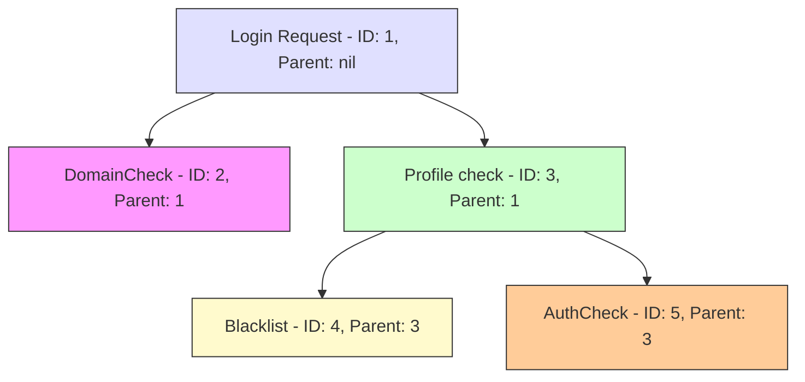
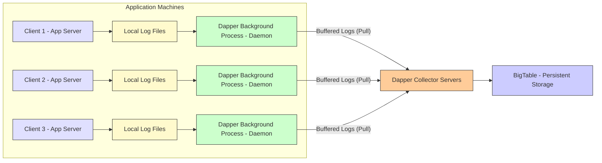

# Google Dapper, A Large Scale Distributed Systems Tracing Infrastructure (1080P25) - Part 1

# Google Dapper: A Request Tracing System

_screenshots/frame_00-00-00.jpg)

Google Dapper, introduced in 2010, is a distributed request tracing system designed to monitor and debug operations within Google's vast service infrastructure. It provides engineers with visibility into the complex paths requests take through thousands of backend services.

### The Need for Request Tracing

Consider a simple Google Search query, such as "large language models".
_screenshots/frame_00-00-24.jpg)
When a user submits this query, the process involves:
*   Sending the query to Google servers.
*   These servers potentially interacting with thousands of data stores.
*   Fetching and aggregating results from various sources.
*   Presenting the aggregated, paginated results to the user.

Behind this seemingly simple interaction, a complex chain of events unfolds. As a Google engineer, understanding this chain is critical for debugging, performance optimization, and understanding system behavior. Dapper addresses this by tracing the entire request path, providing insights into:
*   Client-to-server communication.
*   Server-to-data store interactions.
*   Aggregation processes.
*   Latency at each step.
*   Overall response time.

### Key Requirements for Dapper

For a tracing system like Dapper to be effective and adopted across an organization like Google, it must meet several critical requirements, balancing both technical and operational considerations.

_screenshots/frame_00-02-04.jpg)

1.  **Fast (Low-Latency):**
    *   The tracing system must not significantly impact the performance of production services.
    *   Engineers will not onboard a system that introduces noticeable latency or overhead.
    *   This is a paramount technical requirement.

2.  **Easy-to-Use:**
    *   The system should be straightforward to onboard, set up, and maintain.
    *   Simplicity in integration and usage promotes widespread adoption.
    *   This falls under the "political" or "ease of use" requirements.

3.  **Universal (Used by All Services):**
    *   For comprehensive tracing, all services involved in a request path must utilize Dapper.
    *   Partial adoption limits visibility, making it impossible to trace the entire request flow and pinpoint issues in uninstrumented services.
    *   This is a crucial operational requirement for end-to-end debugging.

4.  **High-Availability:**
    *   Dapper itself is a debugging tool; therefore, it must be highly available.
    *   If Dapper is down or slow, engineers cannot debug other failing services.
    *   Its reliability is essential for maintaining the overall health of Google's infrastructure.

5.  **Real-time Tracing:**
    *   Data consistency and freshness are vital for effective debugging.
    *   Engineers need to see requests going wrong in near real-time (e.g., less than one minute since creation) to quickly identify and resolve problems.

_screenshots/frame_00-02-42.jpg)

6.  **Scalable:**
    *   Google's scale demands a tracing system capable of handling immense data volumes.
    *   Dapper processes approximately **1 terabyte of request traces per day**.
    *   While scalable, it doesn't store traces indefinitely; engineers typically require traces from the last two weeks, so data is retained for that period.

### Achieving Universal Adoption with Software Clients

One significant aspect of Dapper's success in achieving universal adoption, despite the "political" challenges of integrating it across diverse services, is its reliance on **software clients**.
*   Google leverages generic client libraries for making remote calls (e.g., RPC clients).
*   Dapper's tracing functionality is integrated directly into these generic clients.
*   By instrumenting these fundamental communication libraries, Dapper automatically captures trace data for virtually any service that uses them, making request tracing a universal feature by default.

### Dapper's Data Schema: Spans

_screenshots/frame_00-03-57.jpg)

The fundamental unit of data stored and managed by Dapper is an object called a **Span**. Each span represents a single operation or step within a request's lifecycle. Further details on the internal structure and relationships of spans will be discussed.

---

### Dapper's Data Schema: Spans (Continued)

A **span** represents a single logical unit of work within a distributed trace. It captures information about an operation, such as its name, start time, duration, and associated metadata. Spans are organized hierarchically to reflect the causal relationships between operations.

_screenshots/frame_00-04-10.jpg)

Consider a `Login Request` as an example:

1.  **Root Span: Login Request**
    *   `ID: 1`
    *   `Parent: nil` (This is the top-level operation)

2.  **Child Spans of Login Request:**
    *   **DomainCheck**
        *   `ID: 2`
        *   `Parent: 1` (This RPC call verifies if the domain is allowed)
    *   **Profile check**
        *   `ID: 3`
        *   `Parent: 1` (This RPC call checks if a user profile exists)

3.  **Child Spans of Profile check:**
    *   **Blacklist**
        *   `ID: 4`
        *   `Parent: 3` (Checks if the user is blacklisted)
    *   **AuthCheck**
        *   `ID: 5`
        *   `Parent: 3` (Authenticates the user, e.g., with a password)

_screenshots/frame_00-05-08.jpg)

This hierarchical structure of spans forms a **trace**. All spans belonging to the same end-to-end request share a common **Trace ID**. For instance, in the example above, all spans (1, 2, 3, 4, 5) would have the `Trace ID = 1`. This allows Dapper to aggregate all related spans and present a complete view of the request path, whether for a high-level overview or a service-specific deep dive.

The relationships can be visualized as follows:

#### Span Events

Each span internally records a set of **events**. These events are micro-objects, effectively an array of objects within a span, each storing:
*   **Timestamp:** When the event occurred.
*   **Service:** The service that initiated the event.
*   **Annotation:** A descriptive text string (e.g., "RPC call started," "RPC call stopped," "Database query executed").

### Dapper System Architecture

The Dapper system is designed for simplicity and efficiency to meet its stringent requirements for low-latency and high scalability.

_screenshots/frame_00-06-40.jpg)

The architecture involves several components:

1.  **Clients (Application Servers):**
    *   These are the application servers running Google's services.
    *   They use Dapper-instrumented libraries for making remote calls.
    *   Instead of sending trace data directly to a central server, clients persist their tracing logs to **local storage** (typically log files on disk).

2.  **Dapper Background Process (Daemon):**
    *   A daemon process runs on each application machine.
    *   It continuously consumes the tracing logs generated by the local clients.
    *   This daemon buffers the log lines, acting as a local aggregator and temporary store.

_screenshots/frame_00-06-52.jpg)

3.  **Dapper Collector Servers:**
    *   These are dedicated servers responsible for collecting trace data from the background daemons.
    *   Collectors **pull** buffered log lines from the daemons.
    *   They process these raw log lines, converting them into structured **span** objects.

4.  **BigTable (Persistent Storage):**
    *   The processed span objects are then stored persistently in Google's BigTable.
    *   **BigTable** is a distributed NoSQL database well-suited for sparse data and multiple versions, making it ideal for storing trace data. It is backed by GFS (now Colossus).
    *   Its inherent reliability and scalability contribute significantly to Dapper's high availability and ability to handle 1 terabyte of trace data per day.

This design ensures that:
*   **Low Latency:** Clients log locally, minimizing impact on application performance.
*   **Scalability:** Data is processed asynchronously and stored in a highly scalable system like BigTable.
*   **High Availability:** BigTable provides robust storage, and the distributed nature of daemons and collectors adds resilience.

---

### Querying Traces in Dapper

_screenshots/frame_00-08-03.jpg)

As depicted in the Dapper system architecture, application clients generate logs that are processed by Dapper background daemons, collected by Dapper collectors, and finally stored as spans in BigTable.

When a Google engineer needs to debug an issue or analyze a request, they can query Dapper for a specific trace.

1.  **Trace ID Indexing:** BigTable maintains an index on the `Trace ID`. This allows for efficient retrieval of all spans associated with a particular end-to-end request.
2.  **Querying:** An engineer can use a `Get Trace(ID)` query.
    *   By providing the unique `Trace ID` of a request (e.g., from a user's search query like "large language models"), BigTable returns an array of all related spans.
    *   This array shows all the systems and services that were hit during that single request, providing a complete picture of its execution path.

_screenshots/frame_00-09-01.jpg)

#### Trace Availability Latency

The time it takes for a trace to become available for querying in BigTable is generally low, but with some variability:
*   **Typical Availability:** Most traces reach BigTable and are available for querying within **15 seconds** of their creation.
*   **Typical Query Response:** Engineers usually get trace results within **1 minute** of making a `Get Trace` query.
*   **Worst-Case Latency:** In rare scenarios, it can take up to **2 hours** for a trace to appear in BigTable. While not ideal, this latency is generally considered acceptable for Dapper's debugging purposes, as it provides eventual consistency for historical analysis.

### Minimizing Overhead: Request Sampling

A critical requirement for Dapper is to have very **low overhead** and minimal impact on the latency of production systems. To achieve this, Dapper employs a clever strategy: **request sampling**.

_screenshots/frame_00-10-23.jpg)

#### How Sampling Works

Instead of tracing every single request, Dapper samples a small fraction of them. This significantly reduces the volume of data processed and stored, thereby minimizing I/O calls and overall system impact.

*   **Fixed Sampling Rate (Production Systems):**
    *   For high-volume production services, Dapper uses an extremely low fixed sampling rate.
    *   The typical rate is **1 in 1024 requests**. This means only one out of every 1024 requests is chosen for tracing.
    *   Despite this low rate, given Google's immense request volume, enough data is still collected for meaningful analysis.
    *   This aggressive sampling ensures that the tracing system has a near-zero impact on the latency of the core services.
    *   All sampled spans belonging to the same request retain the same `Trace ID`.
    *   If the total `Trace ID` space is 2^64, then `Trace IDs` with a value less than or equal to (2^64 / 1024) ≈ 2^54 are selected for sampling.

*   **Adaptive Sampling Rate (Low-Volume Services):**
    *   For services with lower request volumes (e.g., internal tools or smaller applications), a fixed rate like 1/1024 might not yield enough samples to be useful.
    *   In such cases, Dapper supports an **adaptive sampling rate**.
    *   Engineers can configure a minimum number of samples per second (e.g., "at least 10 samples per second").
    *   If a service processes 100 requests per second and needs 10 samples, the system automatically adjusts the sampling rate to 1/10.
    *   This ensures that even low-volume services collect sufficient trace data for debugging, while still minimizing overhead relative to their traffic. Adaptive sampling is less frequently used because most Google services handle very high volumes.

_screenshots/frame_00-11-45.jpg)

#### Benefits of Sampling

*   **Reduced Latency Impact:** By tracing only a small fraction of requests, the overhead on production systems is drastically minimized.
*   **Scalability:** Less data needs to be collected, processed, and stored, making the system more scalable.
*   **Sufficient Data:** For high-volume systems, even a tiny sample rate provides enough data points to identify patterns and debug issues effectively.

Engineers can query for sampled requests using `Get Request(Service, start_timestamp, end_timestamp)` to retrieve all successfully sampled and persisted requests for a given service within a specified time range.
</REFINEDNOTES>

---

### Dapper's Design Philosophy and Ecosystem Integration

_screenshots/frame_00-11-57.jpg)

Dapper stands out as a well-engineered system due to its fundamental design principles and its seamless integration within the broader Google ecosystem.

1.  **Leveraging Existing Infrastructure:**
    *   Instead of building every component from scratch, Google engineers strategically utilized existing, proven systems.
    *   **BigTable:** Used for reliable and scalable persistent storage of trace data.
    *   **Generic RPC Clients:** Integrating Dapper's tracing functionality directly into Google's universal Remote Procedure Call (RPC) clients significantly boosted the system's adoptability. This meant any service using these standard communication libraries automatically generated trace data, making Dapper's reach universal without requiring custom instrumentation for every application.

2.  **Ease of Adoption:**
    *   This approach of integrating into existing client libraries and using established backend systems greatly reduced the friction for engineers to adopt Dapper. It addressed the "easy-to-use" and "universal" requirements by making tracing a default, almost invisible, part of their workflow.

3.  **Ecosystem Integration:**
    *   Dapper is not an isolated system; it functions as a foundational component within Google's operational toolkit.
    *   Other critical monitoring and debugging systems, such as **Google Monarch** (Google's global monitoring system), actively consume and utilize Dapper traces to identify and debug problematic requests. This tight integration enhances the overall observability and diagnostic capabilities across Google's services.

In essence, Dapper's success lies in its elegant simplicity, its strategic reuse of robust internal technologies, and its deep integration, which collectively make it an indispensable tool for understanding and maintaining Google's massive distributed systems.

---

