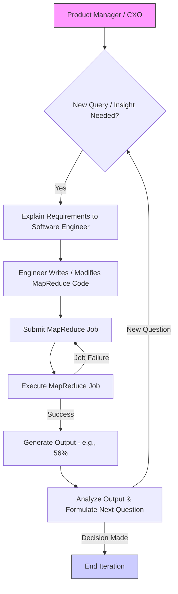

# Google Dremel： Interactive Analysis Of Web Scale Datasets (1080P25) - Part 1

# Google Dremel: Introduction and Motivation

_screenshots/frame_00-01-38.jpg)

## 1. Introduction to Dremel

*   **Origin:** Dremel is a highly influential system developed by Google, first published in a 2008 paper.
*   **Continued Relevance:** Even over 15 years later, Dremel's architecture and principles are foundational. It is still actively used at Google, notably as the underlying technology for BigQuery.
    _screenshots/frame_00-00-37.jpg)
*   **Recognition:** Dremel's long-term impact was recognized with the VLDB Test of Time Award in 2020, 12 years after its initial publication.
*   **Importance:** Understanding Dremel is crucial for any software engineer involved in large-scale data analytics.

## 2. The Problem Dremel Solved: Interactive Data Analysis at Scale

In 2008, Google faced a significant challenge: analyzing petabytes of data efficiently and interactively.

### 2.1. User Needs and Data Volume

*   **Data Scale:** Google possessed petabytes of data that required analysis.
*   **Stakeholders:** Product Managers (PMs), Engineers, and CXOs needed to query this vast dataset to identify patterns and inform decisions.
*   **Query Nature:** These stakeholders primarily required "one-off" or ad-hoc queries, meaning they needed quick answers to specific, often exploratory, questions rather than predefined, routine reports.
    _screenshots/frame_00-02-51.jpg)

### 2.2. Limitations of Existing Solutions (MapReduce)

At the time, the standard approach for large-scale data processing at Google was MapReduce. While powerful for batch processing, it presented several critical drawbacks for interactive analytics:

*   **Slow Processing:** Scanning and processing petabytes of data with MapReduce was inherently time-consuming, leading to long execution times for queries.
*   **Engineer-Centric Workflow:**
    *   **Requirement Gathering:** When a PM or CXO had a question, they had to explain their requirements to a software engineer.
    *   **Code Development:** The engineer would then write custom MapReduce jobs (scripts) in code to address the specific query.
    *   **Job Execution:** The code would be executed, and eventually, an output would be generated (e.g., "56% of people on long drives stop at restaurants").
    _screenshots/frame_00-03-51.jpg)
*   **Poor Iteration Time:**
    *   **Example Scenario:** A PM might initially ask, "How many people on long rides (e.g., Mumbai to Goa) stop at restaurants for food?" After getting an answer (e.g., 56%), they would likely have follow-up questions, such as "What was this percentage in the last three months?" or "Is this number increasing over time?"
    *   **Repetitive Process:** Each new question required the entire cycle to repeat: explaining to an engineer, writing new code, and executing a new MapReduce job.
    *   **High Latency:** This iterative process was extremely slow, typically taking days (1 to 3 days) to get answers, even with dedicated engineering resources. This made rapid decision-making impossible.

*   **Operational Challenges:** MapReduce jobs could be prone to failures, necessitating restarts and further prolonging the analysis process.

### 2.3. Consequences of MapReduce Limitations

The inefficiencies of MapReduce for ad-hoc queries led to significant frustration and wasted resources:

*   **Product Managers & CXOs:** Complained about the slowness of engineers and systems, hindering their ability to gain timely insights and make data-driven decisions.
*   **Engineers:** Spent a considerable amount of their time on data mining tasks and communicating with PMs to understand requirements, diverting them from core development work.

## 3. Google's Vision: Interactive Analytics

Faced with these challenges, Google recognized the urgent need for a new system that could provide:

1.  **Interactivity:** The ability to get query results within a minute.
2.  **Efficiency:** Freeing up engineers from constant ad-hoc data mining tasks, allowing them to focus on product development.

This vision laid the groundwork for the development of Dremel.

### 3.1. MapReduce Workflow for Ad-hoc Queries (Pre-Dremel)

---

### 3.2. Dremel's Design Goals for Interactive Analytics

To achieve the goal of interactive analytics and address the limitations of MapReduce, Dremel was designed with two primary objectives:

1.  **Interactive Analytics System (within 1 minute):**
    *   Queries must return results extremely quickly, ideally within one minute, to enable rapid iteration and decision-making.
    *   This required a fundamental shift in how data was accessed and processed.

2.  **Remove Software Engineer (SE) Dependency:**
    *   Empower Product Managers (PMs) and other stakeholders to query data directly without needing a software engineer to write custom code for each query.
    *   **Solution:** Provide an interface that allows PMs (or data analysts) to write SQL queries.
        *   Most PMs have at least a high-level understanding of SQL.
        *   Data analysts, proficient in SQL, are a more cost-effective resource for data querying than highly skilled software engineers writing MapReduce jobs.
        *   This direct querying capability removes an entire layer of dependency, significantly speeding up the iteration cycle.

_screenshots/frame_00-04-04.jpg)

### 3.3. Understanding Access Patterns for Performance

Achieving sub-minute query response times for interactive analytics necessitates a deep understanding of typical access patterns and query types.

*   **Common Query Types:** Interactive analytics systems are predominantly used for:
    *   **Count Queries:** e.g., `COUNT(*)`.
    *   **Statistical Queries:** e.g., `AVG()`, `SUM()`, `PERCENTILE()`.
*   **Stakeholder Needs:** CXOs and PMs are generally interested in aggregate statistics (counts, percentages, averages) rather than individual raw data rows. They want summarized insights to make decisions.
*   **Key Operations:** The most critical operations that need to be "blazingly fast" are:
    *   **Filtration:** Selecting relevant data based on criteria.
    *   **Aggregation:** Computing summary statistics from filtered data.
*   **Distributed Data:** Data is typically distributed across many systems, requiring efficient filtering and aggregation across these distributed sources.

## 4. Dremel Query Architecture

Dremel's architecture is designed to handle these challenges and deliver rapid, interactive query performance. It employs a tree-like serving structure.

_screenshots/frame_00-06-32.jpg)

### 4.1. Components of the Dremel Query Architecture

1.  **Clients:**
    *   These are the users (e.g., Product Managers, Data Analysts) who initiate queries.
    *   They typically interact with Dremel through a dashboard or an interactive user interface.

2.  **Query Manager:**
    *   Receives queries from clients.
    *   **Rate Limiter:** Controls the number of incoming queries to prevent system overload.
    *   **Load Balancer:** Distributes queries across available resources (shards) based on their current load to ensure optimal performance.
    *   **Shard Selection:** Determines which specific data shards are relevant to a given query.

3.  **Root Node:**
    *   Receives queries from the Query Manager.
    *   Acts as the top-level aggregator for query results.
    *   **Query Analysis:** Examines the incoming query to identify which shards contain the necessary data.
    *   **Result Aggregation:** Once all sub-shards return their partial results, the Root node combines them to produce the final answer, which is then returned to the client.
    *   **Shard Distribution:** The Root node understands the data distribution (e.g., shard 1 manages key range K1-K1000, shard 2 manages K > 1000). If a query involves keys from multiple ranges (e.g., K=100 and K=1100), the Root directs the query to all relevant shards.

4.  **Shards (Intermediate Nodes):**
    *   Shards are physical servers, not just logical entities.
    *   They manage specific ranges of data keys.
    *   **Recursive Querying:** Each shard can further decompose and send queries to its own "sub-shards" or child nodes in a recursive manner, forming a tree structure.
    *   **Example:** Shard 1 might have sub-shards Shard 1-1 and Shard 1-2. A query reaching Shard 1 would then be distributed to its children if applicable.

5.  **Leaf Nodes (L1, L2, L3, L4, etc.):**
    *   These are the lowest-level nodes in the Dremel tree architecture.
    *   They are responsible for directly accessing data stored on disk.
    *   **Data Storage:** Dremel leverages Google's distributed file system, Colossus (the successor to GFS), for underlying data storage.
    *   **Local Processing:** Leaf nodes perform the initial filtration and aggregation operations on the data segments they manage, then pass partial results up the tree.

_screenshots/frame_00-07-25.jpg)

### 4.2. Query Flow Example

Consider a query like `SELECT COUNT(*) FROM trips WHERE location = 'nearby'`.

1.  **Client:** Fires the SQL query.
2.  **Query Manager:** Receives the query, performs rate limiting/load balancing, and forwards it to the Root.
3.  **Root:** Analyzes the query, determines which top-level shards (e.g., Shard 1, Shard 2) might contain relevant `trips` data based on `location` or other partitioning keys. It sends the query to these shards.
4.  **Shards (e.g., Shard 1):** Receive the query and recursively pass it down to their sub-shards (e.g., Shard 1-1, Shard 1-2).
5.  **Leaf Nodes (e.g., L1, L2):** Receive the query, access the relevant data blocks on Colossus, perform local filtering (`location = 'nearby'`) and partial counting (`COUNT(*)`).
6.  **Aggregation Upwards:** Partial counts from Leaf Nodes are returned to their parent Shards. Shards aggregate results from their children and pass them up to the Root.
7.  **Root (Final Aggregation):** Receives aggregated counts from all relevant top-level Shards, combines them into a final `COUNT(*)`, and returns the result to the Client.

---

### 4.3. Data Storage and Processing at Leaf Nodes

*   **Data Locality:** When a query for a specific key (e.g., K-100) reaches a leaf node, the node first checks if the data is available on its local disk.
*   **Distributed File System:** If the data is not local, the leaf node retrieves it from a distributed file store.
    *   In 2008, this was the **Google File System (GFS)**.
    *   Currently, the successor to GFS, **Colossus**, is used.
    *   Colossus is a fundamental storage layer for most Google systems.

_screenshots/frame_00-07-36.jpg)

### 4.4. Google's Infrastructure and Dremel's Dependencies

Dremel, like many other Google systems, relies on a suite of foundational infrastructure services:

1.  **Storage:** Provided by **Colossus** (formerly GFS).
2.  **Network Capabilities:** Powered by **Jupiter**. Dremel uses Jupiter for its network communication.
3.  **Compute and Memory:** Managed by **Borg**.
    *   Borg is Google's internal cluster management system, which inspired Kubernetes.
    *   The "shards" (physical servers) in Dremel's architecture are provisioned and managed by Borg.
4.  **Configuration Setup:** Handled by **Spanner**.

_screenshots/frame_00-08-05.jpg)

### 4.5. Compute Estimation and Scalability

*   **Dynamic Compute Allocation:** When a query is made, the Query Manager estimates the necessary compute power.
*   **Compute Measurement:** Compute is measured as `number of machines * number of threads per machine`. The total number of threads across all machines defines the query's compute power.
*   **Scalability:** If a query requires more compute power, the system can dynamically increase the number of threads or machines allocated, which directly impacts the query's execution time.

### 4.6. Multi-level Aggregation and Tree Architecture

*   **Hierarchical Aggregation:** After leaf nodes process data from the file store, partial results are propagated upwards.
    *   A leaf node sends its results to its parent shard.
    *   The parent shard aggregates results from all its children (including other leaf nodes or lower-level shards) and then sends its combined result to its own parent.
    *   This process continues up the tree until the Root node.
*   **Arbitrary Levels:** The Dremel architecture supports any number of levels in its tree structure, indicated by "dots" in diagrams. This allows for flexible scaling and organization of data.
*   **Query Manager's Role in Sharding:** The Query Manager plays a crucial role in suggesting the optimal number of shards required to effectively aggregate a given query, balancing load and performance.
*   **Analogy:** This hierarchical aggregation is conceptually similar to how segment trees or interval trees work, where results from sub-intervals are combined at higher nodes.
*   **Google's Preference for Tree Architectures:** Google frequently uses tree-like architectures in its systems (e.g., Google Monarch) due to their efficiency in aggregating distributed results.

### 4.7. Benefits of Dremel's Architecture

*   **Efficiency:** Queries are typically answered in tens of seconds, a dramatic improvement over the days-long iteration cycles of MapReduce.
*   **Interactive Workflow:** Users (PMs, CXOs) can remain at their desktops, fire a query, wait for a minute or less, get results, and then immediately formulate and execute a new query based on the insights gained. This enables a truly interactive and iterative analytical process.
*   **Pre-fetched Cache (Smart Caching):**
    *   Dremel includes a pre-fetched cache mechanism that intelligently anticipates subsequent queries.
    *   **Example:** If a user queries for "the number of people who visited a restaurant during a long drive," the system will pre-fetch data related to "long drives" and "restaurants."
    *   **Anticipation:** The assumption is that subsequent queries will likely explore similar data domains (e.g., "What kind of restaurants?", "What routes were taken?").
    *   **Performance Boost:** By having this related data already in cache, subsequent queries execute even faster, further enhancing the interactive experience.

_screenshots/frame_00-08-34.jpg)

---

### 4.8. Optimizations for Latency and Accuracy

In addition to the core tree architecture, Dremel incorporates several optimizations to further improve query latency and flexibility:

1.  **High Hit Rate Pre-fetch Cache:**
    *   The pre-fetch cache, mentioned earlier, has a very high hit rate (around 95%).
    *   This significantly reduces latency for subsequent related queries, as data is already in memory.

2.  **Approximate Results (Tolerant Accuracy):**
    *   For many analytical queries, users (PMs, CXOs) do not require 100% precise answers. They are often content with 90-99% accuracy.
    *   **Example:** For a query like "percentage of people who visited a restaurant on a long trip," an answer of "56% ± 2%" is usually sufficient and doesn't affect decision-making.
    *   **Mechanism:** If approximate results are acceptable, the Query Manager can instruct the Root node to return a response as soon as a sufficient percentage of results (e.g., 90% or 98%) has been aggregated, without waiting for all leaf nodes to respond.
    *   **Benefit:** This avoids waiting for slow or failed leaf nodes (e.g., L3 or L4 taking too long), drastically reducing tail latency and overall query time.
    *   **Application:** This is particularly useful for queries like "top K results" (e.g., top 10 most popular YouTube videos), where processing the last few percent of data might take disproportionately long. Ignoring this "tail" data provides significant latency savings with minimal impact on the result's utility.

### 4.9. Columnar Storage

The final and crucial optimization Dremel employs is its use of columnar storage.

*   **Row-Oriented Storage (Traditional):**
    *   In a traditional row-oriented database, data for a record (tuple) is stored contiguously.
    *   **Example:** For `(Name, Country, Age)`, a row would be `(Name1, Country1, Age1)`, followed by `(Name2, Country2, Age2)`, etc.
    *   **Scanning for Aggregates:** If you want to calculate the average age, you would need to scan through all data points (Name, Country, Age) sequentially for every row, even though you only need the `Age` column. This is inefficient.
        _screenshots/frame_00-13-48.jpg)

*   **Columnar Storage (Dremel):**
    *   Data is stored by column, meaning all values for a specific column are grouped together.
    *   **Example:** Instead of `(Name1, Country1, Age1, Name2, Country2, Age2, ...)`, it would be `(Age1, Age2, Age3, ..., Name1, Name2, Name3, ..., Country1, Country2, Country3, ...)`.
    *   **Benefits:**
        1.  **Faster Scans for Aggregates:** If you want the average age, you only need to scan the `Age` column data. This means scanning three data points (Age1, Age2, Age3) instead of nine data points (Name1, Country1, Age1, Name2, Country2, Age2, Name3, Country3, Age3) in the row-oriented example.
        2.  **Improved Compression:**
            *   When similar types of data are stored together (e.g., all ages, all countries), compression algorithms are far more effective.
            *   **Example:** If many users are from the same country, storing all country values together allows for better compression.
            *   **Impact:** Better compression leads to:
                *   Lesser storage space consumed.
                *   Lesser bandwidth required for data transfer.
                *   Faster overall processing.
            *   **Compression Algorithms:**
                *   **Run-Length Encoding (RLE):** A simple compression technique effective when there are long sequences of identical values.
                *   **Non-Zero Run-Length Encoding (NZRLE):** A variant of RLE.
                *   **Challenge with NZRLE:** If there's a large block of zeros and you need to query within that block, it can be difficult to find the starting point ("head") without scanning from the beginning or a previous header.
                *   **Google's Custom Algorithm:** To address these challenges and optimize for query performance, Google developed its own compression algorithm.
                    *   This algorithm has been highly influential and has inspired many other systems, including Apache Parquet (developed by engineers at Twitter and now open source).
                    *   Apache Parquet has since evolved with even better algorithms.

_screenshots/frame_00-14-16.jpg)

### 4.10. Data Representation and Encoding

*   **Conceptual Model (Tree-like Schema):**
    *   Dremel handles complex, nested data structures.
    *   **Example:** A `Trip` object might have an `ID`, multiple `Locations` (0 to many), and multiple `Users` (0 to many).
    *   Each `Location` might have a `Type` (e.g., restaurant, playground) and `Vertex` (which could be a polygon for an enclosed space).
    *   Each `User` might have 0 to many `Interests` (each with an `ID` and `Type`) and an optional `Country` (0 to 1).
    *   This hierarchical structure is similar to how data is represented in formats like Protocol Buffers.

*   **Encoding for Columnar Storage:**
    *   Google's custom algorithm takes these complex, nested objects and converts them into a flat, columnar format suitable for efficient storage and querying.
    *   **Goal:** The compression and encoding are designed to make it easy to:
        *   Decompress data quickly when needed.
        *   Find specific data ranges during queries.
        *   Efficiently compute aggregate statistics directly from the compressed columnar data.

_screenshots/frame_00-14-29.jpg)
_screenshots/frame_00-15-10.jpg)

---

### 4.11. Advanced Columnar Encoding Algorithm

*   **Complexity:** The algorithm developed by Google for converting complex, nested objects into a columnar storage format is highly intricate and mathematically involved.
*   **Practicality for Engineers:** While understanding the mathematical details of this specific algorithm is generally not critical for most engineers, it offers a deep theoretical exploration for those interested in data compression and encoding.
*   **Inspiration:** The Dremel algorithm for choosing paths within its tree-like data representation and encoding shares conceptual similarities with the Huffman encoding algorithm.

## 5. Conclusion on Google Dremel

*   **Concise and Influential:** The original Google Dremel paper is notably concise (only eight pages long), yet it describes a system that has been extremely influential in the field of large-scale data analytics.
*   **Core Innovations:** Dremel's primary innovations, which enable interactive analytics on petabyte-scale data, include:
    *   A tree-based query execution architecture.
    *   The ability to provide approximate query results for latency sensitive applications.
    *   Intelligent pre-fetching and caching.
    *   Highly optimized columnar storage with custom compression algorithms.

_screenshots/frame_00-15-24.jpg)

---

