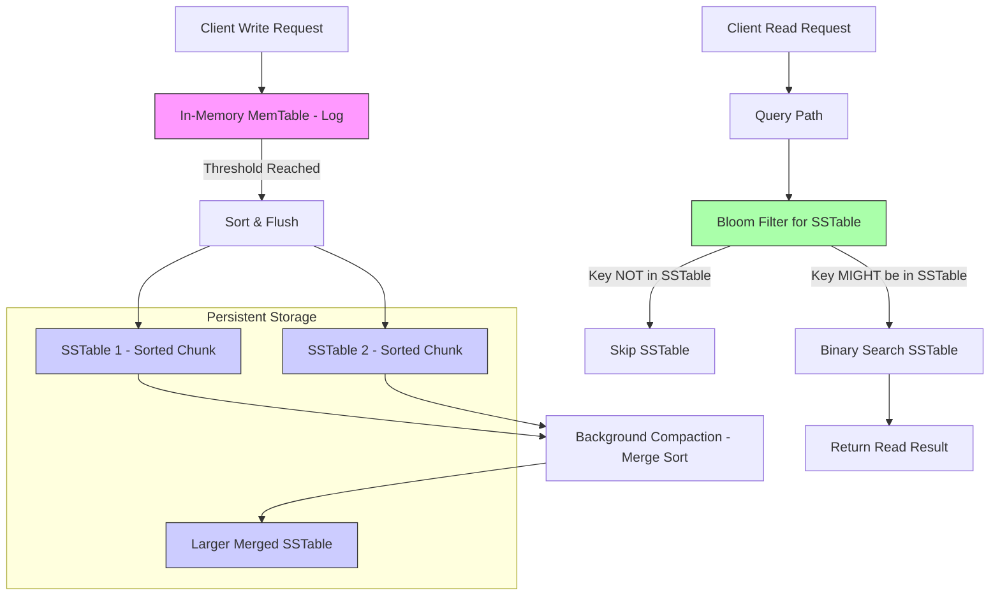

# How Databases Scale Writes： The Power Of The Log ✍️🗒️ (1080P25) - Part 1

# Optimizing Database Writes

This discussion focuses on methods to optimize write operations in a database system, addressing scalability challenges.

## Traditional Database Write Operations

_screenshots/frame_00-00-00.jpg)

1.  **System Flow**: A client sends information to a server, which then writes this data to a database to maintain application state.
2.  **Database as a Data Structure**: Databases fundamentally rely on underlying data structures to manage and access data.
3.  **B-plus-tree (B+ Tree)**:
    *   **Purpose**: The traditional data structure used by many databases to speed up queries.
    *   **Characteristics**: Similar to a binary search tree but allows multiple paths from each node, making it suitable for disk-based storage.
    *   **Performance**:
        *   **Insertion**: `O(log n)`
        *   **Search**: `O(log n)`
    *   **Operation Mapping**: SQL commands like `INSERT` or `SELECT` translate into insertion or search operations on the B+ tree.
    *   **Acknowledgement**: Each operation (insert, select) requires an explicit acknowledgement from the database confirming successful execution.

    _screenshots/frame_00-00-35.jpg)

    ```mermaid
    graph LR
        SQL_CMD[SQL Command - INSERT/SELECT] --> DB_Access[Database Access]
        DB_Access --> BPT[B+ Tree Data Structure]
        BPT -- "Manipulation (Insert/Search)" --> O_Log_N[O(log n) Performance]
        O_Log_N --> ACK[Acknowledgement from Database]
    ```

## Challenges with Traditional Database Writes

To scale a database, it's crucial to reduce inefficiencies in write operations:

*   **Unnecessary Data Exchange**: Each request-response cycle involves sending data, acknowledgements, and headers, which consumes bandwidth.
*   **High I/O Calls**: Frequent individual database operations lead to numerous Input/Output (I/O) calls, which are resource-intensive and increase request-response times.

## Optimization Strategy 1: Query Condensation (Batching)

_screenshots/frame_00-02-30.jpg)

The first idea to improve efficiency is to consolidate multiple data queries:

*   **Concept**: Instead of sending individual queries to the database, condense a batch of queries into a single block and send it in one shot.
*   **Benefit**: This allows for a single acknowledgement from the database for the entire batch.
*   **Advantages**:
    *   **Bandwidth Efficiency**: Reduces the amount of "extra" data (headers, individual ACKs) sent across the network.
    *   **Reduced I/O Operations**: Fewer I/O calls to the database and fewer I/O responses, freeing up resources and improving performance.
*   **Drawback**:
    *   **Additional Server Memory**: The server needs to allocate extra memory to buffer and condense these data queries before sending them.

## Optimization Strategy 2: Leveraging Write-Optimized Data Structures

The second strategy involves using a data structure inherently fast for write operations.

*   **Fastest Write Data Structure**: A **linked list** is identified as the most basic and fastest data structure for write operations.
    *   **Mechanism**: To perform a write, data is simply appended to the end (tail) of the list.
    *   **Performance**: `O(1)` (constant time) because it only involves updating pointers at the end of the list.
*   **The "Log" Concept**:
    *   A "log" is a well-known data structure that follows the philosophy of a linked list, emphasizing fast appends.
    *   This concept is foundational to data structures like the **Log-Structured Merge (LSM) tree**, which aims to optimize writes.
*   **Advantages of a Log for Writes**:
    *   Extremely fast for append-only write operations due to its sequential nature (`O(1)`).
*   **Disadvantages of a Log for Reads**:
    *   **Slow Read Operations**: Reading data from a log is inherently slow (`O(n)`). To find a specific piece of information, the entire log must be searched sequentially, which becomes highly inefficient for large datasets.

---

## Addressing Drawbacks of Write Optimization Strategies

The previous discussion highlighted advantages such as fast writes and fewer I/O operations, but also identified drawbacks: additional memory usage and slow read operations. The goal is to retain the advantages while mitigating the disadvantages.

### Managing Additional Memory

*   **Problem**: Condensing queries requires the server to hold data in memory temporarily.
*   **Mitigation**: While additional memory is unavoidable, its impact can be managed by constraining the maximum number of data blocks that can be held in memory before being flushed (written) to the database. This acts as a buffer limit.

### Mitigating Slow Read Operations

_screenshots/frame_00-03-08.jpg)

*   **Critical Issue**: Slow read operations are a major concern, especially for user-facing applications like social media feeds (e.g., Facebook news feed). Users expect fast access to information.
*   **Root Cause**: Reading directly from a log (which behaves like a linked list) results in sequential search, leading to `O(n)` read times, which is highly inefficient.
*   **Solution Approach**: Convert the data from the write-optimized log format into a read-optimized data structure.

### Combining Write-Optimized and Read-Optimized Structures

The core idea is to combine the benefits of a linked list (fast writes) with the benefits of a sorted structure (fast reads).

*   **Comparison of Data Structures**:

    | Data Structure | Write Performance | Read Performance | Notes                                                                                                                                                                                                                                                                                                                                                                                                                                                                                                                                                                                                                                                                                                                                                                                                                                                                                                                                                                                                                                                                                                                                                                                                                                                                                                                                                                                                                                                                                                                                                                                                                                                                                                                                                                                                                                                                                                                                                                                                                                                                                                                                                                                                                                                                                                                                                                                                                                                                                                                                                                                                                                                                                                                                                                                                                                                                                                                                                                                                                                                                                                                                                                                                                                                                                                                                                                                                                                                                                                                                                                                                                                                                                                                                                                                                                                                                                                                                                                                                                                                                                                                                                                                                                                                                                                                                                                                                                                                                                                                                                                                                                                                                                                                                                                                                                                                                                                                                                                                                                                                                                                                                                                                                                                                                                                                                                                                                                                                                                                                                                                                                                                                                                                                                                                                                                                                                                                                                                                                                                                                                                                                                                                                                                                                                                                                                                                                                                                                                                                                                                                                                                                                                                                                                                                                                                                                                                                                                                                                                                                                                                                                                                                                                                                                                                                                                                                                                                                                                                                                                                                                                                                                                                                                                                                                                                                                                                                                                                                                                                                                                                                                                                                                                                                                                                                                                                                                                                                                                                                                                                                                                                                                                                                                                                                                                                                                                                                                                                                                                                                                                                                                                                                                                                                                                                                                                                                                                                                                                                                                                                                                                                                                                                                                                                                                                                                                                                                                                                                                                                                                                                                                                                                                                                                                                                                                                                                                                                                                                                                                                                                                                                                                                                                                                                                                                                                                                                                                                                                                                                                                                                                                                                                                                                                                                                                                                                                                                                                                                                                                                                                                                                                                                                                                                                                                                                                                                                                                                                                                                                                                                                                                                                                                                                                                                                                                                                                                                                                                                                                                                                                                                                                                                                                                                                                                                                                                                                                                                                                                                                                                                                                                                                                                                                                                                                                                                                                                                                                                                                                                                                                                                                                                                                                                                                                                                                                                                                                                                                                                                                                                                                                                                                                                                                                                                                                                                                                                                                                                                                                                                                                                                                                                                                                                                                                                                                                                                                                                                                                                                                                                                                                                                                                                                                                                                                                                                                                                                                                                                                                                                                                                                                                                                                                                                                                                                                                                                                                                                                                                                                                                                                                                                                                                                                                                                                                                                                                                                                                                                                                                                                                                                                                                                                                                                                                                                                                                                                                                                                                                                                                                                                                                                                                                                                                                                                                                                                                                                                                                                                                                                                                                                                                                                                                                                                                                                                                                                                                                                                                                                                                                                                                                                                                                                                                                                                                                                                                                                                                                                                                                                                                                                                                                                                                                                                                                                                                                                                                                                                                                                                                                                                                                                                                                                                                                                                                                                                                                                                                                                                                                                                                                                                                                                                                                                                                                                                                                                                                                                                                                                                                                                                                                                                                                                                                                                                                                                                                                                                                                                                                                                                                                                                                                                                                                                                                                                                                                                                                                                                                                                                                                                                                                                                                                                                                                                                                                                                                                                                                                                                                                                                                                                                                                                                                                                                                                                                                                                                                                                                                                                                                                                                                                                                                                                                                                                                                                                                                                                                                                                                                                                                                                                                                                                                                                                                                                                                                                                                                                                                                                                                                                                                                                                                                                                                                                                                                                                                                                                                                                                                                                                                                                                                                                                                                                                                                                                                                                                                                                                                                                                                                                                                                                                                                                                                                                                                                                                                                                                                                                                                                                                                                                                                                                                                                                                                                                                                                                                                                                                                                                                                                                                                                                                                                                                                                                                                                                                                                                                                                                                                                                                                                                                                                                                                                                                                                                                                                                                                                                                                                                                                                                                                                                                                                                                                                                                                                                                                                                                                                                                                                                                                                                                                                                                                                                                                                                                                                                                                                                                                                                                                                                                                                                                                                                                                                                                                                                                                                                                                                                                                                                                                                                                                                                                                                                                                                                                                                                                                                                                                                                                                                                                                                                                                                                                                                                                                                                                                                                                                                                                                                                                                                                                                                                                                                                                                                                                                                                                                                                                                                                                                                                                                                                                                                                                                                                                                                                                                                                                                                                                                                                                                                                                                                                                                                                                                                                                                                                                                                                                                                                                                                                                                                                                                                                                                                                                                                                                                                                                                                                                                                                                                                                                                                                                                                                                                                                                                                                                                                                                                                                                                                                                                                                                                                                                                                                                                                                                                                                                                                                                                                                                                                                                                                                                                                                                                                                                                                                                                                                                                                                                                                                                                                                                                                                                                                                                                                                                                                                                                                                                                                                                                                                                                                                                                                                                                                                                                                                                                                                                                                                                                                                                                                                                                                                                                                                                                                                                                                                                                                                                                                                                                                                                                                                                                                                                                                                                                                                                                                                                                                                                                                                                                                                                                                                                                                                                                                                                                                                                                                                                                                                                                                                                                                                                                                                                                                                                                                                                                                                                                                                                                                                                                                                                                                                                                                                                                                                                                                                                                                                                                                                                                                                                                                                                                                                                                                                                                                                                                                                                                                                                                                                                                                                                                                                                                                                                                                                                                                                                                                                                                                                                                                                                                                                                                                                                                                                                                                                                                                                                                                                                                                                                                                                                                                                                                                                                                                                                                                                                                                                                                                                                                                                                                                                                                                                                                                                                                                                                                                                                                                                                                                                                                                                                                                                                                                                                                                                                                                                                                                                                                                                                                                                                                                                                                                                                                                                                                                                                                                                                                                                                                                                                                                                                                                                                                                                                                                                                                                                                                                                                                                                                                                                                                                                                                                                                                                                                                                                                                                                                                                                                                                                                                                                                                                                                                                                                                                                                                                                                                                                                                                                                                                                                                                                                                                                                                                                                                                                                                                                                                                                                                                                                                                                                                                                                                                                                                                                                                                                                                                                                                                                                                                                                                                                                                                                                                                                                                                                                                                                                                                                                                                                                                                                                                                                                                                                                                                                                                                                                                                                                                                                                                                                                                                                                                                                                                                                                                                                                                                                                                                                                                                                                                                                                                                                                                                                                                                                                                                                                                                                                                                                                                                                                                                                                                                                                                                                                                                                                                                                                                                                                                                                                                                                                                                                                                                                                                                                                                                                                                                                                                                                                                                                                                                                                                                                                                                                                                                                                                                                                                                                                                                                                                                                                                                                                                                                                                                                                                                                                                                                                                                                                                                                                                                                                                                                                                                                                                                                                                                                                                                                                                                                                                                                                                                                                                                                                                                                                                                                                                                                                                                                                                                                                                                                                                                                                                                                                                                                                                                                                                                                                                                                                                                                                                                                                                                                                                                                                                                                                                                                                                                                                                                                                                                                                                                                                                                                                                                                                                                                                                                                                                                                                                                                                                                                                                                                                                                                                                                                                                                                                                                                                                                                                                                                                                                                                                                                                                                                                                                                                                                                                                                                                                                                                                                                                                                                                                                                                                                                                                                                                                                                                                                                                                                                                                                                                                                                                                                                                                                                                                                                                                                                                                                                                                                                                                                                                                                                                                                                                                                                                                                                                                                                                                                                                                                                                                                                                                                                                                                                                                                                                                                                                                                                                                                                                                                                                                                                                                                                                                                                                                                                                                                                                                                                                                                                                                                                                                                                                                                                                                                                                                                                                                                                                                                                                                                                                                                                                                                                                                                                                                                                                                                                                                                                                                                                                                                                                                                                                                                                                                                                                                                                                                                                                                                                                                                                                                                                                                                                                                                                                                                                                                                                                                                                                                                                                                                                                                                                                                                                                                                                                                                                                                                                                                                                                                                                                                                                                                                                                                                                                                                                                                                                                                                                                                                                                                                                                                                                                                                                                                                                                                                                                                                                                                                                                                                                                                                                                                                                                                                                                                                                                                                                                                                                                                                                                                                                                                                                                                                                                                                                                                                                                                                                                                                                                                                                                                                                                                                                                                                                                                                                                                                                                                                                                                                                                                                                                                                                                                                                                                                                                                                                                                                                                                                                                                                                                                                                                                                                                                                                                                                                                                                                                                                                                                                                                                                                                                                                                                                                                                                                                                                                                                                                                                                                                                                                                                                                                                                                                                                                                                                                                                                                                                                                                                                                                                                                                                                                                                                                                                                                                                                                                                                                                                                                                                                                                                                                                                                                                                                                                                                                                                                                                                                                                                                                                                                                                                                                                                                                                                                                                                                                                                                                                                                                                                                                                                                                                                                                                                                                                                                                                                                                                                                                                                                                                                                                                                                                                                                                                                                                                                                                                                                                                                                                                                                                                                                                                                                                                                                                                                                                                                                                                                                                                                                                                                                                                                                                                                                                                                                                                                                                                                                                                                                                                                                                                                                                                                                                                                                                                                                                                                                                                                                                                                                                                                                                                                                                                                                                                                                                                                                                                                                                                                                                                                                                                                                                                                                                                                                                                                                                                                                                                                                                                                                                                                                                                                                                                                                                                                                                                                                                                                                                                                                                                                                                                                                                                                                                                                                                                                                                                                                                                                                                                                                                                                                                                                                                                                                                                                                                                                                                                                                                                                                                                                                                                                                                                                                                                                                                                                                                                                                                                                                                                                                                                                                                                                                                                                                                                                                                                                                                                                                                                                                                                                                                                                                                                                                                                                                                                                                                                                                                                                                                                                                                                                                                                                                                                                                                                                                                                                                                                                                                                                                                                                                                                                                                                                                                                                                                                                                                                                                                                                                                                                                                                                                                                                                                                                                                                                                                                                                                                                                                                                                                                                                                                                                                                                                                                                                                                                                                                                                                                                                                                                                                                                                                                                                                                                                                                                                                                                                                                                                                                                                                                                                                                                                                                                                                                                                                                                                                                                                                                                                                                                                                                                                                                                                                                                                                                                                                                                                                                                                                                                                                                                                                                                                                                                                                                                                                                                                                                                                                                                                                                                                                                                                                                                                                                                                                                                                                                                                                                                                                                                                                                                                                                                                                                                                                                                                                                                                                                                                                                                                                                                                                                                                                                                                                                                                                                                                                                                                                                                                                                                                                                                                                                                                                                                                                                                                                                                                                                                                                                                                                                                                                                                                                                                                                                                                                                                                                                                                                                                                                                                                                                                                                                                                                                                                                                                                                                                                                                                                                                                                                                                                                                                                                                                                                                                                                                                                                                                                                                                                                                                                                                                                                                                                                                                                                                                                                                                                                                                                                                                                                                                                                                                                                                                                                                                                                                                                                                                                                                                                                                                                                                                                                                                                                                                                                                                                                                                                                                                                                                                                                                                                                                                                                                                                                                                                                                                                                                                                                                                                                                                                                                                                                                                                                                                                                                                                                                                                                                                                                                                                                                                                                                                                                                                                                                                                                                                                                                                                                                                                                                                                                                                                                                                                                                                                                                                                                                                                                                                                                                                                                                                                                                                                                                                                                                                                                                                                                                                                                                                                                                                                                                                                                                                                                                                                                                                                                                                                                                                                                                                                                                                                                                                                                                                                                                                                                                                                                                                                                                                                                                                                                                                                                                                                                                                                                                                                                                                                                                                                                                                                                                                                                                                                                                                                                                                                                                                                                                                                                                                                                       ```mermaid
graph LR
    LogStructure[Log] --> FastWrites[O(1) Writes]
    LogStructure --> SlowReads[O(N) Reads - Sequential Search]
    
    Database[Database] --> BPlusTree[B+ Tree]
    BPlusTree --> LogN_Writes[O(log N) Writes]
    BPlusTree --> LogN_Reads[O(log N) Reads]

    CombinedSystem[Combined System]
    CombinedSystem --> InMemoryLog[In-Memory Log / Linked List]
    InMemoryLog -- "Fast Appends" --> ClientWrites[Client Writes]
    InMemoryLog -- "Convert to Sorted" --> PersistentStorage[Persistent Storage - Sorted Array/Tree]
    PersistentStorage -- "Fast Reads" --> ClientReads[Client Reads]

    style InMemoryLog fill:#fcc,stroke:#333,stroke-width:1px
    style PersistentStorage fill:#ccf,stroke:#333,stroke-width:1px
    style LogStructure fill:#f9f,stroke:#333,stroke-width:1px
    style BPlusTree fill:#f9f,stroke:#333,stroke-width:1px
    ```

    _screenshots/frame_00-05-12.jpg)

    | Feature        | B+ Tree         | Linked List / Log | Sorted Array / Tree |
    | :------------- | :-------------- | :---------------- | :------------------ |
    | **Write Time** | `O(log n)`      | `O(1)`            | `O(n)` (for insertion) |
    | **Read Time**  | `O(log n)`      | `O(n)`            | `O(log n)`         |
    | **Use Case**   | Balanced reads/writes | Write-heavy       | Read-heavy          |

*   **The "Magic Solution"**: The ideal solution is to combine the strengths:
    *   Use a linked list (or log) for initial, fast write operations.
    *   Convert this data into a sorted array (or a tree-like structure) for efficient read operations.
    *   _screenshots/frame_00-05-22.jpg) - "LINKED LIST + SORTED ARRAY log(N), O(1)" - This meme illustrates the combined performance benefit.

*   **Process Overview**:
    1.  **Initial Write (In-Memory)**: Client data is first written to an in-memory linked list (log). This ensures `O(1)` write performance.
    2.  **Conversion to Sorted Structure (Persistence)**: The data from the in-memory log is then sorted and persisted to disk in a structure like a sorted array or tree.
        *   **Why not sort in memory?**: Sorting in memory for every insertion would negate the `O(1)` write advantage of the linked list, as insertions into a sorted array are slow. The goal is to keep in-memory writes fast.
        *   **Where sorting occurs**: The sorting and conversion happen *before* the data is written to the database's persistent storage. This means the data is sorted *before* it's made available for fast reads from disk.
    3.  **Read Operations**: Reads are performed on this sorted, persistent data structure, achieving `O(log n)` read performance.

This approach aims to achieve both great write speeds (`O(1)`) and great read speeds (`O(log n)`), overcoming the limitations of using either a B+ tree or a simple log exclusively. The next section will delve into the specific mechanics of how this combined system works.

---

### Mechanics of Hybrid Write/Read Optimization

The system uses a combination of an in-memory log and sorted persistent storage to achieve both fast writes and fast reads.

1.  **In-Memory Log (MemTable)**:
    *   **Function**: The server continuously appends new records to an in-memory data structure, acting as a log. This is often called a "MemTable."
    *   **Write Speed**: Appending to a log is an `O(1)` operation, ensuring fast initial writes.
    *   **Example**: As seen in _screenshots/frame_00-06-11.jpg), new entries (e.g., Jane 31, Tim 12, Iris 19, Mac 47, John 17, Gaurav 23) are added sequentially to the `LOG`. The order is based on arrival, not value.

2.  **Flushing to Persistent Storage**:
    *   **Trigger**: Once the in-memory log reaches a predefined threshold (e.g., a certain number of records or memory size), its contents are flushed to the database (persistent storage).
    *   **Sorting during Flush**: Before persistence, the data from the in-memory log is **sorted**. This is crucial for enabling fast reads later.
    *   **Result**: The data is written to the database in a sorted fashion, creating a sorted file or "chunk."
    *   **Example**: The unsorted log entries (23 Gaurav, 17 John, 47 Mac, 19 Iris, 12 Tim, 31 Jane) are sorted into `12 Tim, 17 John, 19 Iris, 23 Gaurav, 31 Jane, 47 Mac` when flushed to the DB, as shown in _screenshots/frame_00-06-11.jpg).
    *   **Read Optimization**: With sorted data in the DB, binary search can be applied, enabling efficient `O(log n)` queries.

### Handling Subsequent Writes and Multiple Sorted Chunks

What happens when new data arrives after the first flush?

*   **Continuous Appending**: New records continue to be appended to a *new* in-memory log.
*   **Subsequent Flushes**: When this new in-memory log also reaches its threshold, it is sorted and flushed to the database as *another* sorted chunk.
*   **The Merging Dilemma**:
    *   **Inefficient Approach (Re-sort Entire DB)**: If each new sorted chunk were immediately merged with the *entire existing sorted database*, it would involve sorting `(N + M)` records, where `N` is the existing database size and `M` is the size of the new chunk. This leads to `O(N log N)` complexity, which is extremely slow and defeats the purpose of fast writes, especially for large databases. For instance, merging 6 new records into 10,000 existing records would require re-sorting 10,006 records, as illustrated in _screenshots/frame_00-08-02.jpg) showing "Sort 10000" and `O(n log n)`.

*   **Better Approach (Keeping Sorted Chunks)**:
    *   Instead of merging immediately, the database can maintain multiple **sorted chunks** of data.
    *   **Example**: As depicted in _screenshots/frame_00-08-24.jpg), the DB now has two sorted chunks:
        1.  `12 Tim, 17 John, 19 Iris, 23 Gaurav, 31 Jane, 47 Mac`
        2.  `1 Sam, 36 Larry, 56 Jack, 60 Terry, 81 Bob, 99 Anna`
    *   **Read Performance with Chunks**: To perform a read, the system would binary search the first chunk. If the record isn't found, it binary searches the second chunk, and so on.
    *   **Drawback**: If there are `K` chunks, a read operation might require `K * O(log (N/K))` operations in the worst case (where `N` is total records and `N/K` is chunk size). This can still be slow if `K` becomes very large. For `N` insertions with chunks of size 6, the number of chunks is `N/6`, leading to `O(N)` read times in the worst case, as each chunk might need to be searched. For a Facebook-scale database with billions of records, `N/6` lookups is still unacceptably slow.

### Optimizing Read Performance with Merging (Log-Structured Merge Tree Concept)

To address the slow reads caused by many small chunks, a hybrid approach is used: merging chunks strategically. This is the essence of a Log-Structured Merge (LSM) Tree.

*   **Strategic Merging**: Periodically, smaller sorted chunks are merged into larger sorted chunks. This reduces the total number of chunks that need to be searched during a read operation.
*   **Merge Sort Technique**: When merging two sorted chunks, a standard merge sort algorithm is applied. This is efficient because the individual chunks are already sorted.
    *   **Process**:
        1.  Take the smallest element from each of the two sorted chunks.
        2.  Compare them and select the overall smallest.
        3.  Append the selected element to a new merged sorted chunk.
        4.  Advance the pointer in the chunk from which the element was taken.
        5.  Repeat until all elements are merged.
    *   **Example**: Merging the two chunks from the previous example:
        *   Chunk A: `[12 Tim, 17 John, 19 Iris, 23 Gaurav, 31 Jane, 47 Mac]`
        *   Chunk B: `[1 Sam, 36 Larry, 56 Jack, 60 Terry, 81 Bob, 99 Anna]`
        *   **Step 1**: Compare `12` (from A) and `1` (from B). `1` is smaller. Output `1 Sam`. Pointer in B moves to `36`.
        *   **Step 2**: Compare `12` (from A) and `36` (from B). `12` is smaller. Output `12 Tim`. Pointer in A moves to `17`.
        *   ... and so on.
    *   _screenshots/frame_00-09-41.jpg) visually demonstrates the start of this merge process, taking "1 Sam" as the first element.

This merging process ensures that while writes are initially fast (to the in-memory log), reads remain efficient by keeping the number of sorted chunks manageable through periodic background merges.

---

### Mechanics of Hybrid Write/Read Optimization (continued)

The merging process is a fundamental aspect of maintaining efficient read performance in a Log-Structured Merge (LSM) tree-like system.

1.  **Detailed Merge Process (Merge Sort)**:
    *   When merging two already sorted arrays (chunks), a two-pointer approach is used.
    *   **Steps**:
        1.  Initialize pointers at the beginning of each sorted chunk.
        2.  Compare the elements pointed to by each pointer.
        3.  The smaller element is moved to the new, merged sorted array.
        4.  The pointer for the chunk from which the element was taken is advanced to the next element.
        5.  This process continues until all elements from both chunks have been moved to the new merged array.
    *   **Example Continuation**: Following the example from the previous section (merging Chunk A: `[12 Tim, 17 John, ...]` and Chunk B: `[1 Sam, 36 Larry, ...]`):
        *   `1 Sam` is added (from B). Pointer in B moves to `36`.
        *   `12 Tim` is added (from A). Pointer in A moves to `17`.
        *   `17 John` is added (from A). Pointer in A moves to `19`.
        *   `19 Iris` is added (from A). Pointer in A moves to `23`.
        *   `23 Gaurav` is added (from A). Pointer in A moves to `31`.
        *   `31 Jane` is added (from A). Pointer in A moves to `47`.
        *   Now, `47 Mac` (from A) is compared with `36 Larry` (from B). `36 Larry` is smaller. Output `36 Larry`. Pointer in B moves to `56`.
        *   This continues until a single, fully sorted array of size 12 is formed.
    *   _screenshots/frame_00-09-53.jpg) illustrates the ongoing merge process, showing `1 Sam` and `12 Tim` already moved to the merged output.

2.  **Advantages of Merging Chunks for Read Performance**:
    *   **Reduced Search Complexity**: By merging smaller sorted chunks into larger ones, the total number of chunks that a read query needs to examine is reduced. This directly improves read performance.
    *   **Quantitative Example**:
        *   **Scenario 1: Three unmerged chunks of size 6 each.**
            *   Time to search one chunk: `log2(6) ≈ 3` operations.
            *   Worst-case search (checking all three chunks): `3 * log2(6) = 3 * 3 = 9` operations.
        *   **Scenario 2: Two chunks merged into one of size 12, plus one chunk of size 6.**
            *   Time to search the size-12 chunk: `log2(12) ≈ 4` operations.
            *   Time to search the size-6 chunk: `log2(6) ≈ 3` operations.
            *   Worst-case search: `log2(12) + log2(6) = 4 + 3 = 7` operations.
            *   **Saving**: `9` operations (unmerged) vs. `7` operations (merged) shows a clear improvement.
        *   **Scenario 3: Four unmerged chunks of size 6 vs. one merged chunk of size 24.**
            *   Unmerged: `4 * log2(6) = 4 * 3 = 12` operations.
            *   Merged: `log2(24) ≈ 5` operations.
            *   **Saving**: `12` operations vs. `5` operations.
    *   _screenshots/frame_00-10-54.jpg) visually represents the comparison of searching three individual chunks versus two chunks (one merged).
    *   _screenshots/frame_00-11-06.jpg) highlights `log2(24) = 5`.

3.  **Merging Strategy**:
    *   The merging process is performed in the background.
    *   **Rule**: Two sorted chunks of size `X` are merged to form a single sorted chunk of size `2X`.
    *   This process continues: `6` -> `12` -> `24` -> `48`, and so on, up to the maximum possible array size (total `N` insertions).
    *   This strategy results in a collection of blocks (chunks) of varying sizes within the database.

### Further Read Optimization: Bloom Filters

Even with strategic merging, a database might still consist of several sorted chunks. A read query might still need to perform binary searches across multiple chunks if the desired record is not found in the first few. To optimize this, **Bloom filters** can be employed.

*   **Problem**: When searching for a record, the system currently has to binary search each chunk sequentially until the record is found or all chunks are exhausted. This involves potentially expensive disk I/O for each chunk.
*   **Solution**: A Bloom filter can quickly tell you if a record *might* be in a given chunk, or if it is *definitively not* in that chunk.
*   **Basic Concept (Analogy)**:
    *   Imagine searching for a specific word (e.g., "cat") in a large book.
    *   Without a Bloom filter, you might have to scan through the entire book (or relevant sections) to find the word.
    *   A Bloom filter acts as a probabilistic data structure that can tell you:
        *   "The word 'cat' is **definitely not** in this book/chunk." (No false negatives)
        *   "The word 'cat' **might be** in this book/chunk." (Possible false positives, meaning it says it might be there, but it's not).
*   **Application to Database Chunks**:
    *   Each sorted chunk can have an associated Bloom filter.
    *   Before performing a costly binary search (and disk read) on a chunk, the system first queries its Bloom filter.
    *   If the Bloom filter says the record is **definitely not** in the chunk, that chunk can be skipped, saving I/O.
    *   If the Bloom filter says the record **might be** in the chunk, then the binary search proceeds on that chunk.
    *   This significantly reduces unnecessary disk reads, especially for records that are not present in the database or are located in later chunks.
</REFINEDNOTES>

---

### Further Read Optimization: Bloom Filters (continued)

_screenshots/frame_00-13-58.jpg)

To further optimize read operations and reduce unnecessary disk I/O when dealing with multiple sorted chunks (or Sorted String Tables), **Bloom filters** are used.

1.  **Bloom Filter Analogy**:
    *   Imagine a book and a simple Bloom filter with 26 positions (one for each letter A-Z).
    *   **Rule**: If any word in the book starts with a particular letter, that letter's position in the Bloom filter is marked as '1' (or true).
    *   **Example**:
        *   If the word "cat" exists, the 'C' position is marked '1'.
        *   If the word "corona" exists, the 'C' position is also marked '1'.
    *   _screenshots/frame_00-14-08.jpg) and _screenshots/frame_00-14-47.jpg) illustrate this setup, showing the 'C' position being marked.

2.  **Key Properties of Bloom Filters**:
    *   **False Positives**:
        *   If you search for "cat" and the 'C' position is marked '1' (because "corona" is in the book, but "cat" isn't), the Bloom filter will indicate that "cat" *might* be in the book. This is a **false positive**.
        *   Bloom filters can produce false positives, meaning they might indicate an item is present when it isn't.
    *   **No False Negatives**:
        *   If the 'C' position is marked '0' (meaning no word starting with 'C' exists), then you can be absolutely certain that "cat" (or any other word starting with 'C') is **definitely not** in the book.
        *   Bloom filters cannot produce false negatives, meaning they will never say an item is absent if it is actually present.

3.  **Application in Database Read Queries**:
    *   Each sorted chunk (Sorted String Table) in the database has an associated Bloom filter.
    *   When a read query for a specific record comes in, the system first consults the Bloom filter for each chunk.
    *   If a chunk's Bloom filter indicates the record is **definitely not** present, that chunk is skipped entirely, saving a potentially expensive disk I/O operation.
    *   If the Bloom filter indicates the record **might be** present (including false positives), then a binary search is performed on that specific chunk.
    *   This significantly speeds up queries by avoiding unnecessary disk reads.

4.  **Managing False Positive Rate**:
    *   The rate of false positives can be controlled.
    *   Increasing the size (number of bits) of the Bloom filter reduces the false positive rate.
    *   Using more complex hashing or combining multiple letters (e.g., checking for "CA" instead of just "C") can also reduce false positives by providing more specific information.
    *   When two chunks are merged, their Bloom filters are also merged or a new, larger Bloom filter is created for the combined chunk. A larger Bloom filter is often needed for larger chunks to maintain an acceptable false positive rate.
    *   Reducing false positives indirectly reduces read times by minimizing "useless" disk reads.

_screenshots/frame_00-16-05.jpg) shows "Bloom Filter" written, indicating its role in the overall system.

### Summary of Log-Structured Merge (LSM) Tree Concept

The system described, which combines fast in-memory writes with sorted, merged persistent storage and Bloom filters, is the fundamental concept behind a **Log-Structured Merge (LSM) Tree**.

*   **Core Idea**: To achieve both high write throughput and efficient read performance.
*   **Mechanism**:
    *   **Fast Writes**: Achieved by appending new data to an in-memory log (MemTable) in a sequential (`O(1)`) fashion.
    *   **Fast Reads**: Achieved by persisting data to disk in sorted "tables" (SSTables) and managing these tables through background merging (compaction) and using Bloom filters for efficient lookup.



### Key Terminology

*   **Sorted String Table (SSTable)**: A sorted set of records (key-value pairs) that represents a persistent, immutable chunk of data on disk. These are the sorted arrays created after flushing the in-memory log.
*   **Compaction**: The background process of taking multiple smaller Sorted String Tables (SSTables) and merging them into a single, larger, sorted SSTable. This process uses merge sort to condense data, reduce the number of files, and eliminate duplicate or deleted records, thereby improving read performance.
</REFINEDNOTES>

---


---

