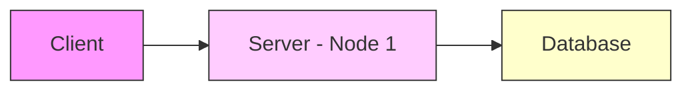
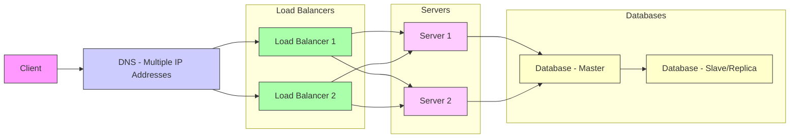

# How To Avoid A Single Point Of Failure In Distributed Systems ✅ (1080P60) - Part 1

# Single Points of Failure (SPOF)

_screenshots/frame_00-00-00.jpg)

## Definition

A **Single Point of Failure (SPOF)** is a component within a system whose failure will cause the entire system to stop functioning. Such systems lack **resiliency**, meaning they cannot withstand the failure of critical components.

## Examples of SPOF

*   **In Computing:** If a database crashes, and there is no backup or redundancy, the entire application or service relying on that database will crash.
*   **General Analogies:**
    *   _screenshots/frame_00-00-48.jpg) The destruction of Earth would be a SPOF for humanity.
    *   In storytelling, a character whose death would make the entire narrative collapse represents a SPOF.

## Significance in System Design

Understanding and mitigating SPOFs is a crucial and advanced topic in system design. Interviewers often assess an architect's ability to design resilient systems by asking about SPOF identification and mitigation strategies.

## Basic System Architecture and SPOFs

Consider a simple client-server-database architecture:

_screenshots/frame_00-01-36.jpg)

In this setup:
*   **Client:** A client failure (e.g., a single user's device) is generally not considered a system-wide SPOF, as it only affects that individual client.
*   **Server (Node 1):** If `Server - Node 1` crashes, the entire service becomes unavailable. This is a SPOF.
*   **Database:** If the `Database` crashes, the server cannot retrieve or store data, leading to a system-wide failure. This is also a SPOF.

## Mitigation Strategies for SPOFs

The primary way to mitigate SPOFs is to introduce **redundancy** by adding more nodes or copies of critical components.

### 1. Adding Redundant Nodes (More Nodes)

This involves duplicating components to ensure that if one fails, another can take over.

*   **Service Redundancy:**
    *   To mitigate a server SPOF, you can add another server node.
    *   _screenshots/frame_00-02-12.jpg)
    *   **Types of Service Redundancy:**
        *   **Cold Standby (Backup):** A second node (`Node 2`) is idle, only activating if the primary node (`Node 1`) fails. This is less efficient for services, as the backup sits unused.
        *   **Active-Active (or Hot Standby):** Both `Node 1` and `Node 2` are active and can handle requests simultaneously, often sharing the load. This is generally preferred for services.

*   **Data Redundancy (Database Replication):**
    *   To mitigate a database SPOF, you can create a replica (copy) of the database.
    *   _screenshots/frame_00-02-24.jpg)
    *   **Mechanism:** Every change in the primary database is mirrored to the replica database.
    *   **Benefit:** Ensures data availability and integrity even if one database fails.
    *   **Probability Reduction:** If the probability of one database failing is `P`, having two independent databases reduces the probability of *both* failing to `P * P` (P-squared), which is significantly smaller. For example, if `P = 0.01` (1% chance), `P^2 = 0.0001` (0.01% chance).
    *   **Master-Slave Architecture:** A common pattern for database redundancy.
        *   **Master:** The primary database that handles all write operations.
        *   **Slaves/Replicas:** Copies of the master database that receive mirrored data.
        *   Some slaves can be configured as **read slaves**, allowing read requests to be distributed across them, reducing the load on the master.

### 2. Mitigating Load Balancer SPOF

When multiple server nodes are introduced, a **load balancer** is typically used to distribute incoming client requests among them. However, a single load balancer itself becomes a SPOF.

*   **Issue:** If the single load balancer fails, no client requests can reach the servers, rendering the entire service unavailable.
*   **Solution:** Deploy multiple load balancers.
*   **Challenge:** If there are multiple load balancers, how does a client know which one to connect to?
*   **Resolution: Using DNS for Redundancy:**
    *   Clients connect to a **Domain Name System (DNS)** server.
    *   The DNS is configured to resolve a single hostname (e.g., `facebook.com`) to multiple IP addresses. Each of these IP addresses corresponds to one of the redundant load balancers.
    *   When a client requests the hostname, the DNS can return any of the available IP addresses, effectively distributing clients across the active load balancers and providing redundancy at the entry point.

## Enhanced Resilient Architecture

Combining these mitigation strategies, a more resilient system architecture would look like this:

---

### 3. Mitigating Geographic SPOF (Multiple Regions)

Even with redundant components (multiple servers, databases, load balancers, and DNS entries), an entire system can still fail if all its components are located in a single geographical region.

*   **Issue:** A natural disaster (e.g., earthquake, flood), large-scale power outage, or regional network failure can take down an entire data center or region.
*   **Solution:** Deploy the entire system (including all redundant components) across multiple, geographically distinct regions.
*   **Benefit:** If one region experiences a disaster, the system can failover to another region, ensuring continued availability.
*   _screenshots/frame_00-04-24.jpg) illustrates the concept of encapsulating the entire system (DNS, Load Balancers, Servers, Databases) within a region, and then having multiple such regions.
*   _screenshots/frame_00-04-47.jpg) shows the speaker adding "MULTIPLE REGIONS" as the third key strategy.

### 4. Mitigating Coordinator/Gateway SPOF

In complex distributed systems, especially those with distributed read/write operations for databases or microservices, there might be dedicated **coordinator** or **gateway** components.

*   **Role of Gateway/Coordinator:** These components act as an entry point or orchestrator for certain operations, often incorporating load balancing mechanisms.
*   **SPOF Risk:** If a single coordinator or gateway is used, it becomes a SPOF.
*   **Solution:** Just like load balancers, these coordinators/gateways must also be made redundant by deploying multiple instances and using DNS or similar mechanisms to distribute requests among them.
*   This principle of eliminating SPOFs by adding redundancy applies recursively throughout the system design. Every component that could bring down the system if it fails needs to be made resilient.

## Testing Resiliency: Chaos Engineering

Simply designing for resilience isn't enough; systems must be actively tested to ensure they truly are distributed and resilient.

*   **Chaos Monkey (Netflix):** Netflix famously developed "Chaos Monkey" as part of its "Chaos Engineering" practice.
    *   **Functionality:** Chaos Monkey randomly shuts down instances of services in production environments.
    *   **Purpose:** To proactively identify weaknesses and SPOFs in the system before they cause real outages. If the system remains operational despite random component failures, it demonstrates true resilience.
    *   **Broader Principle:** This practice helps ensure that the system is genuinely distributed and capable of handling failures, not just theoretically.

## System Design Interview Considerations

When discussing system design in an interview context, it's crucial to cover SPOF mitigation. Key points to mention include:

1.  **More Nodes:** Adding redundant server instances (often implies more cost for infrastructure).
2.  **Master-Slave Replication:** For databases, ensuring data redundancy and availability.
3.  **Multiple Regions:** Distributing the system geographically to protect against regional failures.

These strategies collectively form a robust approach to building highly available and resilient distributed systems.

---

