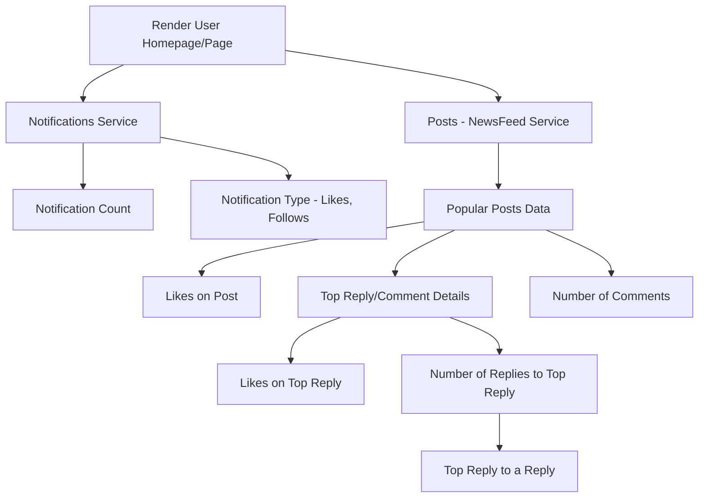
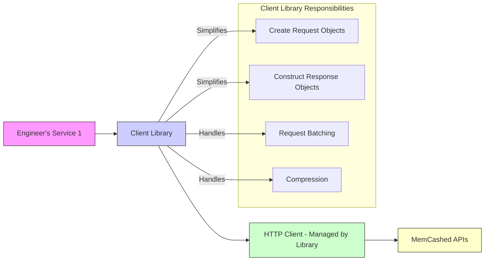
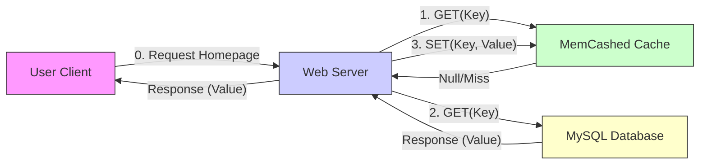
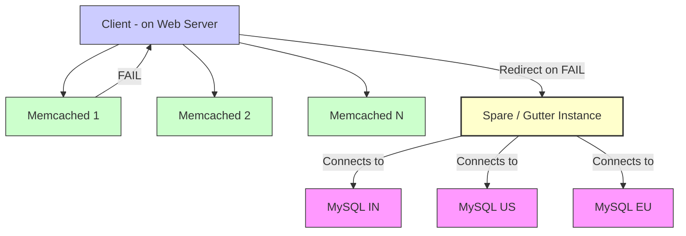
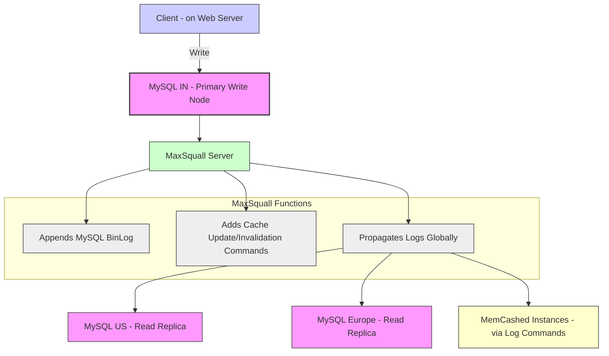

# Scaling Memcache At Facebook (1080P25) - Part 1

_screenshots/frame_00-00-01.jpg)

# Facebook MemCashed: Scaling a Distributed Cache

This series introduces the design and challenges of Facebook's MemCashed system, focusing on its specific use cases and architectural considerations as detailed in a white paper and various talks by Facebook engineers.

## Context: Facebook's Scale and Caching Needs

Facebook, owning large platforms like Instagram and WhatsApp, manages an immense volume of data that necessitates extensive caching. The primary motivation for Facebook's MemCashed system, particularly around 2010, was to efficiently render user homepages and other pages quickly.

## The Challenge: Rendering Dynamic User Pages

Rendering a user's homepage or profile page (e.g., on Instagram) is a complex operation due to the multitude of data points involved. It's not a simple single key-value lookup.

*   **Example Scenario:** Imagine viewing a post by Brad Pitt.
    *   You want to see the top comment, including memes or jokes.
    *   Then, you might want to see replies to that top comment, along with the number of replies.
    *   _screenshots/frame_00-00-58.jpg) illustrates an Instagram post with visible like and comment counts, demonstrating the type of aggregated data.
*   **Data Structure:** This entire "tree" of information (posts, comments, replies, notifications, etc.) needs to be cached *per user* to ensure quick retrieval.
*   **Complexity:** This poses a significant challenge for several reasons:
    *   **Large Data Volume:** The sheer amount of data to cache is substantial.
    *   **Branching Queries:** A single homepage request translates into hundreds of concurrent/parallel key-value reads. This involves a branching operation that spreads out to hit multiple machines and services.
    *   **Distributed Services:** Different parts of the page are managed by distinct services within Facebook:
        *   **Posts (NewsFeed):** Managed by dedicated engineering teams; may have internal sub-services (e.g., recommendation service to determine what content to show, activity service for likes/comments).
        *   **Notifications:** A separate service providing counts and types of notifications (likes, follows).
        *   **Activity Data:** Number of likes, type of likes, comments on each post.
    *   **Common Cache Requirement:** Dozens of engineering teams, each responsible for different services, need to use a common cache to achieve rapid response times for user requests.

_screenshots/frame_00-01-10.jpg)

The diagram below illustrates the hierarchical breakdown of elements required to render a user's page, mirroring the "tree" structure discussed:

## Design Goals for MemCashed (circa 2010)

Assuming the role of a staff engineer at Facebook in 2010, the core objectives for building a common cache like MemCashed were:

1.  **Universal Adoption:** Create a cache that could be utilized by most, if not all, engineers across Facebook to streamline development and improve system performance.
    _screenshots/frame_00-02-53.jpg)
2.  **High Concurrency for Complex Queries:** Effectively handle the specific use case of making hundreds of concurrent/parallel key-value reads for a single user homepage request.
3.  **Low Latency:** Ensure that cached data is retrieved with very low latency, ideally within 10 milliseconds, as a cache with high latency provides little benefit.
4.  **CAP Theorem Stance:** Clearly define where the cache lies within the CAP theorem trade-offs (Consistency, Availability, Partition Tolerance). This fundamental system design consideration is crucial for understanding its behavior under network partitions or failures.

---

## CAP Theorem and MemCashed

The CAP theorem states that a distributed system can only guarantee two out of three properties: Consistency, Availability, and Partition Tolerance. When building a distributed cache at Facebook, engineers often face the choice between perfect consistency or perfect availability, assuming partition tolerance is a given (which it is in large distributed systems).

*   **Facebook's Approach:** Facebook's MemCashed does not strictly adhere to being *perfectly* consistent or *perfectly* available. Instead, it makes pragmatic trade-offs, sometimes prioritizing consistency and sometimes availability, depending on the specific use case.
    *   _screenshots/frame_00-03-50.jpg) and _screenshots/frame_00-04-22.jpg) show the speaker indicating that MemCashed does not choose *only* Consistency or *only* Availability.
*   **High-Level Stance:** At a high level, Facebook's MemCashed leans towards a **highly available, eventually consistent** system.
    *   They aim for very high availability but not necessarily perfect availability.
    *   They also strive to make the system as consistent as possible, given the availability goals.
*   **Rationale for Consistency:** Providing stale replies or outdated content (e.g., not seeing a friend's reply on an Instagram post immediately) can degrade the user experience and impact how users interact with content. Therefore, maintaining a reasonable level of consistency is crucial for a social media platform.
*   **Philosophical Choice:** This balance between high availability and eventual consistency is a deliberate design choice, acknowledging that strict adherence to one extreme can handicap the system's overall utility for the vast number of engineers and diverse use cases at Facebook.

## Ensuring High Adoption for an Internal Engineering Product

Building a shared caching system like MemCashed is essentially creating an "engineering product for engineers." A key goal for such a system is high adoption across the organization to maximize its impact and cost savings.

*   **Impact and Cost Savings:**
    *   **Financial Benefit:** If every engineering team builds and maintains its own caching solution, it incurs significant costs in terms of development, maintenance, testing, and deployment. A common, well-adopted system saves Facebook substantial money.
    *   **Career Growth:** For engineers aiming for senior or staff positions, building systems that have a tremendous impact (either by generating revenue or saving costs) is a crucial path for career advancement.
*   **Strategies for High Adoption:** To make MemCashed widely used by Facebook engineers, several factors are critical:
    1.  **Meet Requirements:** The system must meet most, if not all, of the core requirements of the engineers who will use it.
    2.  **Ease of Use:** This is paramount. An easy-to-use system simplifies onboarding and encourages widespread adoption.
    3.  **Good Documentation:** Clear and comprehensive documentation helps engineers understand and effectively utilize the cache.
    4.  **Robust Error Handling:** A system that gracefully handles errors and provides clear feedback is more reliable and user-friendly.
    5.  **Soft Skills and Communication:** While not strictly technical, strong interpersonal connections and understanding user requirements are vital. This involves:
        *   Letting people know about the system.
        *   Actively understanding the diverse needs and requirements of different engineering teams.

_screenshots/frame_00-04-54.jpg) and _screenshots/frame_00-05-57.jpg) show the speaker discussing these points, emphasizing the importance of ease of use and meeting engineering requirements.

---

## Achieving High Adoption: The Role of Client Libraries

For an internal system like MemCashed to achieve high adoption rates among Facebook engineers, it must be easy to use. This ease of use is significantly enhanced through the provision of well-designed client libraries.

### Challenges without Client Libraries:

Historically, for engineers to interact with a caching system's API (e.g., via HTTP), they would typically have to:
1.  Manually construct HTTP requests.
2.  Create request objects for outgoing data.
3.  Parse responses and construct response objects for incoming data.
4.  Refer to extensive documentation to understand API contracts and data structures.

### Benefits of Client Libraries:

Client libraries abstract away much of this complexity, making the caching system feel like a native part of the application's code.

*   **Simplified API Interaction:**
    *   Instead of manual HTTP requests, engineers can import a library (e.g., `hash include` in C++, `import` in Python/Java).
    *   The library internally handles the HTTP client, object creation (for requests and responses), and parsing.
    *   API calls become simple function calls (e.g., `cache.get("key")`, `cache.set("key", "value")`), requiring only parameters, not complex request objects.
*   **Automatic API Contract Updates:**
    *   When the underlying API contract of MemCashed changes, engineers only need to update their client library version. The library handles the necessary adaptations, ensuring smooth operation.
*   **Increased Adoption:** By simplifying the development process and reducing boilerplate code, client libraries significantly increase the likelihood of engineers adopting the system. This aligns with the observation that "engineers, like everybody else, are lazy" – they prefer solutions that are easy to integrate and use.
*   **Advanced Features (Client-Side Intelligence):** Client libraries can embed intelligence that further optimizes interactions with the cache:
    *   **Compression:** Automatically compress values before sending them to the cache, saving bandwidth and storage.
    *   **Request Batching:** This is crucial for Facebook's use case, where a single homepage request requires fetching hundreds of key-value pairs (e.g., notifications, posts, likes, comments).
        *   The client library can batch multiple `GET` requests into a single network call.
        *   Upon receiving a single batched response, it can then parse and distribute the individual results to the application.
        *   This reduces the number of network requests, saves bandwidth, conserves compute resources, and improves overall efficiency.

The diagram below illustrates the role of the client library:
_screenshots/frame_00-07-23.jpg)
_screenshots/frame_00-08-24.jpg)

## Basic Cache Operations: `GET` and `SET`

A cache primarily supports `GET` (retrieve data) and `SET` (store data) operations. Let's examine the flow for a `GET` request.

### `GET` Request Flow (Cache Miss Scenario):

Consider a web server attempting to fetch data, such as "all friends of Gorab."

1.  **Web Server Initiates `GET`:** The web server sends a `GET(Key)` request to the MemCashed system.
    *   Example: `cache.get("friends_of_gorab")`
2.  **Initial Cache State (Empty):** If this is the first request for this key, the cache is empty, resulting in a cache miss. MemCashed returns a `null` or empty response to the web server.
3.  **Fallback to Database:** Upon receiving a `null` response from the cache, the web server knows the data is not cached and proceeds to query the primary database.
    *   At Facebook, this is typically MySQL.
    *   The web server sends a `GET(Key)` to MySQL.
4.  **Database Response:** MySQL retrieves the requested data (e.g., "Gorab has 20 friends") and sends it back to the web server.
5.  **Populate Cache (`SET`):** The web server, having successfully retrieved the data from the database, then performs a `SET(Key, Value)` operation to store this data in MemCashed.
    *   Example: `cache.set("friends_of_gorab", "20")`
    *   This ensures that subsequent requests for the same key can be served directly from the cache, improving latency and reducing database load.
6.  **Return to Client:** Finally, the web server returns the retrieved data to the end-user.

_screenshots/frame_00-09-56.jpg)
_screenshots/frame_00-10-17.jpg)

---

### Cache Management Strategy: Look-Aside Cache

Facebook MemCashed employs a **look-aside cache** (also known as cache-aside). In this pattern, the cache is distinct from the primary database, and the application layer (e.g., the web server or, more commonly, the client library) is responsible for managing cache interactions.

*   **Engineer's Responsibility:** While an engineer could manually implement the logic for `GET` requests (check cache, if miss, go to DB, then populate cache), this is abstracted by the client library.
*   **Client Library's Role:** The client library handles this entire flow transparently. When an engineer calls `client.get(key)`, the library performs the necessary steps:
    1.  Attempts to retrieve data from MemCashed.
    2.  If a cache miss occurs, it fetches data from the database (e.g., MySQL).
    3.  Populates MemCashed with the retrieved data.
    4.  Returns the data to the calling application.

### `SET` Request Flow (Write Operation):

When data needs to be updated (e.g., a user gains a new friend), the `SET` operation is handled differently to ensure consistency and simplify error management.

1.  **Update Database First:** The web server initiates an `UPDATE` operation directly on the primary database (e.g., MySQL) to reflect the new value.
    *   This is the green line labeled "1. UPDATE(K)" in the diagram.
2.  **Delete from Cache (Instead of Update):** Once the database update is successful, instead of directly updating the cache with the new value, the corresponding entry for that key is **deleted** from MemCashed.
    *   This is the green line labeled "2. DELETE(K)" in the diagram.
    *   _screenshots/frame_00-10-47.jpg) illustrates this flow.

#### Why Delete Instead of Update?

Deleting the cache entry rather than updating it directly offers several advantages, primarily related to idempotency and concurrency management:

*   **Idempotency:** The `DELETE` operation is idempotent. If the `DELETE` API call fails, retrying it multiple times will yield the same result (the key will remain deleted or non-existent). This simplifies error handling and retry logic.
    *   If the system attempted to `SET` a new value directly, and the `SET` operation failed, managing retries could be complex, especially with concurrent updates. For example, if a value changed from 20 to 21, and the `SET(key, 21)` failed, a retry might overwrite a newer value (e.g., 22) if another update happened in the interim.
*   **Simplicity:** This approach avoids complex cache invalidation or update logic. The next `GET` request for that key will result in a cache miss, forcing the system to fetch the latest data from the database and repopulate the cache with the correct, fresh value. This ensures eventual consistency.
*   **Concurrency:** It sidesteps issues with concurrent updates to the cache. By deleting, you're essentially saying "this cached value is now invalid, refresh it on next access."

## Network Protocols for Cache Operations: UDP vs. TCP

Facebook's MemCashed uses different network protocols for `GET` and `SET` requests, leveraging the strengths of each.

### UDP for `GET` Requests

*   **Characteristic:** User Datagram Protocol (UDP) is a connectionless protocol that does not guarantee delivery, order, or provide acknowledgments.
*   **Benefit for `GET`:** For read-heavy operations like `GET` requests to a cache, UDP offers:
    *   **Lower Latency:** No handshake overhead, no waiting for acknowledgments. Requests are sent "fire and forget."
    *   **Higher Throughput:** Can send many requests quickly without waiting for individual responses.
*   **Trade-off:** If a `GET` request is lost, the client will experience a cache miss and fall back to the database, which is an acceptable behavior for reads (eventual consistency for reads is tolerable). The client library can manage this fallback.
    *   _screenshots/frame_00-13-07.jpg) and _screenshots/frame_00-13-18.jpg) demonstrate the concept of UDP and TCP.

### TCP for `SET` Requests

*   **Characteristic:** Transmission Control Protocol (TCP) is a connection-oriented protocol that guarantees reliable, ordered delivery of data with acknowledgments and flow control.
*   **Benefit for `SET`:** For write operations (which include `DELETE` in Facebook's MemCashed strategy), TCP is preferred because:
    *   **Reliable Delivery:** Ensures that the `DELETE` request actually reaches the cache server.
    *   **Ordered Execution:** Guarantees that requests are processed in the order they are sent, which is critical for maintaining consistency (even if it's eventual consistency through deletion).
        *   **Scenario:** If you send `SET K1=1` then `SET K1=2` using TCP, the system will process `K1=1` first, acknowledge it, then process `K1=2`. The final value will reliably be 2.
    *   **Avoiding Race Conditions (for writes):** With UDP, if you send `SET K1=1` and then immediately `SET K1=2` without waiting for acknowledgment, network latency or server processing delays could cause `K1=2` to be processed before `K1=1`, leading to a final state of `K1=1` (an older value). TCP's ordered delivery prevents this.
    *   _screenshots/frame_00-14-16.jpg) highlights the use of UDP for `GET` and TCP for `SET`.

This strategic choice of protocols optimizes for the specific needs of read-heavy caching while ensuring the reliability required for critical write/invalidation operations.

---

### Implications of UDP for `GET` Requests

While TCP guarantees order and reliability for `SET` operations, UDP's lack of these guarantees for `GET` requests has specific implications:

*   **Out-of-Order Responses:** When using UDP for `GET` requests, there's no guarantee that a `GET` request at time `T2` will receive a fresher value than a `GET` request at `T1`, even if `T2 > T1`. Due to network conditions or processing delays, responses can arrive out of order.
*   **Facebook's Handling of Anomalies:** If the Facebook client receives packets out of order for `GET` requests, it treats this as an error and **drops the packets**.
    *   This accounts for approximately **20% of all errors** in MemCashed, which are attributed to out-of-order packet processing.
*   **Worthwhile Trade-off:** Despite the error rate, Facebook considers this a worthwhile trade-off because it results in a **20% reduction in request latency** for `GET` operations. The benefits of UDP for reads outweigh the costs of dropping stale or out-of-order data, as the system prioritizes high availability and low latency for reads.

### Advantages of UDP for `GET` Requests (Contributing to Latency Reduction)

The 20% latency reduction from using UDP for `GET` requests is driven by several factors:

1.  **No Connection Establishment:** UDP is connectionless, eliminating the overhead of establishing and maintaining TCP connections. This saves memory on cache servers, allowing them to handle more keys and achieve a higher cache hit rate.
2.  **No TCP File Descriptor Limits:** TCP connections consume file descriptors, which have system-wide limits (e.g., 65,000 per server). While Facebook had increased these limits, moving to UDP for `GET` requests effectively removes this bottleneck, allowing for a much higher number of concurrent `GET` operations.
3.  **No Head-of-Line Blocking:** This is a significant advantage of UDP.
    *   **TCP Head-of-Line Blocking:** In TCP, if multiple requests are multiplexed over a single connection, and an earlier request (at the "head of the line") experiences a delay (e.g., waiting for data, network retransmission), all subsequent requests on that same connection are blocked, even if they are ready to be processed.
    *   **UDP Parallelism:** With UDP, requests can be sent and processed independently and in parallel. If one request is slow, it does not impede others. This is analogous to HTTP/3 (which uses QUIC, built on UDP) avoiding head-of-line blocking present in earlier HTTP versions.
    *   **Analogy:** Imagine an airport security line where one person's complex query holds up everyone behind them (TCP). With UDP, it's like having many separate lines, allowing others to proceed even if one line is slow.

These benefits make UDP a powerful choice for read-heavy distributed caches where maximum throughput and minimum latency are paramount, even at the cost of some packet drops for out-of-order data.

## Scaling MemCashed at Facebook

The primary challenge and core focus of the white paper "Scaling MemCashed at Facebook" is how Facebook engineers approached scaling their caching infrastructure.

### Horizontal Scaling Necessity

*   **Vertical vs. Horizontal:** Vertical scaling (increasing resources of a single server) has limits. For a system like Facebook, managing operations with a single node is impossible.
*   **Horizontal Scaling:** Therefore, horizontal scaling (adding more servers) is essential. This involves distributing data and load across multiple cache nodes.

### Sharding Keys Across Nodes

A fundamental approach to horizontal scaling is **sharding**, where data (in this case, cache keys) is distributed across different nodes.

*   **Mechanism:** Keys are partitioned (sharded) and assigned to specific cache nodes (e.g., M1, M2).
*   **Challenge:** The method of sharding significantly impacts performance and manageability.

_screenshots/frame_00-16-44.jpg) and _screenshots/frame_00-17-51.jpg) show the speaker discussing the benefits of UDP and the need for horizontal scaling with sharding.

---

### Sharding Strategy

When horizontally scaling, a common approach is to shard data across multiple nodes.

*   **Sharding by Key Range:**
    *   Imagine a total key range from K1 to K1000.
    *   With three cache nodes (M1, M2, M3), keys would be distributed:
        *   M1: K1 to K333
        *   M2: K334 to K666
        *   M3: K667 to K1000
    *   _screenshots/frame_00-18-25.jpg) and _screenshots/frame_00-18-48.jpg) illustrate this key range distribution.
*   **Dynamic Resharding:** As more nodes are added, keys would be redistributed from existing nodes to the new nodes to balance the load.
*   **Benefits of Sharding (in general):**
    *   **Direct Key Lookup:** A client can know exactly which node holds a specific key.
    *   **Increased Unique Keys:** Each server can store a portion of the total unique keys. If each server can hold 100 unique keys, and there are 3 servers, the system can cache 300 unique keys out of 1000 total possible keys.
    *   _screenshots/frame_00-19-10.jpg) shows an example of 300 unique keys being served out of 1000 total.

### The Problem with Sharding for Facebook's Use Case

Despite the general benefits, sharding presents significant drawbacks for Facebook's specific access pattern, which involves fetching *hundreds of keys together* for a single user request (e.g., loading a homepage).

*   **Access Pattern Mismatch:** When a client requests a homepage, it's not asking for one key; it's asking for a multitude of data points (posts, comments, likes, notifications, etc.).
*   **Increased Network Hops:** If these hundreds of keys are sharded across many nodes, a single homepage request would no longer query one cache node. Instead, it would have to query *all* 10 (or more) nodes to gather all the necessary data points.
*   **No Reduction in Requests:** Sharding does not reduce the total number of key lookups required for a complex page. In fact, it converts a single logical problem (loading a page) into a multi-problem by spreading the required data across many physical nodes. This leads to an increased number of network requests from the client to the cache cluster.
*   **Performance Degradation:** Instead of speeding up retrieval, sharding for this access pattern would likely increase latency and bandwidth consumption due to the need to parallelize requests across numerous nodes and then aggregate the results.

### Facebook's Solution: Replication

Given the access pattern of concurrent multi-key lookups for a single user page, Facebook opted for **replication** rather than sharding for its primary cache scaling strategy.

*   **Replication Strategy:** When scaling, Facebook adds more cache servers, and each server contains a full or significant replica of the data needed to serve a request.
*   **How it Works:**
    *   If 10x scaling is needed, nine more servers are added, creating a pool of 10 identical (or near-identical) cache servers.
    *   Incoming requests can be distributed to *any* of these 10 servers.
    *   When a user (e.g., Gaurav) fetches their homepage, their request hits one node (e.g., M1) and gets a response in 10 milliseconds.
    *   When another user fetches their homepage, their request hits a different node (e.g., M2) and also gets a response in 10 milliseconds.
*   **Benefits of Replication:**
    *   **Load Distribution:** Spreads the load of identical requests across multiple servers, increasing capacity.
    *   **High Availability:** If one cache server fails, other replicas can continue to serve requests.
    *   **Matches Access Pattern:** For aggregated information (like a homepage requiring many related keys), replication ensures that all necessary data is available on *any* single cache node that a request hits, avoiding the need to query multiple nodes. This directly addresses the problem of retrieving hundreds of keys concurrently.

### Handling Traffic Spikes (e.g., Viral Content)

Replication is particularly effective during periods of high traffic, such as when a celebrity posts viral content.

*   **Increased Load:** Such events lead to a massive number of concurrent requests for specific profile pages or videos, placing a heavy load on services and, consequently, on caches.
*   **Replication's Role:** With replicated caches, each incoming request for the viral content can be directed to a separate cache replica. This allows the system to absorb and serve the increased load efficiently, maintaining low latency for users without overwhelming a single sharded node.

---

## Rate Limiting and Congestion Control

Even with replication, cache servers can still be overloaded, especially during massive traffic spikes. To prevent this, MemCashed implements rate limiting at the client level.

### Sliding Window Mechanism

*   **Client-Side Queue:** Each client (running on the web server) maintains a sliding window, essentially a queue, for outgoing cache requests.
    *   Requests from the client (e.g., to fetch a profile page) enter this queue.
    *   The client then processes these requests and sends them to the MemCashed nodes.
    *   _screenshots/frame_00-22-09.jpg) and _screenshots/frame_00-23-00.jpg) show this queue within the client.
*   **Request Dropping:** If the number of incoming requests exceeds the fixed size of the sliding window (queue capacity), new requests are dropped.
    *   **Policy:** Facebook's implementation drops requests from the *back* of the queue (newest requests), rather than the front (oldest requests). This is a common policy, though sometimes dropping older requests can be beneficial if they are already stale.

### Optimal Sliding Window Size

Facebook's experience highlights a delicate balance in choosing the sliding window size:

*   **Large Sliding Window (Queue):**
    *   **Problem:** Leads to high congestion, as many requests have to wait for a long time before being processed.
    *   **Consequence:** Older requests in the queue become stale. The user (e.g., on a mobile device) might retry the request to the web server anyway due to perceived slowness, effectively invalidating the cached request in the large queue. This means resources were spent queuing a request that will likely be retried.
*   **Small Sliding Window (Queue):**
    *   **Problem:** Requests are dropped very quickly if the queue fills up.
    *   **Consequence:** The user's mobile client immediately perceives a failure or delay and retries the request to the web server. This leads to an increased number of retries from the end-user, putting more pressure on the web servers and potentially the cache again.
*   **Conclusion:** The ideal sliding window size is a **suitable balance** – neither too large nor too small – to manage congestion effectively without triggering excessive client-side retries.

## Fault Tolerance: Handling Overloaded Cache Servers

Despite replication and rate limiting, individual cache servers can still become overloaded. Facebook observed that this often happens when a new cache server is brought online or when significant data movement (e.g., key migration) occurs, leading to a surge of new keys being populated.

### The "Extra Cache" Strategy

To address this, Facebook uses an **extra cache** or a **spare instance**.

*   **Purpose:** This spare instance acts as a backup or overflow mechanism.
*   **Mechanism:** In situations where a primary MemCashed server is overloaded or fails, the system can leverage this extra cache.
    *   The lecture implies that this extra cache is used to absorb the load or possibly replace a failing instance, preventing a single point of failure or congestion.
    *   _screenshots/frame_00-25-20.jpg) shows the speaker referring to an "extra cache" as a solution for overloaded servers.

This approach demonstrates a nuanced understanding of potential failure modes and proactive measures to maintain high availability and performance in a large-scale distributed caching environment.

---

### Gutter Instances (Spare Cache)

When a primary MemCashed server (e.g., `Memcached (1)` in the diagram) fails or becomes overloaded, Facebook's system can redirect requests to a **spare instance**, which they internally call a "gutter."

*   **Function:** Gutter instances act as an overflow or emergency fallback. If a request to a primary cache server fails, the client redirects it to a gutter instance.
*   **Scale:** Gutter instances constitute a small percentage (around **1%**) of all MemCashed nodes.
*   **Impact:** Despite their small number, these gutter instances are capable of managing **99% of all failures**. This indicates that failures are relatively rare, and the gutter system efficiently handles the vast majority of them.
*   **Architecture:** Gutter instances also connect to MySQL database instances, similar to the primary MemCashed servers. However, they are reserved specifically for failure scenarios.
*   **Data Locality:** Data locality for gutter instances is intentionally "horrible" because they serve requests from any client experiencing a failure, regardless of geographical or data-proximity considerations. Their purpose is fault tolerance, not optimal latency.
*   **Cost-Benefit:** For only 1% of the infrastructure cost, Facebook achieves 99% savings in failure impact, making it a highly effective fault tolerance mechanism.

_screenshots/frame_00-25-31.jpg) and _screenshots/frame_00-27-31.jpg) illustrate the concept of a "spare" or "gutter" instance.

## Scaling the Database Layer: Global Consistency with BinLogs

While MemCashed handles caching, the underlying database layer (MySQL) also needs to scale globally to support Facebook's worldwide user base. A single database server cannot serve the entire world.

### Challenge of Global Synchronization

*   **Geographical Distribution:** Database servers are distributed geographically (e.g., India, USA, Europe).
*   **Consistency Requirement:** If these servers are not kept in sync, users in different regions would see different data (e.g., messages not appearing for relatives in other countries), leading to a poor user experience. Facebook prioritizes high consistency and very high availability.

### Approaches to Database Synchronization

1.  **Client-Side Fan-out (Rejected):**
    *   **Concept:** When an update is made to one MySQL instance, the client could be responsible for fanning out and making the same update to all other MySQL instances globally.
    *   **Drawback:** This approach is considered "extreme" due to the complexity and overhead it places on the client. It would involve managing multiple network calls, retries, and potential consistency issues at the client level.

2.  **Eventually Consistent System via Change Logs (Chosen):**
    *   **Concept:** Facebook employs an eventually consistent system using **change logs** (also known as transaction logs) to propagate writes globally.
    *   **Process:**
        1.  A user's write request is directed to a local MySQL server (e.g., the Indian server).
        2.  This server processes the write and records all data update commands (CREATE, UPDATE, DELETE – SELECT operations are ignored as they don't change data) into a **change log**.
        3.  This change log is then asynchronously propagated to other MySQL servers around the world (e.g., US, Europe).
        4.  Each receiving server executes the commands from the change log in sequence, ensuring that its copy of the data eventually becomes consistent with the source.
    *   **MySQL's BinLog:** In MySQL, this change log is specifically called a **binary log (bin log)**. It contains a record of all data-modifying operations.
    *   **Facebook's Innovation:** Facebook leverages this bin log in a clever way. Beyond just replicating database changes, they "sneak in" their own updates, such as **cache update commands**, directly into the bin log. This means that as database changes propagate globally, corresponding cache invalidation/update commands are also distributed, helping to maintain cache consistency across regions.

_screenshots/frame_00-28-06.jpg) and _screenshots/frame_00-28-42.jpg) illustrate the global MySQL replication and the role of the change log.

---

### MaxSquall: The Change Log Propagation System

Facebook utilizes a specialized server, called **MaxSquall**, to manage and propagate the MySQL bin logs (change logs) globally.

*   **Role of MaxSquall:**
    *   **Log Appending:** MaxSquall is responsible for taking the bin log from a primary MySQL server (e.g., the Indian server) where a write originated.
    *   **Custom Updates:** Crucially, Facebook "sneaks in" its own updates, such as **cache invalidation/update commands**, into this log file via MaxSquall. This ensures that cache updates are synchronized with database changes.
    *   **Global Propagation:** MaxSquall then propagates these enhanced logs to all other MySQL instances across different geographical regions (e.g., US, Europe). This ensures that all database replicas eventually become consistent.

_screenshots/frame_00-29-31.jpg) and _screenshots/frame_00-29-37.jpg) show the MaxSquall component in the diagram.

## Optimization: Read/Write Split for Database Scaling

A critical optimization for scaling the database layer, considering the nature of Facebook's workload, is the distinction between read and write operations.

*   **Workload Imbalance:** For MemCashed, read operations are approximately **1,000 times more frequent** than write operations. Writes are relatively rare.
    *   _screenshots/frame_00-30-11.jpg) highlights this "1000x reads vs writes" ratio.
*   **Optimized Architecture:** This imbalance is leveraged to optimize the database infrastructure:
    *   **Few Write Nodes:** Only a few dedicated MySQL servers are designated as **write nodes** (e.g., one in India, one in the US, one in Europe). These nodes handle all incoming write operations for their respective regions.
    *   **Many Read Nodes:** A significantly larger number of MySQL servers are configured as **read nodes**. These nodes primarily serve read queries.
*   **Write Flow:**
    1.  When a write operation occurs, it is directed to a single, local write node.
    2.  This write node then pushes an event (the bin log) to MaxSquall.
    3.  MaxSquall manages the eventual propagation of this update across *all* read and write nodes globally.
*   **Benefits:**
    *   **Reduced Write Fan-out:** Write operations do not need to fan out and update hundreds of database servers directly from the client. This simplifies write logic and reduces overhead.
    *   **Avoids "Thundering Herd":** Without this read/write split, all write operations would attempt to update all databases and caches simultaneously, leading to a "thundering herd" problem and severe performance degradation.
    *   **Efficient Scaling:** This architecture allows Facebook to scale its database writes efficiently by centralizing them to a few nodes, while massively scaling reads with numerous read replicas to handle the high read traffic.
    *   **Eventual Consistency:** The system maintains eventual consistency, ensuring that all data eventually propagates throughout the global infrastructure.

This sophisticated, nuanced approach to both caching and database scaling demonstrates Facebook's engineering prowess in handling massive, globally distributed workloads.

---

