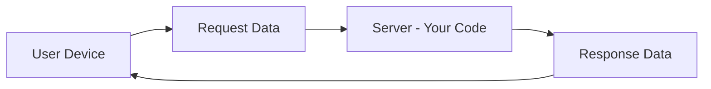

# System Design Basics： Horizontal Vs. Vertical Scaling (1080P30) - Part 1

# Basics of System Design

System design involves structuring and organizing software components to build a robust, scalable, and reliable system. This introduction covers fundamental concepts for beginners.

## Initial Setup: Code on a Computer

Imagine you have a computer running an algorithm or code. This code functions like a standard program:
*   It takes **input**.
*   It produces **output**.

## Exposing Code to Users: The Request-Response Model

When your code is deemed useful by others, they may want to use it. Since you cannot physically give your computer to everyone, you need a way to make your code accessible.

_screenshots/frame_00-00-10.jpg)

1.  **Exposure Mechanism:** Your code is exposed over the internet using a specific protocol.
2.  **API (Application Programming Interface):** This is the standard method for exposing your code. An API defines how other software components can interact with your code.
3.  **Interaction Flow:**
    *   A user sends a **request** to your computer (server).
    *   Your code runs, processes the request, and generates an output.
    *   This output is returned to the user as a **response**.

_screenshots/frame_00-00-41.jpg)

This client-server interaction can be visualized as:

## Challenges of Self-Hosting

Hosting your service on a personal computer (desktop) presents several significant challenges:

*   **Configuration:** You need to manage and configure all aspects, including connecting databases and setting up network endpoints for user connections.
*   **Reliability:** Issues like power loss or hardware failure can lead to service downtime.
*   **Business Impact:** If users are paying for your service, downtime directly translates to financial losses and customer dissatisfaction. You cannot afford for your service to go down.

## Cloud Computing: A Solution for Hosting

To overcome the challenges of self-hosting, services are typically hosted on the cloud.

_screenshots/frame_00-02-35.jpg)

### What is the Cloud?

*   The cloud is essentially a **collection of computers** provided by a third-party vendor (e.g., Amazon Web Services - AWS, Google Cloud Platform, Microsoft Azure).
*   These vendors offer **computation power**, which refers to access to their servers or virtual machines that can run your algorithms and services.
*   There is no fundamental difference between a desktop and a cloud server in terms of running code; the cloud simply provides remote computers that you can access (e.g., via remote login).

### Benefits of Cloud Hosting

*   **Managed Services:** Cloud providers handle a significant portion of the configuration, settings, and underlying infrastructure management.
*   **Reliability:** Cloud infrastructure is designed for high availability and fault tolerance, significantly reducing the risk of downtime compared to self-hosting.
*   **Scalability:** Cloud platforms offer easy ways to increase or decrease computing resources as demand changes.
*   **Focus on Business Logic:** By offloading infrastructure concerns to cloud providers, developers can focus more on the core business requirements and functionality of their applications.

## Scalability: Handling Increased Demand

Once your service is hosted on the cloud and gains popularity, you will eventually face a scenario where your single machine (or current setup) cannot handle the volume of incoming requests. This is where **scalability** becomes crucial.

### Definition of Scalability

Scalability is the ability of a system to handle a growing amount of work or to be easily enlarged to accommodate that growth. In the context of system design, it means the ability to handle more user requests or connections.

### Methods to Achieve Scalability

There are two primary ways to scale a system:

1.  **Vertical Scaling (Scaling Up):**
    *   **Method:** Buying a bigger machine. This involves upgrading the existing server with more resources (e.g., more CPU, RAM, storage).
    *   **Analogy:** Upgrading your single car to a faster, more powerful model.
    *   **Limitations:** There's an upper limit to how powerful a single machine can be, and it can be expensive.

2.  **Horizontal Scaling (Scaling Out):**
    *   **Method:** Buying more machines. This involves adding more servers to distribute the workload across multiple instances.
    *   **Analogy:** Adding more cars to your fleet to handle more passengers.
    *   **Benefits:** Offers greater flexibility and potentially higher limits for handling load. It's often more cost-effective for very large scales.

Both methods generally involve "throwing more money at the problem" to increase capacity. Understanding when and how to apply each scaling strategy is a core aspect of system design.

---

## Scalability: Vertical vs. Horizontal

Scalability is the system's ability to handle an increasing number of requests or workload. There are two main approaches:

### 1. Vertical Scaling (Scaling Up)

*   **Concept:** This involves upgrading an existing machine with more powerful hardware (e.g., more CPU, RAM, faster storage). The computer becomes "larger" and can process requests faster.
*   **Mechanism:** Buy a bigger machine.

_screenshots/frame_00-03-27.jpg)

### 2. Horizontal Scaling (Scaling Out)

*   **Concept:** This involves adding more machines to a system. Incoming requests are then distributed across these multiple machines.
*   **Mechanism:** Buy more machines. Requests can be randomly distributed among them.

_screenshots/frame_00-03-52.jpg)

### Comparison of Vertical vs. Horizontal Scaling

_screenshots/frame_00-05-04.jpg)

| Feature                       | Horizontal Scaling (More Machines)                                                                   | Vertical Scaling (Bigger Machine)                                              |
| :---------------------------- | :--------------------------------------------------------------------------------------------------- | :----------------------------------------------------------------------------- |
| **1. Load Balancing**         | **Required:** Requests need to be distributed across multiple machines.                              | **Not Applicable:** With a single machine, there is no load to balance.        |
| **2. Resilience/Availability** | **Resilient:** If one machine fails, requests can be redirected to other operational machines.       | **Single Point of Failure:** If the single, larger machine fails, the service goes down. |
| **3. Communication Speed**    | **Slow (Network Calls/RPCs):** Communication between services on different machines occurs over the network, which is slower due to I/O overhead. | **Fast (Inter-Process Communication):** Communication happens within the same machine, which is generally much faster. |
| **4. Data Consistency**       | **Complex:** Maintaining data consistency across multiple, potentially distributed databases or caches is challenging, often requiring complex mechanisms or leading to "loose transactional guarantees" (e.g., eventual consistency). | **Consistent:** All data resides on a single system, making it easier to maintain strong data consistency. |
| **5. Scalability Limit**      | **Scales Well:** Can scale almost linearly with the number of machines added, offering high potential for growth. | **Hardware Limitations:** There's a physical limit to how large and powerful a single machine can become. |

### Real-World Application: A Hybrid Approach

In practice, most real-world systems use a hybrid approach that leverages the best aspects of both vertical and horizontal scaling.

*   **Initial Strategy:**
    *   Start with **vertical scaling** as much as feasible. This provides benefits like fast inter-process communication and easier data consistency.
    *   This is often the simpler approach for initial growth.

*   **Long-Term Strategy:**
    *   As user demand grows significantly and vertical scaling limits are approached, transition to or incorporate **horizontal scaling**.
    *   The "hybrid" often means horizontal scaling where *each* individual machine within the horizontally scaled cluster is as vertically scaled (big) as economically and technically feasible.
    *   This approach combines the resilience and high scalability of horizontal scaling with the performance benefits of powerful individual machines.

_screenshots/frame_00-06-05.jpg)

### Key Considerations in System Design

When designing a system, the following three core qualities are paramount:

1.  **Scalability:** Can the system handle increasing load?
2.  **Resilience:** Can the system withstand failures and continue operating?
3.  **Consistency:** Does the system provide accurate and synchronized data across its components?

These considerations guide architectural decisions to build robust and efficient systems.

---

### System Design: The Art of Trade-offs

System design is fundamentally about making **trade-offs** between desirable qualities such as scalability, resilience, and consistency. No single system can maximize all these attributes simultaneously without compromising others.

*   **Balancing Act:** The goal is to design a system that effectively meets specific requirements by carefully balancing these qualities.
*   **Constraints:** These design decisions must be made within the realm of what is technically feasible and cost-effective using available computer science principles and technologies.

_screenshots/frame_00-07-32.jpg)

As illustrated in the comparison of horizontal and vertical scaling, each approach has its advantages and disadvantages. A successful system designer understands these inherent trade-offs and chooses the most appropriate architecture for the given business needs and constraints.

---

