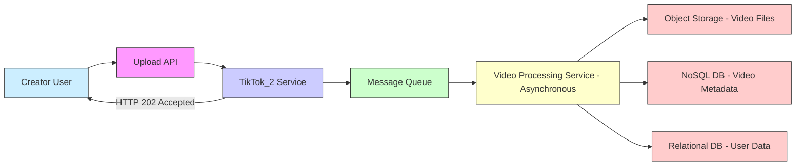
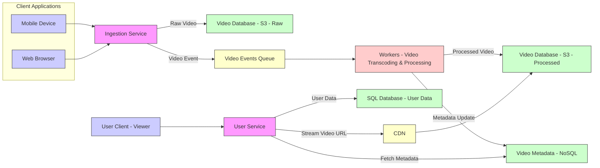
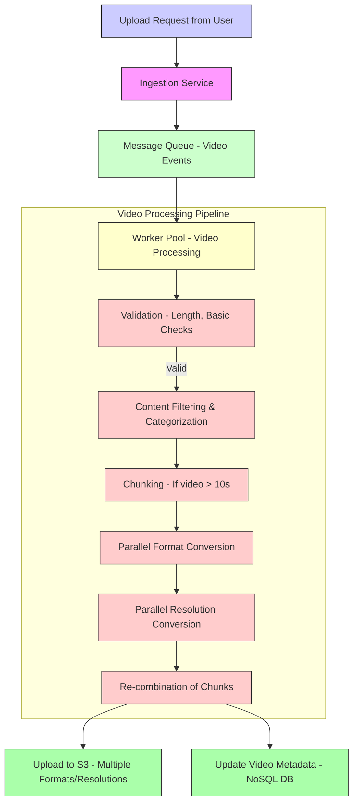

# System Design Interview： Tiktok Architecture With @Sudocode (1080P25) - Part 1

# System Design Interview: Short Video Platform (TikTok/Instagram Reels)

_screenshots/frame_00-00-00.jpg)

## Introduction

This document captures the initial phase of a system design mock interview conducted by GKCS, featuring Yogita Sharma, a Software Engineer at Karin and a prominent system design content creator on YouTube. The objective of this session is to design a short video sharing platform, similar in functionality to TikTok or Instagram Reels.

## Problem Statement

_screenshots/frame_00-00-26.jpg)

The core challenge is to design a system that allows users worldwide to post short videos, which are then distributed to their news feeds. The design must specifically address three fundamental aspects:
1.  **Video Ingestion (Upload):** How users upload videos to the system.
2.  **Video Storage:** The strategy for storing these videos efficiently and reliably.
3.  **Video Distribution:** The mechanism for delivering these videos to users' news feeds or timelines.

## Functional Requirements

Based on the problem statement, the primary functional requirements for the system are:
*   **Video Upload:** Users must be able to upload short video content.
*   **Video Storage:** The system must securely and durably store all uploaded videos.
*   **Feed Generation and Distribution:** The system must generate personalized feeds or timelines and distribute videos to users.

## Non-Functional Requirements (NFRs)

_screenshots/frame_00-00-53.jpg)

The following non-functional requirements are critical for the platform's success, particularly given its global nature and user expectations:

*   **Availability:**
    *   **High Availability:** The system must maintain high availability, ensuring continuous access to video content for users.
    *   **Fault Tolerance:** The system should be highly fault-tolerant. This implies that:
        *   The failure of a single server or even an entire data center should not disrupt the service.
        *   Ideally, the business operations should continue uninterrupted even in the event of significant regional outages.
*   **Consistency:**
    *   **Eventual Consistency:** Strict consistency is not a top priority. It is acceptable for there to be a delay in a newly uploaded video appearing across all geographical regions. For instance, a notification about a new video could reach users even half an hour after the upload.
*   **Performance:**
    *   **Low Latency Upload:** The video upload process itself must be fast, providing users with immediate feedback that their video has been successfully published.
    *   **Low Latency Streaming:** Users should experience minimal latency when streaming or watching videos.
    *   **Upload to User Visibility Latency:** While upload must be fast, the time taken for a video to become fully visible to all target users (e.g., appearing in their feeds, triggering notifications) can be a few minutes.

## Scale Estimation

*   **Daily Active Users (DAU):** The system is expected to serve approximately 10 million Daily Active Users. These users are primarily content viewers.

_screenshots/frame_00-02-14.jpg)

---

## Scale Estimation (Continued)

_screenshots/frame_00-04-29.jpg)

*   **Viewers (Consumers):** The estimate is 10 million Daily Active Users (DAU) who consume videos.
*   **Creators (Uploaders):** The estimated number of creators is 100,000. This is based on the observation that the ratio of creators to consumers is typically low in such platforms.

### Read-to-Write Ratio Analysis

_screenshots/frame_00-06-09.jpg)

The system's workload can be analyzed by calculating the read-to-write ratio:
*   **Writes (Uploads):** 100,000 creators.
*   **Reads (Views):** 10,000,000 viewers.

The ratio of writes to reads is approximately 100,000 / 10,000,000 = 1/100.
*   **Conclusion:** This indicates a read-heavy system, meaning the design should prioritize efficient and scalable video retrieval over write operations. This insight will be crucial when choosing data storage solutions.

## Initial System Design - Monolith Approach

_screenshots/frame_00-06-23.jpg)

The initial approach is to design a simplified monolithic system, which can then be broken down into microservices later.

### 1. Video Upload (Functional Requirement A)

_screenshots/frame_00-06-51.jpg)

*   **Service Name:** Let's call the central service `TikTok_2`.
*   **Upload API:** This service will expose an `upload` API.
*   **API Inputs:** The `upload` API will accept:
    *   User data (e.g., `user ID`, `login credentials`)
    *   Video metadata (e.g., `title`, `description`, `hashtags`)
    *   The actual video file.
*   **Video Length Constraint:** Videos are restricted to a maximum length of 60 seconds. The ideal target length is 7 seconds for short-form content. Longer videos are not currently a primary concern but may be considered for special use cases.
*   **User Experience:** The goal is to provide a low-latency upload experience, making users feel their job is "done" immediately after pressing "publish."

### 2. Video Storage (Functional Requirement B)

_screenshots/frame_00-08-31.jpg)

The system needs to store three distinct types of data:
1.  **User Data:** Information related to user accounts (e.g., profiles, authentication details).
2.  **Video Metadata:** Data describing each video (e.g., `video ID`, `creator ID`, `upload timestamp`, `description`, `likes count`, `view count`).
3.  **Video Data:** The actual binary video files.

**Prioritization for Storage Choice:**
The immediate focus is on storing the **video data** due to its unique characteristics and high demand.

**Considerations for Video Data Storage:**
*   **Read Accessibility:** Videos must be easily and quickly accessible for playback.
*   **High Load:** A single video can be viewed by hundreds, thousands, or even millions of users, leading to significant read load.
*   **Read-Heavy Workload:** Given the 1:100 write-to-read ratio, the storage solution must excel at serving read requests at scale.
*   **Choice of Storage:** Based on prior experience with similar systems, an object storage solution (like Amazon S3, Google Cloud Storage, or Azure Blob Storage) is a strong candidate for storing the actual video files. This choice is driven by the need for high availability, durability, scalability, and cost-effectiveness for large amounts of unstructured data that are frequently read.

---

### Data Storage Choices

_screenshots/frame_00-09-13.jpg)

The choice of database for each data type is critical for performance and scalability:

*   **Video Data (Actual Video Files):**
    *   **Choice:** Object Storage (e.g., Amazon S3).
    *   **Rationale:**
        *   **Reliability & Durability:** Object storage services like S3 are highly reliable for storing large binary files.
        *   **Scalability:** They can handle massive amounts of data and high read loads (millions of views per video).
        *   **Managed Service:** Offloads the burden of building and maintaining a custom storage solution.
        *   **Read Performance:** Optimized for high-throughput reads, crucial for video streaming.
        *   **CDN Integration:** Easily integrates with Content Delivery Networks (CDNs) for low-latency global video distribution (discussed further below).
    *   **Trade-off:** Reliance on a third-party vendor (AWS in this case). An alternative would be to build an in-house object storage system, but this requires significant engineering effort.

*   **Video Metadata:**
    *   **Choice:** NoSQL Database (e.g., MongoDB, or a Key-Value store).
    *   **Rationale:**
        *   **Flexibility:** Metadata schemas can evolve, and NoSQL databases offer schema flexibility.
        *   **Scalability:** Can handle large volumes of read/write operations for metadata.
        *   **Rich Data Types:** Can store various metadata attributes like `thumbnail file paths`, `creation timestamp`, `video length`, `user ID`, `likes`, `views`, `hashtags`, etc.
        *   **Redis (Consideration):** While Redis is a key-value store, it's typically an in-memory cache. For persistent storage of metadata, a database like MongoDB is more suitable.

*   **User Data:**
    *   **Choice:** Relational Database (e.g., MySQL).
    *   **Rationale:**
        *   **Maturity & Reliability:** MySQL is a well-established, "tried and tested" database.
        *   **Structured Data:** User data (e.g., `user profiles`, `authentication details`, `followers`, `following`) is typically highly structured.
        *   **Transactionality:** Supports ACID transactions, which are often important for user account management.
        *   **Integration:** Expected to be accessed by multiple services, including future recommendation systems.

## Upload Service Design

### Initial Monolithic `TikTok_2` Service

_screenshots/frame_00-11-15.jpg)

The `TikTok_2` service will handle the upload API.
*   **Input:** User data, metadata, and the actual video file.
*   **Output:** Stores the video file in S3, metadata in MongoDB, and updates user data in MySQL.

### Scaling the Upload Process

_screenshots/frame_00-11-40.jpg)

Given 100,000 creators, potentially uploading hundreds of thousands of videos daily (e.g., 500,000 files/day if each creator uploads 5 videos), the upload mechanism needs to be robust and handle bursts.

*   **Asynchronous Upload with Queuing:**
    *   **Mechanism:** Instead of direct processing, all upload requests will first be sent to a **message queue**.
    *   **Rationale:**
        *   **Decoupling:** Decouples the upload API from the actual video processing, improving responsiveness.
        *   **Load Leveling:** Prevents the `TikTok_2` service from being overwhelmed during peak upload times by buffering requests.
        *   **Fault Tolerance:** If processing fails, messages can be retried from the queue.
        *   **No Rate Limiting:** Allows creators to upload as many files as they wish without explicit rate limits on the client side, as the queue handles the incoming volume.
    *   **User Acknowledgment:** Upon receiving an upload request, the `TikTok_2` service immediately sends an acknowledgment to the user (e.g., HTTP status `202 Accepted`). This signifies that the request has been received and will be processed, providing a fast response and good user experience for uploads. The actual resource creation happens asynchronously in the background.

### Deeper Dive into S3 and CDN Integration

_screenshots/frame_00-12-53.jpg)

*   **Reliability & SLAs:** S3 (an AWS service) offers high reliability and service level agreements (SLAs) for data storage and access. This saves significant development time and resources compared to building an in-house solution with similar guarantees.
*   **Global Distribution with CDN:**
    *   **Purpose:** To achieve low-latency video streaming for a global user base, S3 can be easily integrated with a Content Delivery Network (CDN).
    *   **Mechanism:** Videos stored in S3 buckets can be cached at various CDN edge locations worldwide. When a user requests a video, the CDN serves it from the nearest edge location, drastically reducing latency.
    *   **Regional Buckets (Optional but beneficial):** Having S3 buckets in different geographical regions can further optimize initial content ingestion and distribution to local CDNs.

---

### Benefits of S3 and CDN for Video Distribution

_screenshots/frame_00-13-18.jpg)

*   **Low Latency:** By replicating video files across multiple S3 regions and leveraging a CDN, videos are served from geographically closer edge locations to users. This significantly reduces network latency.
    *   *Example:* A user in Mumbai, India, would access a video from an S3 bucket or CDN node near Mumbai, while a user in the US would access it from a location closer to them.
*   **High Availability:**
    *   **Eliminates Single Point of Failure:** Storing all files in a single region or server would make it a single point of failure. If that region goes down, the entire system would become unavailable.
    *   **Regional Isolation:** With multi-region S3 and CDN, an outage in one AWS region (e.g., US) would only impact users in that specific region, not globally.
*   **Scalability:** CDNs are designed to handle massive amounts of read traffic, offloading load from origin servers and ensuring smooth streaming even with millions of concurrent viewers.
*   **Cost-Effectiveness:** Using managed services like S3 and CDNs is generally more cost-effective than building and maintaining a global, highly available, and performant video storage and delivery infrastructure in-house.

### Immutability of Video Files

*   **Nature of Content:** Videos on platforms like TikTok, YouTube, or Netflix are generally immutable once uploaded. Users cannot edit a video after it has been published.
*   **Storage Implications:** This immutability aligns well with object storage solutions like S3, which are optimized for write-once, read-many scenarios.
*   **Future Considerations:** If a use case for video editing or modification arises, the storage approach for the actual video files would need to be re-evaluated or supplemented with a different file storage solution that supports mutability.

### Rationale for Database Choices (Detailed)

*   **MySQL for User Data:**
    *   **ACID Properties:** User data typically requires strong consistency and transactional integrity (ACID properties), which relational databases like MySQL provide.
    *   **Relational Structure:** User profiles, relationships (followers/following), and other user-specific information often fit a relational model naturally.
    *   **Denormalization (Future consideration):** While starting with a normalized relational schema, denormalization might be considered later for specific read-heavy queries to optimize performance.

*   **NoSQL (Key-Value/Columnar) for Video Metadata:**
    *   **Schema Flexibility:** Video metadata is less structured and more prone to evolving over time compared to user data. NoSQL databases (e.g., MongoDB, or a key-value store) offer schema flexibility, allowing for easy addition or removal of attributes without complex schema migrations.
    *   **Non-Relational Nature:** Metadata properties like `thumbnail paths`, `upload date`, `duration`, `deletion status`, `engagement metrics`, etc., are often tied directly to a video ID rather than forming complex relationships with other tables.
    *   **Example Metadata Attributes:**
        *   `video_id` (primary key)
        *   `creator_id`
        *   `upload_timestamp`
        *   `duration_seconds`
        *   `thumbnail_url`
        *   `title`
        *   `description`
        *   `hashtags` (array)
        *   `view_count`
        *   `like_count`
        *   `deleted_timestamp` (if applicable)
    *   **Performance:** NoSQL databases can provide high-performance reads and writes for these types of data, which is crucial for dynamic content like video feeds.

---

### Rationale for NoSQL (Key-Value) for Video Metadata (Continued)

*   **Fast Access for Reads:** Key-value stores are generally faster for direct access than relational databases, especially for retrieving a specific record using its primary key (e.g., `video_id`). This speed is crucial for services that frequently fetch metadata.
*   **Recommendation Engine Use Case:** A recommendation engine will need to quickly fetch video links and other metadata (not the entire video file) to process and suggest content to users. A key-value store's rapid access is highly beneficial here.
*   **User History & Video Listing:** When listing all videos created by a user or tracking a user's watch history, the system will frequently query the video metadata store. The horizontal scalability and fast reads of a key-value store make it suitable for these high-volume read operations.
*   **Horizontal Scalability:** Key-value stores are designed for easy horizontal scaling, which is essential for a system with a tremendous number of reads compared to writes.

## Transitioning from Monolith to Microservices

_screenshots/frame_00-18-18.jpg)

The initial monolithic `TikTok_2` service concept will be broken down into specialized microservices to handle specific functionalities more efficiently and scalably.

### Identified Services:

1.  **Ingestion/Upload Service:**
    *   **Role:** Dedicated to handling video uploads.
    *   **Responsibilities:** Receives video files and associated data from users, places them into a message queue for asynchronous processing, and sends an immediate acknowledgment (HTTP 202) to the user.
    *   **Inputs:** Raw video files, user data, metadata.
    *   **Outputs:** Pushes `Video Events` to a queue, stores `Raw Video` in a temporary or raw S3 bucket.

2.  **Video Serving/Streaming Service:**
    *   **Role:** Responsible for delivering videos to users for consumption.
    *   **Responsibilities:** Determines user location and preferences, fetches appropriate video versions from storage (S3 via CDN), and streams them to the user's device.

### Video Processing Requirements

A critical aspect of handling videos is supporting various formats and resolutions.

*   **Need for Multiple Formats & Resolutions:**
    *   **Device Compatibility:** Different devices (e.g., iPhone, Android phones) support different video formats and codecs.
    *   **Network Conditions:** Users have varying network bandwidths; providing multiple resolutions (e.g., 240p, 360p, 720p, 1080p) allows for adaptive streaming, ensuring a smooth experience even on slower connections.
    *   **User Experience:** Higher-end phones can stream high-resolution videos, while lower-end devices or limited data plans benefit from lower resolutions.
*   **Implication:** A single uploaded video needs to be transcoded (converted) into multiple formats and resolutions. This process will be handled by dedicated workers, triggered by video events.

### Updated Architecture Diagram (Conceptual)

_screenshots/frame_00-19-18.jpg)
_screenshots/frame_00-19-28.jpg)

*Note: The diagram above illustrates the conceptual architecture based on the discussed components. For detailed diagrams, refer to the original material.*

---

## Video Processing and Storage Implications

### Multi-Format and Multi-Resolution Storage Calculation

The decision to support multiple video formats and resolutions significantly impacts storage requirements.

*   **Initial Scenario (Hypothetical):**
    *   If a video needs to be supported on 200 different device types and 4 formats, this would result in 800 files per video.
    *   If, on top of that, 3 more formats are supported, it would mean approximately 2,400 files per single uploaded video.
    *   This initial calculation highlights a potential storage scalability concern.

*   **Revised Calculation based on Practical Estimates:**
    *   **Daily Video Uploads:** Estimated at 200,000 videos per day (200K).
    *   **Average Video Size (Raw):** Assuming each 10-second video is approximately 1 MB.
    *   **Base Daily Storage:** 200,000 videos * 1 MB/video = 200 GB/day for raw videos.
    *   **Impact of Multiple Formats:** If we support 3-4 formats/resolutions, this effectively multiplies the storage requirement.
        *   Assuming a conservative multiplier of 3x (since smaller resolutions/formats will be smaller in size), the daily storage becomes: 200 GB * 3 = 600 GB/day.
        *   Another estimate suggests a multiplier of 2x for resolutions and 2x for formats, leading to a total multiplier of 4x. However, considering progressive size reduction for lower resolutions, a multiplier of `1.2 TB` was also suggested as a realistic upper bound for daily storage.
    *   **Final Estimated Daily Storage:** Approximately **1.2 TB per day**.

### Storage Scalability Assessment

*   **Volume:** Storing 1.2 TB of new data per day is considered manageable for a large-scale distributed system, especially with cloud object storage solutions like S3, which offer virtually unlimited storage capacity.
*   **Cost:** While 1.2 TB/day is technically feasible, the cost associated with storing and serving this much data on cloud providers (like AWS S3) can be significant.
    *   **Enterprise Perspective:** For companies generating such high volumes of data and revenue (like TikTok), it eventually makes economic sense to invest in their own dedicated infrastructure (data centers, hardware) rather than solely relying on cloud services, which can become very costly at extreme scales. This is a common trade-off between operational overhead and cost optimization.

### Upload Time and Data Transfer

*   **Bandwidth Dependency:** The time taken to upload and transfer 1.2 TB of data per day is primarily dependent on the available bandwidth and network infrastructure.
*   **Dedicated Bandwidth:** A large-scale distributed system would likely have dedicated, high-capacity bandwidth, making the daily transfer of 1.2 TB feasible without significant latency issues.
*   **Cost Consideration:** High bandwidth and large storage volumes contribute to cloud costs.

## Summary of Current Design Considerations

_screenshots/frame_00-20-53.jpg)
_screenshots/frame_00-23-58.jpg)

The discussion has established a foundational understanding of the system's requirements and initial architectural choices:

*   **Read-Heavy System:** A 1:100 write-to-read ratio dictates a design optimized for high-volume reads.
*   **Microservices Architecture:** Transitioning from a monolith to specialized services (Ingestion, Video Serving, etc.) for better scalability and maintainability.
*   **Data Storage Strategy:**
    *   **Video Files:** Object Storage (S3) for reliability, scalability, and CDN integration.
    *   **Video Metadata:** NoSQL (Key-Value/Columnar DB like MongoDB) for flexible schema, fast reads, and horizontal scalability.
    *   **User Data:** Relational DB (MySQL) for ACID properties and structured user information.
*   **Asynchronous Upload:** Using a message queue to handle uploads, providing low latency user acknowledgment and decoupling processing.
*   **Global Video Delivery:** CDN integration with S3 for low-latency, highly available video streaming worldwide.
*   **Video Transcoding:** Acknowledged need to convert uploaded videos into multiple formats and resolutions to support diverse devices and network conditions, which significantly increases storage requirements but is essential for user experience.

---

## Ingest Engine Workflow

_screenshots/frame_00-24-41.jpg)

The `Ingest Engine` (formerly `TikTok_2` service) is responsible for processing uploaded videos. Its workflow is designed as a pipeline to handle multiple tasks efficiently and in parallel.

### Pipeline Stages:

1.  **Queue Intake:** All incoming video upload requests are first taken from the message queue. This ensures asynchronous processing and load leveling.
2.  **Validation:**
    *   **Length Check:** The first step involves validating the video's length. Videos exceeding the 60-second limit will be rejected.
    *   **Other Checks:** (Implied) Other validation rules might apply here, such as file integrity or basic format checks.
3.  **Content Filtering/Categorization:**
    *   **Appropriateness Check:** Videos may undergo content moderation or filtering to ensure they meet platform guidelines.
    *   **Categorization:** Videos can be analyzed and categorized for recommendation systems or search functionality.
4.  **Video Transcoding (Multi-Format & Multi-Resolution Conversion):** This is a critical and resource-intensive step that is parallelized.

### Detailed Transcoding Pipeline:

The goal is to convert a single uploaded video into multiple formats and resolutions to ensure compatibility across various devices and network conditions.

*   **Step 1: Chunking (for longer videos)**
    *   For videos longer than a predefined chunk size (e.g., 10 seconds), the video file is divided into smaller, manageable chunks.
    *   *Note:* If a video is already short (e.g., 10 seconds or less), it is treated as a single chunk and bypasses this initial splitting, moving directly to the conversion steps.
*   **Step 2: Parallel Format Conversion**
    *   Each video chunk (or the entire video if it's short) is then processed in parallel to convert it into different required formats (e.g., MP4, WebM, HLS segments).
    *   *Example:* If 4 formats are supported, 4 parallel processes will work on converting the chunks into these different formats.
*   **Step 3: Parallel Resolution Conversion**
    *   Following format conversion, each of the newly formatted chunks is further processed in parallel to generate different resolutions (e.g., 1080p, 720p, 480p, 360p).
    *   This creates a matrix of formats and resolutions for each segment of the video.
    *   _screenshots/frame_00-26-44.jpg)
        *   Imagine a table where rows represent different resolutions (e.g., 1080p, 720p, 480p) and columns represent different formats (e.g., MP4, HLS). Each cell in this table would be a distinct version of the video chunk.
*   **Step 4: Re-combination (if chunked)**
    *   Once all chunks have been converted into their respective formats and resolutions, they are re-combined into complete video files for each format/resolution combination.
*   **Outcome:** For a single original video, the pipeline generates multiple copies (e.g., 8 to 16 copies, depending on the number of formats and resolutions supported).

### Storage of Processed Videos

*   **Target:** These multiple processed video files are then uploaded to S3.
*   **Regional Placement:** The upload to S3 should ideally consider the geographical location of the user/creator, storing copies in S3 buckets in regions physically closer to where the video is expected to be most consumed, or in strategically chosen regions for CDN distribution.

### Flow Diagram for Ingestion Pipeline (Conceptual)

---

### Scalability and Flexibility of the Ingest Pipeline

*   **Extensibility:** The modular, pipeline-based approach for video processing offers excellent extensibility.
    *   To support a new video format or resolution, a new step or a new parallel worker can simply be added to the pipeline without significantly altering existing components.
    *   This makes the system adaptable to future technological changes (e.g., new device types, new codecs).
*   **Parallel Processing with Workers:**
    *   Tasks within the pipeline (e.g., converting a chunk to a specific format/resolution) are distributed to a pool of workers.
    *   Each worker picks up an individual task, allowing for simultaneous processing and maximizing throughput.
    *   This pattern is highly effective for heavy, CPU-bound tasks like video transcoding.
*   **Generalizability:** This pipeline architecture is not limited to video processing. It can be applied to any scenario involving heavy, asynchronous processing of large files (e.g., large text files requiring batch processing), where:
    *   Ingestion happens first.
    *   Tasks are pushed to a queue (events).
    *   Workers subscribe to these events and perform the processing.

### Performance and Consistency Implications

*   **Low SLA for Upload Performance:** The parallel processing and chunking of videos significantly reduce the effective time required for an upload to be "processed" from the user's perspective, even though background tasks are extensive. This contributes to meeting the low-latency upload NFR.
*   **Eventual Consistency:** The entire background processing, including transcoding, uploading to S3, and replication across regions/CDNs, operates asynchronously. This means that a newly uploaded video will not be immediately available to all users globally.
    *   There will be a slight delay (e.g., a minute or less for processing, plus replication time) before the video is fully distributed and visible across all viewers.
    *   This aligns perfectly with the stated non-functional requirement for "eventual consistency" for video availability.

## Video Distribution to Users (Functional Requirement C)

_screenshots/frame_00-27-35.jpg)
_screenshots/frame_00-27-47.jpg)
_screenshots/frame_00-30-18.jpg)
_screenshots/frame_00-31-04.jpg)

The next critical step after video processing and storage is distributing these videos to end-users efficiently.

### Key Aspects of Video Distribution:

1.  **Replication of Videos:**
    *   **Multiple Copies:** Videos are not stored as a single copy. Multiple copies are maintained for durability and availability.
    *   **Regional Replication:** Copies are replicated across different geographical regions in S3 buckets. This ensures that users access videos from a location closer to them, minimizing latency.
    *   **CDN Integration:** As previously discussed, CDNs further enhance distribution by caching these replicated videos at edge locations globally.

2.  **Serving Multiple Files per Video:**
    *   **Format/Resolution Matrix:** For each original video, there are multiple derivative files, each corresponding to a specific format and resolution combination (e.g., MP4-1080p, WebM-720p).
    *   **Device and Network Awareness:** When a user requests a video, the `Video Serving Service` must intelligently select the most appropriate video file based on the user's device capabilities, network conditions, and geographical location. This ensures optimal streaming quality and experience.

### Example of Format and Resolution Matrix:

| Resolution \ Format | MP4 | WebM | HLS |
| :------------------ | :-- | :--- | :-- |
| **1080p**           | ✅  | ✅   | ✅  |
| **720p**            | ✅  | ✅   | ✅  |
| **480p**            | ✅  | ✅   | ✅  |
| **360p**            | ✅  | ✅   | ✅  |

*   Each "✅" represents a distinct video file stored in S3, ready for distribution.
*   The `Video Serving Service` will determine which specific file (e.g., MP4-720p) to serve to a user.

---

### 1. Video Replication and Storage Strategy

_screenshots/frame_00-31-28.jpg)

To ensure high availability and fault tolerance, video files are not stored as single copies. Instead, a comprehensive replication strategy is employed:

*   **Multi-Regional Replication:**
    *   Each unique video (in all its formats and resolutions) is replicated across multiple geographical regions (e.g., four regions based on user demographics).
    *   This means if there are 16 or 32 files per video (due to format/resolution variations), each of these files will be available in every designated region.
*   **Fault Tolerance with S3 and CDN:**
    *   **Regional Outage Protection:** If one S3 bucket or an entire AWS region becomes inaccessible, the video remains available from other regions. This prevents a single point of failure from disrupting service globally.
    *   **Node-Level Resilience:** Within each region, S3 (object storage) inherently provides data redundancy across multiple nodes/servers. If one storage node fails, the file is still accessible from another replica, contributing to high availability.
*   **Benefits:** This multi-regional, replicated storage combined with CDN integration directly addresses the non-functional requirements for **fault tolerance** and **high availability**.

### 2. Video Serving Service

_screenshots/frame_00-32-53.jpg)

The `Video Serving Service` is a critical component responsible for intelligently delivering the optimal video stream to each user. Its responsibilities include:

*   **User Location Detection:** Identifying the geographical location of the user to direct the request to the nearest available data center or CDN edge.
*   **Device and Network Analysis:** Determining the user's device capabilities (supported formats, screen resolution) and current network bandwidth.
*   **Optimal Video Selection:** Based on the above factors, the service selects the most appropriate video file (format and resolution) from the available options in S3 (via CDN).
*   **CDN Redirection:** Redirecting the user's request to the nearest CDN edge node that holds a cached copy of the selected video.
*   **Recommendation Integration (Future):** While not the immediate focus, this service would eventually integrate with a recommendation engine to influence which videos are served.

### 3. CDN for Low Latency Distribution

_screenshots/frame_00-33-17.jpg)

*   **CDN Caching:** Content Delivery Networks (CDNs) play a crucial role in achieving low latency for video distribution. Once a video is requested by a user and served from the CDN, it is cached at the nearest edge location. Subsequent requests for the same video from users in that vicinity will be served directly from the cache, bypassing the origin S3 storage and significantly reducing latency.
*   **User Experience Optimization:** The `Video Serving Service` continuously strives to provide the "best quality video" possible while maintaining a smooth user experience, adapting to network conditions and device capabilities.

### 4. CDN: Build vs. Buy Decision

_screenshots/frame_00-33-53.jpg)

The decision to use a third-party CDN (e.g., Akamai) versus building an in-house CDN (e.g., Netflix's Open Connect) involves significant trade-offs:

| Feature           | Third-Party CDN (Buy)                                 | In-House CDN (Build)                                    |
| :---------------- | :---------------------------------------------------- | :------------------------------------------------------ |
| **Cost**          | Ongoing operational expense, scales with usage.       | High upfront investment (hardware, data centers, staff). |
| **Time to Market**| Fast deployment, leveraging existing infrastructure.  | Significant development and deployment time.            |
| **Control**       | Limited control over infrastructure and algorithms.   | Full control over every aspect, highly customizable.     |
| **Flexibility**   | Bound by provider's offerings and SLAs.               | Can be tailored precisely to specific requirements.      |
| **Reliability**   | Relies on provider's SLAs; generally very high.       | Dependent on internal engineering expertise and resources.|
| **Global Reach**  | Extensive global presence, often difficult to replicate. | Challenging and expensive to achieve global scale, considering regulations and infrastructure in different countries. |
| **Resources**     | Requires budget for subscription.                     | Requires substantial engineering resources, hardware, and operational teams. |
| **Suitability**   | Ideal for startups or companies with high variable load, or those who cannot afford the upfront cost/time. | Justified for very large companies with massive scale, unique requirements, and sufficient capital/resources (e.g., Netflix, TikTok). |

*   **Conclusion:** For a company like "Interview Ready" (a smaller entity), outsourcing to a reputable CDN is the pragmatic choice due to the complexity, cost, and time involved in building a global CDN. For a company at the scale of TikTok or Netflix, building a custom CDN becomes a strategic investment for greater control, flexibility, and long-term cost optimization.

---

## Protocols for Video Ingestion and Distribution

### 1. Ingestion Protocol (Client to Ingest Engine)

*   **Choice:** HTTPS (HTTP Secure) over TCP.
*   **Rationale:**
    *   **Security:** HTTPS provides encryption (SSL/TLS) for data in transit, crucial for protecting user data and video content during upload.
    *   **Reliability & Ordering:** Being built on TCP, HTTPS ensures reliable and ordered delivery of data packets, which is essential for large file transfers like videos.
    *   **Fragmentation:** Large video files can be broken into chunks and sent via multiple HTTP requests (or a single streaming HTTP POST), which the ingest engine can then reassemble. This is a standard practice for efficient large file uploads over HTTP.
    *   **Industry Standard:** HTTPS is a widely adopted and well-supported protocol for web communication and file uploads, making it a robust choice.
*   **Alternatives (Considered & Rejected):**
    *   **FTP (File Transfer Protocol):** While designed for file transfer, FTP is generally less secure (lacks native encryption) and less integrated with modern web architectures compared to HTTPS. It would require additional security layers and might complicate integration with other web services.

### 2. Video Distribution Protocol (Video Serving Service to User)

*   **Choice:** HTTPS (for metadata and initial stream requests) and various streaming protocols (e.g., HLS/DASH over HTTP) for the actual video content.
*   **Rationale:** The actual video content is streamed, not fully downloaded, and HTTPS provides the secure and reliable transport for this. Adaptive bitrate streaming protocols (like HLS or DASH) are typically used over HTTP/HTTPS to deliver video chunks, allowing for dynamic quality adjustment based on network conditions.

## End-to-End Request Flow: User Viewing a Creator's Videos

Consider a scenario where a user visits a creator's profile (e.g., "Gaurav's recent TikTok videos") to view their content.

_screenshots/frame_00-35-30.jpg)
_screenshots/frame_00-36-08.jpg)
_screenshots/frame_00-36-45.jpg)
_screenshots/frame_00-38-13.jpg)
_screenshots/frame_00-38-25.jpg)

1.  **User Request:** The user's device sends a request to the `Video Serving Service` to retrieve a list of videos from a specific creator (e.g., Gaurav).

2.  **Video Serving Service Processing:**
    *   **User Identification:** The service first identifies the requesting user (viewer).
    *   **Metadata Retrieval:** It queries the `User Database` (MySQL) to fetch user-specific information (e.g., profile details, followed creators) and the `Video Metadata` database (NoSQL) to retrieve metadata for the requested creator's videos.
        *   This query will fetch details like video titles, descriptions, and thumbnail URLs for all relevant videos.
    *   **List Generation:** The `Video Serving Service` compiles a list of video titles and thumbnails, which is then sent back to the user's device. This initial list does *not* include the actual video content, preventing unnecessary bandwidth usage.

3.  **User Interaction (Thumbnail Click):**
    *   The user sees the list of videos and clicks on a specific video's thumbnail.

4.  **Video Streaming Initiation:**
    *   Upon clicking, the user's device sends a new request (containing the `video ID`) back to the `Video Serving Service`.
    *   **CDN Redirection:** The `Video Serving Service` identifies the optimal video variant (format, resolution) for the user's device and network, and then redirects the request to the nearest `CDN` edge node.
    *   **Direct Streaming from CDN:** The CDN directly streams the selected video content to the user's device.
        *   No further processing or pre-processing is required at this stage; the video files are already optimized and cached.
        *   This direct streaming from the CDN ensures low latency and a smooth viewing experience.

**Key Principle:** Videos are *not* pre-downloaded or pre-streamed to the user's device before they click on them. Streaming only begins *after* explicit user interaction, optimizing bandwidth and resource usage.

---

