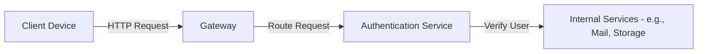

# System Design Walkthrough At Interviewready Designed For Sde 1 To Sde 3 Interview Preparation (1080P30) - Part 1

# Interview Ready System Design Course Walkthrough

This document provides a comprehensive walkthrough of the System Design course offered by Interview Ready. It's designed to be useful for both new users and those who have started but not completed the course.

## Accessing the Course

1.  **Login/Signup:**
    *   Users need to log in to access the course.
    *   Signup options include Google, GitHub, or traditional email/password.
    *   _screenshots/frame_00-00-12.jpg)
    *   **Note:** The zip code field is optional for users outside India.
2.  **Free Preview:**
    *   A free preview is available to explore the course content before purchase.
    *   _screenshots/frame_00-00-00.jpg)
    *   Coupon codes can be applied during the purchase process if available.
3.  **Purchase Options:**
    *   The paid sections of the course can be unlocked after buying.
    *   Payment options include Indian Rupees (INR) for Indian payments and US Dollars (USD) for international payments.

## Course Structure and Content

The course is divided into four main sections, designed to guide learners through various aspects of system design:

| Section Name                 | Description                                                                                                                                              | Target Audience/Focus                                                                                                                                                                                                      |
| :--------------------------- | :------------------------------------------------------------------------------------------------------------------------------------------------------- | :------------------------------------------------------------------------------------------------------------------------------------------------------------------------------------------------------------------------- |
| **1. Fundamentals**          | Covers foundational concepts of system design. All videos in this section are free.                                                                       | Highly recommended for beginners or those wishing to refresh their basic knowledge.                                                                                                                                         |
| **2. High-Level Design (HLD)** | Focuses on designing large-scale distributed systems and understanding how their various components interact and behave. (e.g., designing Gmail)          | Intermediate to advanced learners, building upon fundamental concepts.                                                                                                                                                     |
| **3. Low-Level Design (LLD)**  | Dives into designing specific components of a large system, identifying necessary objects and classes. (e.g., designing a component of Splitwise)           | Advanced learners, closer to coding and test case design for system components. The first LLD chapter covers Splitwise.                                                                                                     |
| **4. Additional Free Resources** | Provides supplementary materials. These resources alone are often sufficient for clearing an SD1 (Software Developer Level 1) interview.                   | All learners, particularly useful for interview preparation at junior levels.                                                                                                                                              |

## Interactive Learning Features

The course incorporates several features to enhance the learning experience:

*   **Course Progress Tracking:**
    *   _screenshots/frame_00-02-13.jpg)
    *   The system tracks your completion percentage for the course.
    *   A certificate is awarded for 100% course completion, serving as an incentive.
*   **Video-Specific Features:**
    *   **About Section:** Provides useful information relevant to the video lesson.
    *   **Resources Section:** Links to external videos or supplementary materials.
    *   **Note Section:** Allows users to take personal notes directly within the course interface, which can be useful for interview preparation or general upskilling.
    *   **Discussion Section:** Facilitates interaction and questions among learners.
*   **Assessment & Supplementary Materials:**
    *   **Architecture Diagrams:** Most videos are supplemented with visual architecture diagrams to clarify complex concepts.
        *   _screenshots/frame_00-02-50.jpg)
    *   **Quiz Sections:** Help users test their understanding of concepts at a deep level.
    *   **FAQs (Frequently Asked Questions):** Provided for relevant chapters to address common queries.
    *   **API Contracts:** Available for relevant chapters, detailing communication protocols.
        *   _screenshots/frame_00-02-38.jpg)
    *   **Capacity Estimation:** Included for relevant chapters to teach system scaling.
    *   **Video Rating:** Users can rate videos (1-5 stars) to provide feedback.

## High-Level Design (HLD) Explained

High-Level Design involves conceptualizing large-scale distributed systems. The focus is on how various components behave and interact to fulfill the system's requirements.

**Example: Designing Gmail**

A Gmail-like system would typically include:

*   **Gateway:** Acts as an entry point, receiving requests from clients and routing them to appropriate internal services.
*   **Authentication Service:** Handles user verification and authorization before requests proceed to core services.

## Low-Level Design (LLD) Explained

Low-Level Design focuses on the granular details of a specific component within a large distributed system. It involves defining the objects and classes required for that component, bringing the design closer to actual code implementation and test case development.

**Example: Designing a component of Splitwise**

For a system like Splitwise, LLD would involve defining classes for `User`, `Expense`, `Group`, `Transaction`, their attributes, methods, and relationships.

## Recommended Learning Path and Target Audience

The recommended progression through the course is:

1.  **Fundamentals:** Build a strong foundation.
2.  **High-Level Design:** Learn to architect large systems.
3.  **Low-Level Design:** Understand the internal workings of system components.

The "Additional Free Resources" section is designed to be sufficient for clearing an SD1 (Software Developer Level 1) interview. For more senior roles (SD2 to SD3), it is recommended to complete the entire course. The course is primarily tailored for individuals targeting SD2 to SD3 interview levels.

---

### Course Suitability for Product/Program Management

While the course is primarily geared towards Software Development (SD) interview levels, individuals in **Product or Program Management** roles may find it useful as a revision material. Although it may not introduce entirely new concepts for them, it can help solidify their understanding of system design principles.

_screenshots/frame_00-04-03.jpg)

As illustrated by the screenshot showing topics like "Chess Design: Building a highly scalable turn-based gaming website" or "Design a Live Video Streaming System like ESPN" under High-Level Design, and "Payment Tracking App like Splitwise" under Low-Level Design, the course offers a wide range of case studies that can be valuable for understanding technical feasibility and architectural considerations relevant to product development.

### Support and Contact Channels

For any further queries or assistance, Interview Ready provides multiple contact channels:

1.  **Chatbot:**
    *   Designed to answer common queries automatically for quick resolution.
    *   For complex or specific inquiries, human support responds within 24 hours.
2.  **Email:**
    *   Users can contact support directly via email at `contact@interviewready.io`.
3.  **Contact Us Form:**
    *   A dedicated form is available on the website for submitting messages.
    *   When reporting a bug, providing a screenshot is highly recommended to expedite resolution.

---

