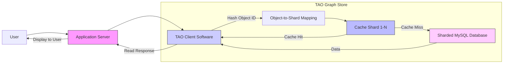

# Tao： Facebook’S Distributed Data Store For The Social Graph (1080P25) - Part 1

# Facebook's Graph Store: TAO (The Associations and Objects)

_screenshots/frame_00-00-00.jpg)

## Introduction to TAO

TAO, which stands for "The Associations and Objects," is Facebook's specialized graph store designed to manage its massive social graph. This white paper from 2013 outlines the architecture and design choices made to handle the immense scale and unique characteristics of Facebook's data.

## Core Concepts: Objects and Associations

At its core, TAO represents the social graph using two fundamental entities:

*   **Objects:** These correspond to **nodes** in a graph.
    *   They typically map to repeatable entities or "things" within the Facebook ecosystem.
    *   Examples: a user (person), a hotel, a comment.
*   **Associations:** These correspond to **edges** in a graph.
    *   They represent connections or relationships between objects.
    *   They generally map to events or actions.
    *   Example: A person (Object 1) "checks into" (Association) a hotel (Object 2).
    *   Another example: When a new comment is added, the original post might be the source object, and the new comment itself could be a separate object, with an association linking them.

_screenshots/frame_00-00-59.jpg)

The fundamental structure is an `Object_1` connected to `Object_2` via an `Association`.

## Scale and Performance Challenges (circa 2013)

Facebook's social graph presented extreme challenges due to its sheer scale and access patterns:

*   **Data Volume:** The graph comprised petabytes of data.
*   **Query Throughput:** The system needed to handle approximately 1 billion queries per second on the social graph.
    *   *Note:* The presenter speculates this number would be significantly higher (e.g., 10x) in the years following 2013.
*   **Workload Pattern:** A critical observation was that about **99.8% of these queries were read operations**, while write operations were far less frequent.
    *   This read-heavy pattern is similar to observations in other high-scale systems, such as those discussed in the Memcached white paper.
    *   This characteristic heavily influenced the design decisions, allowing for read-optimized solutions.

_screenshots/frame_00-02-58.jpg)

## Design Philosophy and Solution

In 2013, Facebook faced the challenge of building a graph store that could meet these demanding requirements when no off-the-shelf solution existed at such a scale.

### Initial Considerations & Limitations

*   **Existing Graph Databases:** Commercial graph databases like Neo4J were available.
    *   **Limitation:** These were typically designed for disk-based storage and were not built to handle the required 1 billion queries per second, especially with petabytes of data. Disk I/O would be too slow.
*   **In-Memory Graph Databases:** The ideal solution would be an in-memory graph database to achieve the necessary speed.
    *   **Limitation:** No in-memory graph database existed that could handle petabytes of data at Facebook's scale.

### The "Build vs. Leverage" Decision

While building a system from scratch might seem appealing, the Facebook engineering team, prioritizing impact and efficiency, opted to leverage existing, well-understood infrastructure.

*   **Facebook's Strengths:**
    *   **MySQL Mastery:** Facebook had extensive experience and expertise with MySQL, having optimized it for their specific needs over many years.
    *   **Memcached Expertise:** Facebook was a major contributor to and expert user of Memcached, an extremely efficient distributed caching system. They had deep knowledge of its operation and scalability.

### TAO's Architectural Foundation

The engineers decided to build TAO as a wrapper around existing technologies:

*   **Primary Data Store:** MySQL would serve as the persistent backend for the graph data.
*   **In-Memory Graph Store/Cache:** Memcached would be used as the primary in-memory store for the graph, leveraging its high performance for read-heavy workloads.

_screenshots/frame_00-03-46.jpg)

This approach allowed Facebook to create a highly scalable, in-memory graph store by combining their expertise in MySQL for persistence and Memcached for rapid data access, rather than developing an entirely new database system from the ground up.

---

### TAO's Design Requirements and Principles

The development of TAO was guided by several critical requirements to address Facebook's unique scale and operational needs for its social graph.

_screenshots/frame_00-07-21.jpg)

1.  **Low Latency:**
    *   **Goal:** Achieve very fast response times for queries, typically under 25 milliseconds.
    *   **Solution:** Keep the active graph data primarily in memory. This aligns with the decision to use Memcached as the core in-memory component.
    _screenshots/frame_00-03-58.jpg)

2.  **Graph Store Abstraction:**
    *   **Goal:** Provide graph-specific functionalities despite using a key-value store (Memcached) and a relational database (MySQL) as underlying technologies.
    *   **Solution:** Implement API wrappers over Memcached that expose graph-centric operations (e.g., creating/reading/updating/deleting associations).
    _screenshots/frame_00-03-58.jpg)

3.  **Ease of Use:**
    *   **Goal:** Ensure that Facebook engineers can easily adopt and use the graph store without needing deep knowledge of Memcached's internal workings or nuances.
    *   **Motivation:** Abstracting away complexity is crucial for widespread adoption of any new system within an organization. Engineers should be able to focus on graph logic, not cache management. This was a primary driver for centralizing graph storage logic into a single system managed by senior engineers.
    *   **Principle:** User-friendly design often takes precedence over raw efficiency in initial product development, as efficiency can be optimized later, but poor usability hinders adoption.
    _screenshots/frame_00-04-12.jpg)

4.  **High Hit Rate:**
    *   **Goal:** Maximize the number of queries served directly from the in-memory cache (Memcached) to minimize reliance on the slower MySQL backend.
    *   **Approach:** Design the cache to observe and mimic the actual access patterns of the system. There is no "perfect" general-purpose cache; caches must be tailored to specific workloads.
    *   **Target:** Achieve a cache hit rate of 95% or higher.
    _screenshots/frame_00-04-12.jpg)

### TAO's API Design: Graph-Centric Operations

The API wrappers over Memcached are designed to make the underlying cache behave like a true graph store, offering intuitive operations for objects and associations.

_screenshots/frame_00-05-46.jpg)

#### Core Association Operations (CRUD)

The system exposes APIs for the fundamental Create, Read, Update, and Delete (CRUD) operations on associations.

*   **`add_association` (Create):**
    *   **Purpose:** To establish a new connection between two objects.
    *   **Parameters:** `source_object_ID`, `destination_object_ID`, `association_type`.
    *   **Example:** `add_association(Gaurav, Pramod_Varma, "friend_request")` would represent Gaurav sending a friend request to Pramod Varma.

#### Querying Associations

TAO provides flexible APIs for retrieving associations, catering to common social graph query patterns.

1.  **`get_associations` (Read):**
    *   **Purpose:** Retrieve associations based on a source object and association type.
    *   **Basic Parameters:** `source_object_ID`, `association_type`.
    *   **Example:** `get_associations(Gaurav, "friends")` would retrieve all friends of Gaurav.
    *   **Advanced Parameters for Filtering and Pagination:**
        *   **`limit`:** Retrieve only a specified number of associations (e.g., `get_associations(Gaurav, "friends", limit=100)` for the top 100 most active friends).
        *   **`time_range`:** Filter associations by a specific time window.
            *   **Example:** `get_associations(Gaurav, "friends", start_time="now - 15 days", end_time="now")` would fetch friends added or active within the last 15 days.
            _screenshots/frame_00-06-40.jpg)
        *   **`offset` / Pagination:** Support fetching results in chunks for displaying long lists (e.g., "next page" functionality on a friend list).

2.  **`get_association_count` (Read Count):**
    *   **Purpose:** Efficiently retrieve the number of associations for a given source object and association type without fetching all individual associations.
    *   **Parameters:** `source_object_ID`, `association_type`.
    *   **Example 1 (User Friends):** `get_association_count(Gaurav, "friends")` returns the total number of friends Gaurav has. This avoids fetching the entire friend list just to display a count on a profile.
    *   **Example 2 (Object Check-ins):** `get_association_count(Las_Vegas_Hotel_ID, "checked_in")` could return the number of people who have checked into that specific hotel.
    *   **Underlying Mechanism (Implied):** Facebook employs a clever technique here. While a "check-in" might typically be modeled as `Person -> Checked_In -> Hotel`, the `get_association_count` API can query the *hotel* as the `source_object_ID` for the `checked_in` association type. This suggests that associations are either stored bidirectionally or indexed in a way that allows reverse lookups or pre-aggregated counts to be efficiently retrieved.

---

### Bi-directional Relations and Limited API Design

_screenshots/frame_00-08-29.jpg)

TAO's design incorporates bi-directional relationships for associations, allowing queries from both ends of an edge.

*   **Bi-directional Edges:** While an association might conceptually flow from a source to a destination (e.g., `Person -> "checked_into" -> Hotel`), TAO allows querying in reverse.
    *   Example: A person can query "all hotels I've checked into."
    *   Conversely, a hotel can query "all people who have checked into me" using the `get_association_count` API, where the hotel acts as the source and the "checked-in" type refers to the inverse relationship. This implies an internal mechanism to manage and efficiently query these inverse relationships.
*   **Minimal API Set:** TAO deliberately offers a very limited set of APIs.
    *   **Rationale:** This minimalist approach is critical for maintaining high performance and scalability, especially when handling a billion read queries per second.
    *   **Performance:** A restricted feature set allows for deeper optimization, preventing performance deterioration that could arise from complex functionalities.
    *   **Adoption:** A simple and easy-to-understand API encourages wider adoption among engineers, preventing them from building custom, potentially less efficient, solutions.
    *   **Functionality:** The APIs primarily support paginated responses for retrieving associations, ensuring efficient data transfer over the network.

### TAO's Scalable and Performant Architecture

The core of TAO's architecture relies on a combination of sharded MySQL databases and a distributed Memcached layer, designed to handle petabytes of data and billions of queries.

_screenshots/frame_00-09-17.jpg)

#### Components:

1.  **Application Servers (Clients):**
    *   Facebook's application servers run a client-side software library for TAO.
    *   This client is responsible for interacting with the TAO cache and, if necessary, the backend MySQL database.

2.  **Distributed Memcached Store (TAO Caches):**
    *   Comprises multiple Memcached servers, forming a distributed in-memory cache.
    *   Each Memcached server (shard) is responsible for a specific range of keys/objects.
    *   To maximize cache hit rates, each shard primarily stores the **most popular objects/associations** within its assigned key range. This ensures frequently accessed data is readily available in memory.
    _screenshots/frame_00-09-29.jpg)
    _screenshots/frame_00-10-52.jpg)

3.  **Sharded MySQL Backend:**
    *   The persistent storage layer consists of multiple MySQL instances.
    *   This sharded setup allows for horizontal scaling to manage petabytes of data and distribute the storage load across many servers.

#### Query Flow:

1.  **Request Initiation:** A user interaction triggers a query on an application server.
2.  **Client-Side Hashing:** The TAO client software on the application server takes the `object_ID` (or `source_object_ID` for associations) and hashes it.
3.  **Shard Mapping:** The hash value (e.g., 123) is used to determine which specific Memcached shard is responsible for that object's data. This mapping is based on predefined key ranges assigned to each shard.
4.  **Cache Lookup:** The client sends the query to the identified Memcached shard.
    *   **Cache Hit:** If the data (object or association) is found in the shard's memory, it is immediately returned to the client, providing extremely low-latency access.
    *   **Cache Miss:** If the data is not present in the Memcached shard (either because it's not popular enough to be cached or hasn't been accessed recently), the client then issues a query to the backend MySQL database.
5.  **Data Retrieval from MySQL:** MySQL retrieves the data and returns it to the TAO client, which may then populate the cache for future requests.

#### Write Operations:

*   All write operations (e.g., adding a new association) are directed **directly to the MySQL database**.
*   This simplifies the architecture by offloading transactional integrity and persistence concerns to MySQL.
*   Memcached's eventual consistency model handles cache invalidation or population as necessary following database updates.

---

### Hashing Strategy for Objects and Edges

To route queries and writes to the correct Memcached shard, a hashing mechanism is employed.

*   **Object Hashing:**
    *   This is straightforward: the `object_ID` is hashed to determine its corresponding shard.
    *   Example: Hashing `object_ID` 123 might yield a value of 400, which maps to a specific shard.
    _screenshots/frame_00-12-28.jpg)

*   **Edge Hashing:**
    *   Hashing edges is more complex due to the common access pattern of retrieving all edges from a particular source.
    *   **Principle:** To optimize for queries like "get all friends of Gaurav," all edges originating from a specific source (e.g., Gaurav's friends) should be co-located on the same shard as the source object itself.
    *   **Method:** Edges are hashed based on their **`source_ID`**. This ensures that all outgoing associations for a given object are stored together, facilitating efficient retrieval.
    *   Example: If `Person_123` likes `Post_345` (an edge of type "like"), the edge's hash is derived from `Person_123`'s ID. If the hash of `Person_123` maps to Shard 1, then this "like" edge will also be stored on Shard 1.
    _screenshots/frame_00-13-32.jpg)

### Handling Bi-directional Edges and Consistency

As discussed earlier, TAO supports bi-directional relationships, which introduces a challenge for data consistency during write operations.

*   **Inverse Edges:** For every explicit association (e.g., `Person -> "likes" -> Post`), an implicit or explicit inverse association is often maintained (e.g., `Post -> "liked_by" -> Person`).
    *   **Purpose:** The inverse edge allows efficient queries from the destination's perspective (e.g., "who has liked this post?").
    *   **Sharding Implication:** Since edges are sharded by their `source_ID`, the original edge (`Person -> Post`) will be stored on a shard determined by `Person`'s ID. The inverse edge (`Post -> Person`) will be stored on a different shard, determined by `Post`'s ID. This means a single logical "like" action results in writes to two different physical shards.
    _screenshots/frame_00-13-53.jpg)

*   **Data Inconsistency Problem:**
    *   When writing to two different shards, there's a risk of inconsistency. One shard might successfully record the write, while the other fails (due to network issues, clock skew, shard downtime, etc.).
    *   This would lead to a fragmented view of the relationship: the `Person` might show they liked the `Post`, but the `Post` might not show that the `Person` liked it.

*   **TAO's Solution: Client-Managed Sequential Writes:**
    *   To prevent inconsistency, TAO employs a client-side coordination mechanism for bi-directional edge writes.
    *   **Process:**
        1.  The application client sends the write request for the *first* edge (e.g., `Person -> "likes" -> Post`) to its corresponding shard.
        2.  The client **waits for a successful response** from the first shard.
        3.  **Only after confirming success** for the first write, the client then sends the write request for the *inverse* edge (e.g., `Post -> "liked_by" -> Person`) to its respective shard.
        4.  If any write fails, the client is responsible for **retrying** the operation until it succeeds, ensuring both sides of the bi-directional relationship are eventually consistent.
    *   **Benefit:** This approach guarantees that both sides of an association are eventually persisted, even if it introduces a slight increase in latency for write operations due to sequential writes and potential retries. Given the read-heavy nature of Facebook's workload (99.8% reads), this trade-off for write consistency is acceptable.

---

### Client-Managed Consistency for Bi-directional Edges (Continued)

_screenshots/frame_00-16-01.jpg)

While the client-managed sequential write strategy aims for eventual consistency by retrying failed writes, there's a scenario where a partial failure can occur:

*   **Scenario: Second Write Fails:** If the first edge write (e.g., `Person -> Post`) succeeds on Shard 1, but the second, inverse edge write (e.g., `Post -> Person`) fails on Shard 3, it leads to temporary data inconsistency.
    *   The `Person` object would correctly show the "like."
    *   However, the `Post` object would not show that this specific `Person` liked it, creating a "hanging edge."
*   **Challenges with Distributed Transactions:** Implementing a full distributed transaction to roll back the first write in case the second fails is:
    *   **Complex:** Especially in a highly distributed system.
    *   **Slow:** It would significantly increase write latency.
*   **TAO's Solution: Asynchronous Repair with Cron Jobs:**
    *   Instead of complex distributed transactions, TAO embraces eventual consistency for these edge cases.
    *   If a second write fails, the "hanging edge" is simply left as is.
    *   A **cron job** (a scheduled task) runs periodically to scan for and identify these incomplete or "hanging" edges.
    *   This cron job then retries the failed writes, ensuring that all bi-directional associations eventually become consistent.

### Optimizing for Read-Heavy Workloads: Primary and Replica Shards

Given that 99.8% of queries are reads, TAO's architecture is heavily optimized for read performance while minimizing the impact of writes.

*   **The Problem of Write Amplification:**
    *   If every shard in a system (e.g., 1,000 shards) were capable of writes and held replicas of data, every write operation would require updating all 1,000 replicas.
    *   This leads to **massive write amplification**, making write operations extremely slow and resource-intensive.
    *   Such a design would significantly degrade performance for both reads (due to lock contention or replication overhead) and writes.
    _screenshots/frame_00-16-14.jpg)

*   **TAO's Solution: Splitting Shards into Primary and Replica Roles:**
    *   The entire TAO architecture is split into two distinct types of shards:
        1.  **Primary Shards:** These are responsible for handling **write operations** for a specific key range.
        2.  **Replica Shards:** These are responsible for serving **read operations** for the same key range.
    *   **Ratio:** Since writes are rare (0.2% of queries), only a small percentage of shards need to be primary shards. For instance, if only 2% of nodes are designated as primary nodes, the write amplification factor is drastically reduced (e.g., from 1,000 to 10 if there are 10 primary shards in total).
    *   **Facebook's Implementation:** For any given key range, Facebook typically has **only one primary shard** and many replica shards.
    _screenshots/frame_00-17-31.jpg)
    _screenshots/frame_00-17-44.jpg)

#### Data Propagation and Consistency

*   **Write Flow to Primary Shards:**
    *   When a write operation occurs, it is directed **only to the primary shard** responsible for that key range.
    *   This significantly reduces write amplification.
*   **Change Data Capture (CDC) for Replication:**
    *   Updates from the primary shards are propagated to the replica shards using a Change Data Capture (CDC) solution.
    *   For MySQL, Facebook uses its custom CDC wrapper called **Mexqueil** (built on top of MySQL's bin log).
    *   Mexqueil captures database changes (like new edges or object updates) from the primary MySQL instance and propagates these events to all relevant replica shards.
*   **Read-After-Write Consistency:**
    *   TAO achieves "read-after-write" consistency, which means that immediately after a write operation is acknowledged as successful, subsequent reads are guaranteed to see the updated data.
    *   **Mechanism:** Clients **never directly connect to a primary shard for write operations.** All write operations are first sent to the **nearest read replica** (client's local cache). This replica then coordinates with the primary shard for the actual write, and only after the primary acknowledges the write is the client notified, ensuring that any subsequent reads from that client's nearest replica will reflect the change.
    _screenshots/frame_00-18-23.jpg)

---

### Read-After-Write Consistency Mechanism

_screenshots/frame_00-20-20.jpg)

TAO ensures "read-after-write" consistency through a specific write flow:

1.  **Client Initiates Write:** A write operation (e.g., adding an edge) is first sent by the TAO client to its **nearest read replica shard**.
2.  **Read Replica Forwards to Primary:** The read replica, which knows its designated primary shard, forwards the write request to that **primary shard**.
3.  **Primary Persists to Database:** The primary shard receives the write, persists the change to the underlying MySQL database, and waits for the database's acknowledgment.
4.  **Primary Responds to Read Replica:** Once the database write is successful, the primary shard responds to the initiating read replica.
5.  **Read Replica Updates and Responds to Client:** The read replica updates its own cache with the new data (now being consistent with the primary) and then sends a success response back to the client.
6.  **Guaranteed Consistency:** This sequence ensures that any subsequent read requests from that client to its nearest read replica will immediately reflect the newly written data, thus providing read-after-write consistency.

### Handling Viral Events and "Hot" Shards

Social media systems frequently experience "viral events" where certain content or users become extremely popular, leading to a sudden surge in access. This can create "hot spots" or "hot shards" within the graph store.

*   **The Problem:**
    *   Consider a post from a very famous personality (e.g., Shahrukh Khan). This post (an object) becomes "super hot."
    *   It generates thousands or hundreds of thousands of associated edges (likes, comments, shares).
    *   If all these edges are routed to a single shard (based on the `source_ID` of the post), that shard becomes abnormally overloaded.
    *   This overload is not just about query volume but also the sheer **amount of data** (millions of edges) that a single shard might struggle to hold in memory or serve efficiently.

*   **Initial Mitigation: Sharding by Source ID + Type:**
    *   To alleviate the load on a single shard, TAO can route edges not just by `source_ID`, but by a combination of `source_ID + type`.
    *   **Example:** For Shahrukh Khan's post:
        *   All "likes" for this post go to Shard A.
        *   All "comments" for this post go to Shard B.
        *   All "shares" for this post go to Shard C.
    *   **Benefit:** This distributes the load across different shards for different *types* of interactions with a hot object.
    _screenshots/frame_00-21-31.jpg)

*   **Limitations of Source ID + Type Sharding:**
    *   While helpful, this strategy may not be sufficient for extremely viral events.
    *   The number of "likes" on a single post can still be astronomically high, causing Shard A (handling likes) to become excessively hot.
    *   Similarly, a single "hot comment" (e.g., by another celebrity like Amitabh Bachchan) might also generate a massive amount of engagement, making its shard hot even if sharded by type.
    _screenshots/frame_00-21-52.jpg)

*   **Ultimate Fallback for Super Hot Shards:**
    *   When a shard becomes excessively hot and starts failing or performing poorly, the TAO client implements a critical fallback: it **bypasses the cache entirely and directly queries the underlying MySQL database.**
    *   **Rationale:** The problem isn't a lack of caching capacity for the *object* itself, but the overwhelming volume of associated *edges* that a single cache shard cannot realistically manage. Pushing all this data into a single shard, even with an LRU (Least Recently Used) policy, is inefficient and often futile.
    *   **Why adding more read replicas won't help:** Simply adding more read replicas for the same hot shard doesn't solve the core issue. Each replica would still need to store the same massive amount of data, and the problem is the data volume itself for a single logical entity, not just the number of servers serving it. The database, designed for persistence and large-scale data storage, is the more robust solution for these extreme, transient hot spots.
    _screenshots/frame_00-22-32.jpg)
</REFINEDNOTES>

---

### Handling Viral Events and "Hot" Shards (Continued)

_screenshots/frame_00-23-45.jpg)

*   **Avoiding Thrashing:** If a shard attempts to host an overwhelming amount of data from a viral event (e.g., millions of likes for a single post), it leads to severe **cache thrashing**.
    *   Thrashing occurs when the cache constantly evicts data to make space for new incoming data, only for that evicted data to be requested again almost immediately. This results in a very low cache hit rate and extremely poor performance, as most requests end up going to the slower backend database anyway.
*   **Direct Database Query as a Deliberate Strategy:**
    *   Rather than attempting to force all this volatile, high-volume data into a cache shard that will inevitably thrash, TAO's strategy is to **directly query the database** for objects and associations identified as belonging to an excessively hot shard.
    *   This approach acknowledges that for truly viral content, the database is the most reliable and efficient source, as it is designed for large-scale persistent storage.
    *   By bypassing the struggling cache, the system avoids exacerbating the problem with inefficient evictions and re-fetches, leading to more predictable performance for these intense workloads.

### Conclusion: TAO's Innovative Approach

TAO stands out as a significant engineering achievement by Facebook, primarily due to its innovative approach to building a high-performance graph store.

*   **Leveraging Existing Technology:** Instead of developing a graph database from scratch, Facebook successfully created a system that "feels" and "behaves" like a graph store by intelligently layering graph-centric APIs and algorithms on top of their existing, highly optimized infrastructure:
    *   **Memcached:** For distributed, in-memory caching and low-latency reads.
    *   **MySQL:** For sharded, persistent storage.
    *   **Mexqueil (Custom CDC):** For efficient data propagation and consistency.
*   **Key Innovation:** The brilliance of TAO lies in its ability to abstract away the complexities of Memcached and MySQL, presenting a simplified, graph-oriented interface to developers while meeting extreme scale and performance demands through clever architectural design and optimizations tailored for a read-heavy workload.

---

