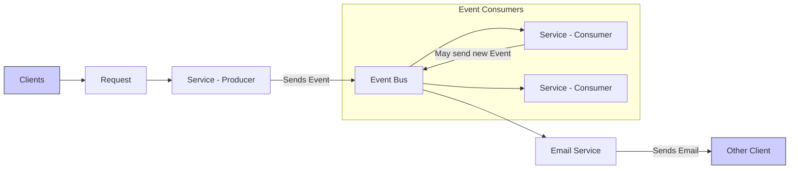

# What'S An Event Driven System？ (720P60) - Part 1

# Event-Driven Architecture (EDA)

_screenshots/frame_00-00-00.jpg)

Event-Driven Architecture (EDA) is a system design paradigm where services communicate indirectly through events, rather than direct requests. This approach fundamentally differs from traditional request-response architectures.

## Core Concepts of Event-Driven Architecture

In an EDA, the interaction among services is decoupled:
*   **Clients** send requests to a primary gateway service.
*   **Services** do not interact with each other directly. Instead, they use **events** to signal changes or occurrences.
*   When a service sends an event to an **Event Bus**, it announces that "something has happened" that concerns it.
*   **Interested consumers** (also known as **subscribers**) listen to the Event Bus, consume relevant events, and react accordingly. These services are often called **producers** when they send events.
*   After consuming an event, a service's internal state might change, leading it to create and send new events. This chain of events can propagate through various services.

_screenshots/frame_00-00-23.jpg)

The diagram above illustrates a typical flow in an Event-Driven Architecture:

## EDA vs. Request-Response Architecture

| Feature            | Request-Response Architecture                               | Event-Driven Architecture                                 |
| :----------------- | :---------------------------------------------------------- | :-------------------------------------------------------- |
| **Communication**  | Direct interaction between services                         | Indirect interaction via events and an event bus          |
| **Coupling**       | Tightly coupled (services need to know about each other)    | Loosely coupled (services don't need to know about others)|
| **Interaction**    | Synchronous, typically waits for a response                 | Asynchronous, reacts to events                            |
| **Scalability**    | Can be challenging to scale individual services independently| Easier to scale and add new consumers without affecting producers |
| **Failure Impact** | Failure in one service can directly impact others           | More resilient; events can be retried or processed later  |

## Popular Applications of Event-Driven Architecture

EDA is widely adopted in various domains:
*   **Git:** Uses "commits" as events to track history and changes.
*   **React (JavaScript):** Manages UI state changes and interactions as events.
*   **Node.js:** Often used for server-side applications that leverage event loops for asynchronous operations.
*   **Gaming Systems:** Crucial for handling real-time interactions and maintaining consistent game states.

## Case Study: First-Person Shooter Game (Counter-Strike)

_screenshots/frame_00-02-52.jpg)
_screenshots/frame_00-03-04.jpg)

Consider a scenario in a first-person shooter game where precise timing and state consistency are critical:

### The Problem: Delayed Server Response

1.  **Player 1** aims and clicks for a "headshot" on **Player 2**.
2.  At the exact moment Player 1 takes the shot (time T), Player 1's client shows Player 2 at **position 9**.
3.  This shot information is sent to the **server**.
4.  However, due to network latency, Player 2 might have already moved to **position 10** and updated their position on the server.
5.  When the server processes Player 1's shot, it evaluates Player 2's current (updated) position (position 10).
6.  The server then incorrectly determines that the shot was *not* a headshot because Player 2 was at position 10, not position 9, leading to an unfair outcome for Player 1.

### The EDA Solution: Event Sourcing and Replay

Event-driven architecture provides a robust solution to this fairness issue:

1.  **Events as Core Data:** Player movements, shots, and other critical game actions are treated as immutable **events**, each with a precise timestamp.
2.  **Event Stream:** All these events are recorded in an ordered stream.
3.  **State Reconstruction:** When evaluating a critical action (like a headshot), the system can:
    *   **Replay events:** Go back in time by replaying the sequence of events up to the timestamp of Player 1's shot.
    *   **Reconstruct state:** Determine Player 2's exact position at time T (position 9) based on the event stream.
4.  **Accurate Evaluation:** With the reconstructed state, the server can accurately confirm that Player 1's shot was indeed a headshot.
5.  **Fairness:** This ensures that actions are judged based on the state observed by the player at the time of their action, providing a fairer gaming experience.

This approach allows for "undoing" or "fast-forwarding" through events to check past or future states, which is highly beneficial for game logic, cheat detection, and debugging.

## When to Use Event-Driven Architecture

Event-driven architectures are particularly useful in system design questions when:
*   **Decoupling is desired:** Services need to operate independently without direct dependencies.
*   **Asynchronous processing is required:** Tasks can be processed in the background without blocking the client.
*   **Scalability and resilience are priorities:** New consumers can be added easily, and the system can gracefully handle failures.
*   **Real-time responsiveness is key:** Systems need to react quickly to changes.
*   **Auditing or historical tracking is important:** The event stream provides a complete log of all changes.

---

### Workings of Event-Driven Architecture

In an Event-Driven Architecture, the interaction flow involves services reacting to events:
1.  **Initial Request:** A client sends a request to a primary service (e.g., Service 1).
2.  **Event Generation:** Service 1 processes the request and, if its state changes or an action occurs, it publishes an event to the **Event Bus**.
3.  **Event Consumption and Local Storage:**
    *   When a consuming service (e.g., Service 2) receives an event from the Event Bus, it typically stores that event in its **own local database**.
    *   _screenshots/frame_00-05-10.jpg)
    *   _screenshots/frame_00-05-33.jpg)
    *   This local persistence is a crucial aspect of EDA. While a centralized store for events is possible, it's generally preferred for individual services to handle their own persistence.
    *   **Rationale for Local Persistence:**
        *   **Decouples Event Bus:** It frees the Event Bus from the responsibility of persisting events, allowing it to focus solely on event delivery.
        *   **Service Autonomy:** Each service can store events in a format most relevant to its specific needs, potentially adding or removing fields as required.
        *   **Availability:** Services can operate even if other services or the Event Bus temporarily go down, as they have their own copy of relevant events.

### Distinction from Standard Microservice Architecture

A key difference in EDA, particularly with local event storage, compared to standard microservice architectures:
*   **Standard Microservices:** Typically, each service stores only the data directly relevant to its domain.
*   **Event-Driven Services:** Services store not only their own relevant data but also event information originating from *other services*. This event information forms a historical log of changes that affected the service.

### Advantages of Event-Driven Architecture

EDA offers several significant advantages:

1.  **Enhanced Availability (with a Consistency Trade-off)**
    *   **Availability:** Because services store relevant event data locally, they don't need to query other services for information every time. If a dependent service goes down, the consuming service can often continue to operate based on its locally persisted event log.
    *   **Consistency Trade-off:** High availability often comes at the cost of immediate **consistency**.
        *   **Definition of Consistency:** All data across all services being identical and up-to-date at any given moment.
        *   In EDA, data across services is often **eventually consistent**. If a service's data changes, other services might not reflect that change immediately; they will eventually receive an event and update their local state, but there's a delay. This means that at any point in time, different services might have slightly different views of the global state.

2.  **Debugging and Time Travel (Event Sourcing)**
    *   By storing all events in an **event log** (which is essentially what the local database does by logging events), the system can reconstruct its state at any point in history.
    *   **Process:** To reach a specific state, one simply replays the sequence of events from the beginning up to the desired timestamp.
    *   **Benefits:** This is immensely valuable for:
        *   **Debugging Production Systems:** If a bug is identified that occurred after a specific timestamp, developers can replay events up to that point, isolating the issue.
        *   **Auditing:** Provides a complete, immutable history of all changes.
        *   **Understanding System Evolution:** Allows insight into how the system's state changed over time.

3.  **Seamless Service Replacement and Evolution**
    *   _screenshots/frame_00-06-18.jpg)
    *   Replacing an existing service (e.g., Service 2 with Service 5) becomes straightforward:
        1.  The new service (Service 5) is initialized.
        2.  It requests all historical events from the Event Bus (or a dedicated event store) from time zero up to the current moment.
        3.  It replays these historical events to build up its internal state, making it consistent with the service it's replacing.
        4.  Once caught up, it starts processing new events from the Event Bus.
    *   This "replay" mechanism ensures a smooth, non-disruptive replacement or upgrade, avoiding the complexities often associated with service transitions in non-event-driven architectures.

4.  **Transactional Guarantees (Distributed Transactions)**
    *   EDA can provide transactional guarantees, particularly for distributed transactions across multiple services. This topic will be explored in more detail.

---

### Advantages of Event-Driven Architecture (Continued)

_screenshots/frame_00-07-39.jpg)

As summarized, EDA offers several benefits, including availability, debugging/rollback capabilities, and easy service replacements. Another key advantage is:

4.  **Transactional Guarantee (Message Delivery Semantics)**
    *   Event-driven architectures provide transactional guarantees regarding message delivery, typically categorized as:
        *   **At Most Once:** The event is sent once, and its delivery is not guaranteed. If it fails to reach the consumer, it's not retried.
            *   **Use Case Example:** A welcome email. If it's missed, it might not be critical to resend.
        *   **At Least Once:** The event is guaranteed to be sent at least once. If the consumer doesn't acknowledge receipt, the Event Bus (or retry logic) will attempt to resend it until successful. This ensures the event is processed.
            *   **Use Case Example:** An invoice email. It's crucial that the customer receives it, even if it means multiple delivery attempts.
    *   This capability allows developers to choose the appropriate level of delivery guarantee based on the criticality of the event.

5.  **Flexibility in Service Evolution and Interpretation of Data**
    *   By storing all events, services can evolve independently. A new service (e.g., Service 5) can:
        *   Consume the same historical events as an older service (e.g., Service 2).
        *   However, Service 5 can perform entirely *different actions* or derive a *different internal state* based on those same events, according to its updated logic or business requirements.
    *   This means the **intent of the data** (the events) is preserved, while the **interpretation and actions** can change, allowing for significant flexibility and future-proofing of services.

### Disadvantages of Event-Driven Architecture

While powerful, EDA also presents several challenges:

1.  **Difficulty with External System Dependencies (Non-Deterministic Behavior)**
    *   _screenshots/frame_00-09-40.jpg)
    *   Consider Service 4, which interacts with external systems (e.g., sending emails).
    *   **Problem:** If Service 4 were to be replaced by replaying events (similar to Service 2's replacement), the outcomes might be non-deterministic. External systems often respond based on the current time or external factors.
    *   **Example:** Replaying an "send email" event might result in a different response from the external email service if the replay happens at a different time or under different conditions. This means the behavior of the replayed service might not accurately reflect the original service's behavior.
    *   **Mitigation (Limited):** Storing timestamps of external responses might help in some cases, but it's not always feasible or meaningful, especially when responses are highly time-dependent.

2.  **Lack of Fine-Grained Control**
    *   **Contrast with Request-Response:** In a traditional request-response model, a service can explicitly target another service and often define timeouts or expectations for response times.
    *   **EDA Challenge:** When an event is published to an Event Bus, there's less direct control over:
        *   **Target Consumer:** Which specific service(s) will consume the event.
        *   **Delivery Time:** When the event will be processed. The event might reside in a queue for some time before being picked up.
    *   Achieving precise control (e.g., guaranteed delivery within a specific timeframe or to a specific consumer subset) often requires complex mechanisms like event priorities or sophisticated routing rules, which add significant complexity to the Event Bus itself.

3.  **Complexity in Event Definition and Consumption Management**
    *   **What Constitutes an Event?** Deciding which internal state changes warrant publishing an event can be challenging. Publishing too many trivial events can lead to event overload, while publishing too few can limit system reactivity.
    *   **Consumer Management:** It becomes difficult to manage which services *should* consume an event and, more importantly, which services *should not*.
        *   If specific services are meant to be excluded from consuming certain events, this adds an "additional layer of complexity" to the Event Bus's routing and security mechanisms.

4.  **Storage Overhead**
    *   Storing *all* historical events, especially for services with high event volumes or long retention periods, can lead to substantial storage requirements over time. This necessitates careful planning for data retention, archiving, and potentially event compaction strategies.

---

### Disadvantages of Event-Driven Architecture (Continued)

5.  **Challenges with Replaying Events for State Reconstruction**
    *   While event sourcing allows for state reconstruction by replaying events, there are practical limitations:
        *   **Replay from Start (Impractical):** Replaying every event from the beginning of time is often infeasible for systems with a large volume of historical data due to the time and computational resources required.
        *   **Diff-based State:** Storing only the differences (diffs) between states after the first event can optimize storage but still requires sequential application.
        *   **Undo Operations (Limited):** The concept of "undoing" events allows moving backward in time. However, not all operations are easily reversible.
            *   **Reversible:** Simple mathematical operations like addition or subtraction.
            *   **Irreversible:** Actions with external side effects, such as sending an email. Once an email is sent, it cannot be "undone" in the same way a database transaction can be rolled back.

    *   **Mitigation: Event Compaction (Squashing Events)**
        *   To overcome the impracticality of full replays, events can be periodically **compacted** or "squashed."
        *   **Process:** Instead of storing every single event indefinitely, events up to a certain point (e.g., end of a day, week, or specific timestamp) can be aggregated into a single snapshot or a smaller set of consolidated events.
        *   **Benefit:** This allows for rolling back or replaying from a more recent compacted state, significantly reducing the number of events to process and improving performance for historical state reconstruction.

6.  **Developer Disadvantages: Difficulty in Reasoning about System Flow**
    *   **Lack of Direct Flow Visibility:** In an EDA, when Service 1 publishes an event, its code typically ends there. Developers looking at Service 1's code cannot easily discern which other services will consume that event or what subsequent actions will be triggered.
    *   **Distributed Understanding:** To understand the full flow, developers must inspect the Event Bus configuration and the code of all potential subscribers. This makes the overall program flow harder to trace and reason about compared to the explicit call chains in a request-response architecture.
    *   **Debugging Complexity:** Debugging issues that span multiple services and asynchronous event flows can be significantly more complex due to this distributed nature.

### Conclusion: Key Differentiator of EDA

The fundamental distinction between Event-Driven Architecture and Request-Response Architecture lies in their communication paradigm:

*   **Event-Driven Architecture:** Services **publish events** when they detect that "someone needs to know something" or that their internal state has changed. This is a broadcast or notification model.
    *   _screenshots/frame_00-11-20.jpg)
    *   Services maintain a **log of their events** and use a **publisher-subscriber model** for communication.
*   **Request-Response Architecture:** Services **ask for something** (data, a specific action) from another service. This is a direct, often synchronous, query-response model.

Almost all advantages and disadvantages of EDA stem from this core difference.

### Popular Implementations

Event-Driven Architectures are prevalent across various technologies:
*   **Older Systems:** Smalltalk and Git (using commits as events) are historical examples.
*   **Modern Systems:** React (for UI state management) and Node.js (for asynchronous I/O and server-side events) are popular contemporary examples leveraging EDA principles.

---

