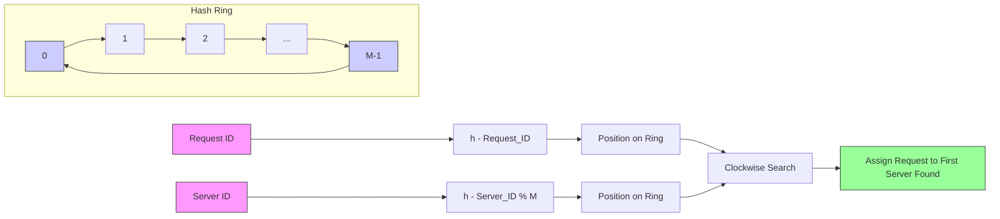

# What Is Consistent Hashing And Where Is It Used？ (1080P30) - Part 1

### Consistent Hashing: A Solution to Dynamic Server Environments

The primary challenge in distributed systems is not merely load balancing, but rather the significant impact of adding or removing servers on the existing data distribution and request routing. Traditional hashing schemes often necessitate a complete remapping of data when server topology changes, leading to high overhead. To address this, we introduce the concept of **Consistent Hashing**.

#### The Hash Ring

Instead of mapping hash function values to a linear array of `0` to `M-1`, consistent hashing utilizes a **hash ring**.

_screenshots/frame_00-01-30.jpg)

*   **Structure:** Imagine a circular range where positions `0` through `M-1` are arranged sequentially around the circumference. `M` represents the total hash space.
*   **Purpose:** This ring serves as a continuous space where both requests and servers can be mapped.

#### Mapping Requests to the Ring

_screenshots/frame_00-02-08.jpg)

1.  **Hashing Request IDs:** Each incoming request is still identified by a `request ID`.
2.  **Hash Function:** A hash function `h()` is applied to the `request ID` (e.g., `h(request_ID)`).
3.  **Placement on Ring:** The resulting hash value `h(request_ID)` maps to a specific point on the hash ring.
4.  **Distribution:** Multiple requests will be mapped to various, seemingly random, points around the ring.

#### Mapping Servers to the Ring

_screenshots/frame_00-02-21.jpg)

1.  **Server IDs:** Each server in the system has a unique `server ID` (e.g., `S0, S1, S2, S3, S4`).
2.  **Hashing Server IDs:** These `server IDs` are also hashed using the *same* hash function (or a different one, though using the same is common for consistency) and then taken modulo `M` to map them onto the ring.
    *   Example: If `h(server_ID_0) % M` results in `19`, then `Server 0` is placed at position `19` on the ring.
3.  **Placement:** All active servers are mapped to distinct points on the hash ring.

#### Request Assignment Algorithm

Once both requests and servers are mapped to the ring, the assignment process is straightforward:

_screenshots/frame_00-00-26.jpg)

1.  **Locate Request:** Identify the position of the incoming request's hash on the ring.
2.  **Clockwise Traversal:** Starting from the request's position, traverse the ring in a **clockwise** direction.
3.  **Nearest Server:** The **first server** encountered during this clockwise traversal is responsible for serving that request.

**Example Scenario:**
If we have servers `S1`, `S2`, `S3`, `S4` mapped to various points on the ring, and multiple requests mapped to other points:
*   A request at point `R1` might find `S2` as its nearest clockwise server.
*   A request at point `R2` might find `S4` as its nearest clockwise server.

This mechanism ensures that each request is deterministically assigned to a server based on its position relative to the servers on the ring.

#### Load Distribution Characteristics

*   **Uniform Hashing:** Assuming a good, uniformly random hash function, both requests and servers are expected to be distributed evenly across the hash ring.
*   **Uniform Distance:** This uniform distribution implies that the "distances" (segments of the ring) between consecutive servers are roughly uniform.
*   **Balanced Load:** Consequently, the number of requests falling into each server's segment (the portion of the ring it is responsible for, from the previous server clockwise up to itself) is also expected to be uniform.
*   **Average Load Factor:** On average, each server is expected to handle approximately `1/N` of the total requests, where `N` is the number of servers. This provides an efficient and relatively balanced load distribution.

---

### Dynamic Server Management with Consistent Hashing

The true power of consistent hashing lies in its ability to handle server additions and removals with minimal disruption, unlike traditional hashing methods.

#### Adding a Server

_screenshots/frame_00-04-18.jpg)

1.  **New Server Mapping:** When a new server (e.g., `S5`) is added, its ID is hashed and mapped to a new point on the hash ring.
2.  **Minimal Re-assignment:** Only requests that were previously assigned to the server immediately clockwise to the new server's position will be affected.
    *   **Example:** If `S5` is added between `S3` and `S4`, only requests that were previously handled by `S4` (specifically, those falling into the segment now preceding `S5` clockwise) will be re-assigned to `S5`. Requests assigned to `S1`, `S2`, and `S3` remain unaffected.
3.  **Reduced Load Shift:** The load on `S4` would decrease as it offloads some requests to `S5`, while the loads on other servers remain unchanged. This significantly reduces the amount of data migration or re-routing required compared to a full rehash.

#### Removing a Server

_screenshots/frame_00-04-31.jpg)

1.  **Server Removal:** If a server (e.g., `S1`) goes offline or crashes, its point is removed from the hash ring.
2.  **Load Redistribution:** The requests previously handled by `S1` are now re-assigned to the *next* server in the clockwise direction.
    *   **Example:** If `S1` is removed, all requests that `S1` was serving will now be served by `S4` (assuming `S4` is the next server clockwise after `S1`).
3.  **Localized Impact:** Similar to adding a server, only a localized portion of the ring is affected, minimizing the overall system disruption.

**Summary of Change Impact:**

| Operation | Affected Servers | Affected Requests |
| :-------- | :--------------- | :---------------- |
| Add Server | One (previous clockwise server) | Requests in the segment now owned by the new server |
| Remove Server | One (next clockwise server) | Requests previously owned by the removed server |

This localized impact is a key advantage, as it avoids the "avalanche effect" seen in simple modulo hashing where most mappings change.

#### Addressing Load Skew with Virtual Nodes

While consistent hashing minimizes re-assignments, it can still suffer from load skew, especially with a small number of physical servers. This occurs when server hash points are not perfectly uniformly distributed, leading to one server owning a disproportionately large segment of the ring.

_screenshots/frame_00-07-34.jpg)

*   **Problem:** If there are only a few servers, the random nature of hashing might place them in a way that some servers are responsible for much larger segments of the ring than others, leading to an uneven distribution of requests.
*   **Example:** If `S1` goes down, and `S4` is the next server clockwise, `S4` might suddenly inherit a large number of requests, causing it to become overloaded.

#### Solution: Virtual Servers (Virtual Nodes)

To mitigate load skew and improve distribution, the concept of **virtual servers** (also known as virtual nodes) is introduced.

_screenshots/frame_00-07-47.jpg)

*   **Concept:** Instead of mapping each physical server to a single point on the hash ring, each physical server is mapped to multiple points. These multiple points are called "virtual nodes" or "virtual servers."
*   **Implementation:** This is achieved by using multiple hash functions or by appending different numerical suffixes to the server ID before hashing (e.g., `h(ServerID_1)`, `h(ServerID_2)`, ..., `h(ServerID_k)`).
*   **Increased Points:** If `k` hash functions are used for each server, and there are `N` physical servers, there will be `N * k` points on the hash ring.
    *   **Example:** With 4 physical servers and `k=3` virtual nodes per server, there will be `4 * 3 = 12` points on the ring.
*   **Improved Uniformity:** By having many more points on the ring, the likelihood of a single physical server owning a disproportionately large segment is drastically reduced. The virtual nodes effectively "break up" large segments, leading to a more granular and uniform distribution of load across physical servers.
*   **Reduced Skew:** This strategy significantly reduces the chance of a skewed load on any single server, even when servers are added or removed.
*   **Optimal `k` Value:** The choice of `k` (the number of virtual nodes per physical server) is crucial. A common approach is to set `k` to a value like `log N` or `log M` (where `N` is the number of servers and `M` is the hash space size) to achieve good load balancing without excessive overhead.

---

#### Impact of Virtual Nodes on Dynamic Server Changes

The use of virtual nodes significantly enhances the resilience and efficiency of consistent hashing when servers are added or removed.

1.  **Server Removal:**
    *   When a physical server is removed, all `k` virtual nodes associated with it are also removed from the hash ring.
    *   The requests previously handled by these `k` virtual nodes are then re-assigned to their respective next clockwise servers on the ring.
    *   **Benefit:** Because a single physical server is represented by multiple points across the ring, its load is distributed among multiple *different* neighboring servers when it's removed. This prevents a single server from becoming a hot spot and ensures that the load increase is distributed more uniformly across the remaining system.
    *   _screenshots/frame_00-08-42.jpg) (Illustrates multiple points for servers, which helps visualize how removing `k` points affects different regions of the ring.)

2.  **Server Addition:**
    *   Similarly, when a new physical server is added, `k` new virtual nodes for this server are mapped onto the hash ring.
    *   These new virtual nodes "steal" requests from their clockwise neighbors.
    *   **Benefit:** The new server gradually takes on load from various parts of the ring, leading to a smoother and more balanced integration into the system. The change in load for any existing server is minimized and distributed.

This approach ensures that regardless of additions or removals, the expected change in load for any individual server is minimal and distributed, leading to a more stable and predictable system.

### Applications of Consistent Hashing

Consistent hashing is a fundamental technique widely adopted in various distributed systems for its flexibility and efficient load balancing properties.

*   **Load Balancing:** It's a core concept for distributing client requests uniformly across a pool of servers.
*   **Web Caches:** Used to distribute cached data among multiple cache servers (e.g., Akamai CDN, Netflix). When a cache server is added or removed, only a small fraction of cached items need to be re-mapped.
*   **Distributed Databases:** Employed to partition data across database shards (e.g., Amazon DynamoDB, Apache Cassandra). This allows for horizontal scaling while minimizing data movement during scaling operations.

### Advantages of Consistent Hashing

Consistent hashing provides critical advantages in dynamic distributed environments:

*   **Flexibility:** Easily accommodates changes in server topology (adding/removing servers) without requiring a complete remapping of data or requests.
*   **Efficiency:** Minimizes the amount of data or request re-assignment during scaling events, leading to better performance and reduced operational overhead.
*   **Reduced Load Skew:** With virtual nodes, it effectively balances the load across servers, preventing individual servers from becoming bottlenecks.

### Importance of Avoiding Server Dependencies

The underlying motivation for consistent hashing and its ability to handle dynamic server changes is to prevent undesirable dependencies and state issues in distributed systems.

*   When client requests depend on specific servers for responses (e.g., if a server holds unique state for a session or data), changes in server availability or mapping can lead to errors or data loss.
*   Consistent hashing aims to ensure that even with server changes, the system remains robust, and requests can still be routed to the appropriate data/service, minimizing the impact of these changes on ongoing operations or data integrity.
*   This is crucial for maintaining high availability and reliability in large-scale systems.

---

