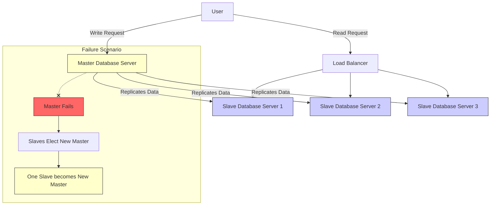

# What Is Database Sharding？ (1080P30) - Part 1

### Querying Large Databases: Scaling Strategies

When dealing with large databases, traditional query optimization methods may become insufficient.

#### Initial Approaches and Their Limitations:

*   **SQL Optimizer:** While useful, relying solely on an SQL optimizer is considered "old school" for very large datasets, as it may not provide adequate performance gains.
*   **Indexing:** Creating indexes can speed up data retrieval. However, for truly massive data volumes, indexing alone is often not a comprehensive enough solution.
*   **NoSQL Databases:** Although NoSQL databases are designed for scale, the current discussion focuses on strategies within a Relational Database Management System (RDBMS) context.

#### Introducing Sharding: A Solution for Large Datasets

_screenshots/frame_00-02-43.jpg)

To effectively manage and query extremely large datasets within an RDBMS, **sharding** is a powerful technique.

**What is Sharding? (Pizza Analogy)**

Imagine you have a large pizza that is too big for one person to eat alone.
_screenshots/frame_00-01-12.jpg)
To manage this, you might:
1.  **Break it into slices:** This represents partitioning your large dataset into smaller, manageable chunks.
2.  **Call friends over:** Each friend represents a different server.
3.  **Distribute slices:** Each friend (server) receives one or more slices, sharing the load of consuming the pizza (processing data requests).

In a database context, this translates to:
*   **Data as Pizza:** The entire dataset.
*   **Slices as Shards:** Smaller, independent portions of the data.
*   **Friends as Database Servers:** Each server is responsible for a specific shard.

_screenshots/frame_00-02-33.jpg)
For example, if you have user IDs ranging from 0 to 799, you could map ranges of user IDs to different "slices" or servers.
*   User IDs 0-99 might go to Server 0.
*   User IDs 100-199 might go to Server 1, and so on.
This distributes the workload, as each server only handles requests for its assigned data chunk.

#### Types of Database Partitioning

The process of breaking data into pieces and allocating it to different servers is known as **partitioning**.

*   **Horizontal Partitioning (Sharding):**
    *   This method partitions data based on the **rows** of a table.
    *   It uses a specific **key** (an attribute of the data, e.g., `user_id`, `customer_id`) to determine which server or partition a particular row belongs to.
    *   Each server holds a subset of the total rows.
    *   **Sharding is a specific form of horizontal partitioning.**

*   **Vertical Partitioning:**
    *   This method partitions data based on the **columns** of a table.
    *   It splits a table into multiple tables, each containing a subset of the original table's columns.
    *   This is typically used when a table has many columns, and different groups of columns are accessed frequently by different operations.
    *   (Note: The lecture briefly mentions vertical partitioning but focuses on horizontal partitioning).

#### Database Servers vs. Application Servers

When discussing sharding, the "servers" involved are specifically **database servers**. It's crucial to distinguish these from other types of servers:

| Feature             | Database Servers                                 | Application/Platform Servers                         |
| :------------------ | :----------------------------------------------- | :--------------------------------------------------- |
| **Primary Role**    | Store, manage, and provide access to raw data.   | Process business logic, handle user requests, orchestrate application flow. |
| **Data Handling**   | Deal with the "meat of the data" directly.       | Typically stateless; interact with data via database servers. |
| **Statefulness**    | Often stateful (maintain data state).            | Designed to be as stateless as possible.             |
| **Key Requirement** | **Consistency** is paramount to ensure data integrity. | Decoupling and scalability are key goals.             |

Database servers, being the custodians of data, must prioritize **consistency** above all else to prevent data corruption or inaccuracies.

---

### Database Consistency and Availability

When designing and operating database systems, especially sharded ones, two critical properties are:

*   **Consistency:** Ensures that any data written to the database is what will be read later. If an update is made, subsequent read requests will immediately reflect that update. This guarantees data integrity.
*   **Availability:** Refers to the database system remaining operational and accessible to users. A highly available system minimizes downtime and ensures the application can run continuously.

In most database systems, **consistency generally takes precedence over availability** when considering data integrity, as inaccurate data can be more detrimental than temporary unavailability.

### Sharding Key Selection

The choice of the **sharding key** (the attribute used to partition data) is crucial for effective sharding.

*   **Example 1: User ID** (as discussed previously)
    *   Suitable for systems where user-specific data is frequently accessed.
*   **Example 2: Location** (e.g., for an application like Tinder)
    *   Sharding by location means all users within a specific geographic area (e.g., City X) reside on the same shard.
    *   This allows queries like "find all users in City X" to be directed to a single database server (e.g., "database server number seven"), leading to:
        *   Smaller shard sizes.
        *   Easier maintenance.
        *   Faster query performance.

### Challenges and Solutions in Sharding

While sharding offers significant benefits for scalability, it introduces new complexities.

_screenshots/frame_00-03-24.jpg)

#### 1. Joins Across Shards

*   **Problem:** When a query requires joining data that resides on different shards, the process becomes very expensive.
    *   The query must be sent to multiple shards.
    *   Each shard pulls its relevant data.
    *   The data then needs to be transferred across the network to be joined, leading to high network latency and processing overhead.
*   **Solution:**
    *   Careful schema design to minimize cross-shard joins.
    *   Denormalization (duplicating data) where appropriate, though this can introduce consistency challenges.
    *   Using specialized distributed query engines.

_screenshots/frame_00-05-16.jpg)

#### 2. Inflexibility of Shard Allocation

*   **Problem:** Traditional sharding often involves a fixed number of shards, similar to a pizza with a set number of slices. This makes it difficult to dynamically scale the database by adding or removing servers.
    *   Cannot easily add more "pizza slices" or reduce them once sharded.
    *   This rigidity hinders dynamic scaling of database servers.
*   **Related Concept: Consistent Hashing**
    *   Consistent hashing is an algorithm that addresses this problem by minimizing key reassignments when nodes (servers) are added or removed from a distributed system.
    *   While not directly implementing consistent hashing for *database sharding*, systems like Memcached use application-level logic based on consistent hashing principles for distributed caching to handle dynamic server changes efficiently.
*   **Solution: Hierarchical Sharding (Dynamic Shard Splitting)**
    *   To overcome inflexibility, a **hierarchical sharding** approach can be used.
    *   If a single shard (a "pizza slice") accumulates too much data, it can be dynamically broken down into smaller "mini-slices" or sub-shards.
    *   A dedicated "manager" for the larger shard would then be responsible for mapping requests to the correct mini-slice within its domain.
    *   This allows for granular scaling and redistribution of data within a shard without affecting the overall sharding scheme.

_screenshots/frame_00-05-38.jpg)

#### 3. Optimizing Complex Queries within Shards

*   **Problem:** After sharding, queries that involve attributes other than the sharding key might still be slow if not properly optimized *within* the shards.
*   **Solution: Secondary Indexing within Shards**
    *   Create indexes on attributes other than the primary sharding key *within each individual shard*.
    *   **Example:** If data is sharded by `City ID`, you can create a secondary index on `Age` within each `City ID` shard.
    *   This enables efficient queries like "find all people in New York who have age greater than 50". The query first routes to the "New York" shard, and then the `Age` index quickly retrieves the relevant users.
    *   This ensures that even complex queries on non-sharding key attributes can be performed quickly once the request reaches the correct shard.

_screenshots/frame_00-06-57.jpg)

---

### Benefits of Sharding

The primary advantage of sharding is a significant improvement in both **read and write performance**. Because data is partitioned, queries for specific data typically fall onto a single shard. This means:

*   **Faster Reads:** Read requests only need to access a smaller, dedicated portion of the database on a single server, reducing the amount of data to scan and network traffic.
*   **Faster Writes:** Write requests also target a single shard, avoiding contention and locking issues that can occur in a monolithic database.

### Handling Shard Failure: Master-Slave Architecture

_screenshots/frame_00-07-09.jpg)

A critical concern in distributed systems like sharded databases is how to handle the failure of an individual shard (e.g., due to power issues or hardware failure). A common solution to ensure data availability and fault tolerance for a single shard is a **Master-Slave architecture**.

#### How Master-Slave Architecture Works:

*   **Master Node:** This is the primary server for a shard, holding the most up-to-date copy of the data.
    *   All **write requests** for that shard are directed to the master.
*   **Slave Nodes:** These are secondary servers that continuously copy data from the master.
    *   They maintain near real-time replicas of the master's data.
    *   **Read requests** for the shard can be distributed across these slave nodes, offloading the master and improving read throughput.
*   **Fault Tolerance:** If the master node fails:
    *   The slave nodes detect the master's failure.
    *   They then elect one of themselves to become the new master.
    *   This mechanism provides a **single point of failure tolerance** for the master, ensuring that the shard remains operational even if the primary server goes down.

### Practical Considerations and Recommendations for Sharding

_screenshots/frame_00-08-12.jpg)

While sharding offers significant scaling benefits, its practical implementation is complex and presents several challenges:

*   **Complexity of Consistency:** Maintaining strong consistency guarantees across multiple distributed shards (each potentially with its own master-slave setup) is notoriously difficult. Ensuring that all parts of the system reflect the latest state of data, especially during updates or failures, requires sophisticated coordination mechanisms.
*   **Operational Overhead:** Managing a sharded database involves more operational complexity in terms of deployment, monitoring, backup, and recovery compared to a monolithic database.
*   **Application-Level Changes:** Sharding often requires changes at the application level to correctly route queries to the appropriate shards and handle cross-shard operations.

**Recommendation for New Systems:**

For systems that are just starting out or do not yet face extreme scaling challenges, it is generally advisable to explore simpler, more established scaling mechanisms before resorting to custom sharding implementations:

1.  **Indexing:** Optimize database queries using appropriate indexes.
2.  **NoSQL Databases:** Consider using NoSQL databases, which are inherently designed for horizontal scaling and often implement sharding-like concepts internally, abstracting away much of the complexity from the developer.

Sharding is a powerful technique for extreme scale, but its complexity means it should typically be adopted only when other, simpler optimizations are no longer sufficient.
</REFINEDNOTES>

---

