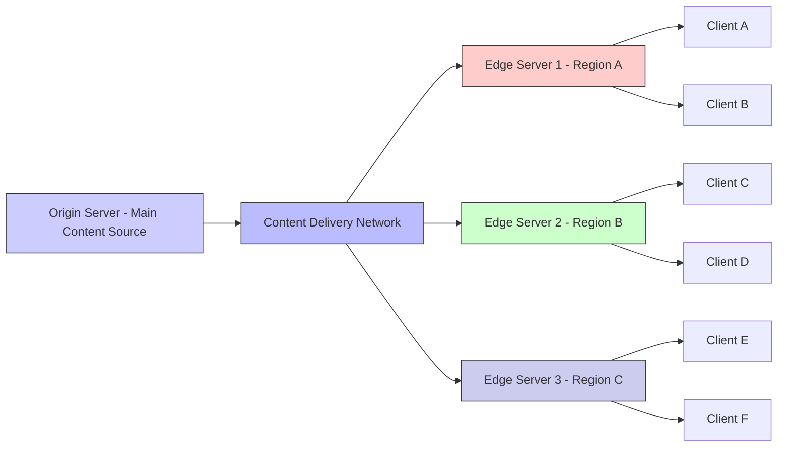

# What Is A Cdn (Content Delivery Network)？ (1080P30) - Part 1

# Content-Deriving Networks (CDNs)

This section introduces the concept of Content-Deriving Networks, more commonly known as Content Delivery Networks (CDNs), which are crucial for making systems cheaper and faster.

## Purpose and Prerequisites

*   **Goal:** To create systems that are cheaper and faster.
*   **Prerequisites:** A foundational understanding of:
    *   **Caching:** Storing frequently accessed data closer to the user for quicker retrieval.
    *   **Distributed Systems:** Systems where components are located on different networked computers, communicating and coordinating their actions.

## Traditional Web System Architecture

When a user wants to access a website (e.g., `www.interviewready.io`), the following steps typically occur:

1.  **DNS Resolution:** The user's device first resolves the domain name (`www.interviewready.io`) with a Domain Name Server (DNS) to obtain an IP address.
    ？-(1080p30)_screenshots/frame_00-00-33.jpg)
2.  **Connection to Server:** The device then attempts to connect to that IP address.
3.  **Content Delivery:** A central server, located at that IP address, serves the requested web pages (e.g., HTML files) from its file system.

？-(1080p30)_screenshots/frame_00-00-45.jpg)

### Basic Server-Client Interaction

### Initial Optimization: Caching

*   Since serving web pages is a common operation, speed is critical.
*   **Caching Principle:** Web pages can be stored in memory or local storage on the server itself, rather than always being read from a potentially slower, distributed file store. This allows for quicker retrieval and response to user requests.

## Challenges with a Centralized Server Architecture

While a single server with caching can improve performance, it faces significant limitations in a global context.

### 1. Geographic Latency

*   **Problem:** The physical distance between users and a single server location leads to high latency.
    *   A server in India might be fast for users in India but very slow for users in the US or Japan due to cross-continental connections.
*   **Impact:**
    *   No single server location can provide optimal speed for all global users.
    *   High latency results in a poor user experience, leading to a loss of user trust.
    *   Studies by companies like Amazon and Google indicate that even a delay of half a second can significantly impact user perception of a website's professionalism and reliability.

### 2. Local Regulations and Content Restrictions

*   **Problem:** Many countries have local regulations dictating where data can be stored and displayed.
    *   **Data Residency:** Laws may require specific content or user data to be stored and processed only within national borders.
    *   **Content Licensing:** Certain content (e.g., movies, TV shows) may only be licensed for distribution in specific regions.
        *   *Example:* A movie available in India might not be allowed to be shown in the US or Japan, and vice-versa.
*   **Requirement:** To comply with these regulations, content needs to be stored and served locally within the relevant country or region.

## Solution: Distributed Caching (Foundations of CDNs)

To overcome the challenges of latency and regulations, a distributed caching approach is employed, forming the basis of Content Delivery Networks.

*   **Concept:** Instead of a single server, large caches (which function very similarly to servers) are distributed globally, placing content closer to the end-users.
    *   Content relevant to Japan is stored in caches near Japan.
    *   Content relevant to India is stored in caches near India.
    *   Content relevant to the USA is stored in caches near the USA.

？-(1080p30)_screenshots/frame_00-01-41.jpg)

### Benefits of Distributed Caching

1.  **Enhanced Speed (Reduced Latency):**
    *   Users connect to a local cache/server in their region.
    *   This significantly reduces the physical distance data needs to travel, leading to much faster page load times and a better user experience.
2.  **Regulatory Compliance:**
    *   Local caches can store and serve region-specific content, ensuring adherence to local data residency laws and content licensing agreements.
    *   Only relevant data is stored in these local caches, rather than the entire content library from a central file store.

**Note:** In this context, these "caches" are sophisticated systems that act like mini-servers, capable of delivering content directly to users.

---

## Content Delivery Network (CDN)

The distributed caching solution described previously is formally known as a Content Delivery Network (CDN).

### CDN Functionality

*   Each "cache" in a CDN acts as a full-fledged server.
*   Users connect to the IP address of a local CDN server (also known as an "edge server" or "Point of Presence - PoP").
*   These edge servers run internal server processes, have their own file systems, and can respond to API hits.
*   The content on these edge servers can be updated or manipulated by the primary (origin) server.

？-(1080p30)_screenshots/frame_00-03-46.jpg)

### CDN Architecture

？-(1080p30)_screenshots/frame_00-04-03.jpg)

### Challenges in Building a CDN

Building and operating a CDN is complex and typically undertaken by large companies due to several factors:

*   **Global Distribution:** Deploying servers globally in a cost-effective and performant manner is challenging.
*   **Cost-Efficiency:** Servers must be inexpensive to allow businesses to offer competitive pricing.
*   **Performance:** Servers must be fast to ensure customer satisfaction.

### Key Offerings of Best CDN Solutions

Leading CDN providers excel in three main areas:

1.  **Proximity to Clients:** They strategically place "boxes" (edge servers) close to potential clients globally to minimize latency.
2.  **Regulatory Compliance:** They effectively handle local regulations, abstracting this complexity away from businesses. This means businesses don't need to build their own rule engines for data residency or content restrictions.
3.  **Content Management:** They offer reasonably easy content propagation and invalidation.
    *   Ideally, the origin server simply places content in storage, and an event is automatically triggered to update the CDN, rather than requiring manual notification.

### Example: Amazon CloudFront

*   **Description:** Amazon CloudFront is a popular CDN solution.
*   **Advantages:** It is known for being cheap, reliable, and easy to use.
*   **Integration:** A significant benefit is its seamless integration with Amazon S3 (Simple Storage Service).
    *   When a new file is added to an S3 bucket, an event automatically triggers its propagation to CloudFront.
    *   This eliminates the need for engineers to manually manage content updates on the CDN.
*   **Industry Standard:** Most cloud providers (e.g., Google Cloud Platform, Microsoft Azure) offer similar CDN services with automated integration capabilities.

### What Data to Send to a CDN?

*   CDNs are primarily designed for **static content**.
*   This includes:
    *   Videos
    *   Images
    *   Documents and other files
    *   Static HTML pages

### Summary of a Content Delivery Network

A CDN can be conceptualized as a "black box" that:

*   Stores static content.
*   Distributes this content geographically, placing it close to all clients.
*   Is typically very cheap and highly efficient for fast data access.

---

