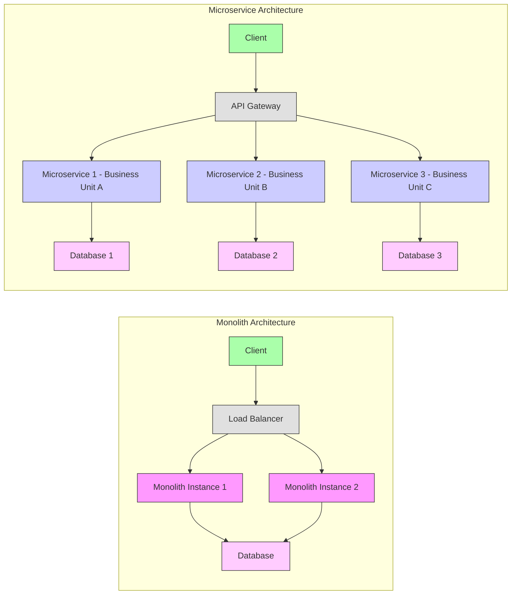

# What Is A Microservice Architecture And What Are Its Advantages？ (720P60) - Part 1

# Monolith vs. Microservices Architecture

This section explores the fundamental differences between Monolith and Microservices architectures, addressing common misconceptions and detailing the advantages and disadvantages of each.

_screenshots/frame_00-00-00.jpg)

## Common Misconceptions

There are prevalent misunderstandings regarding both monoliths and microservices:

1.  **Monoliths are single machines:**
    *   **Misconception:** A monolith is a single, huge system running on just one machine, with all clients connecting to this single machine.
    *   **Correction:** A monolith architecture does not necessarily run on a single machine. It can be deployed across multiple machines, allowing for horizontal scaling (scaling out). Clients can connect to any of these instances, which in turn connect to one or more databases. Therefore, monoliths can be scaled to handle increased load.
    *   _screenshots/frame_00-00-33.jpg) (Initial conceptual diagram often associated with the misconception)
    *   _screenshots/frame_00-02-46.jpg) (Corrected view showing multiple monolith instances for horizontal scaling)

2.  **Microservices are tiny:**
    *   **Misconception:** Microservices are "tiny, tiny dots" where a single function runs on one machine, interacting constantly.
    *   **Correction:** There is nothing inherently "micro" about the physical size or deployment of a microservice. A microservice is fundamentally a **single business unit**.
        *   It encapsulates all data and functions relevant to that specific business domain.
        *   The separation of services is driven by the principle of separating concerns, not by making them as small as possible.
        *   An architecture might have only a few microservices (e.g., three) depending on the system's complexity.
        *   Microservices typically interact with their own dedicated databases.
        *   Clients often connect to a **gateway**, which then communicates internally with the various microservices.

## Clarified Definitions

### Monolith Architecture

A monolithic application is built as a single, unified unit. While it can be deployed on multiple servers for horizontal scaling, all components of the application are packaged and deployed together.

**Key Characteristics:**
*   **Single Codebase:** All functionalities reside within one large codebase.
*   **Shared Resources:** Typically shares a single database or a few databases.
*   **Deployment:** The entire application is deployed as one unit.
*   **Scalability:** Can scale horizontally by running multiple instances of the application behind a load balancer.

### Microservice Architecture

A microservice architecture structures an application as a collection of loosely coupled, independently deployable services. Each service represents a distinct business capability.

_screenshots/frame_00-01-40.jpg)

**Key Characteristics:**
*   **Modular:** Each service focuses on a single business capability.
*   **Independent Deployment:** Services can be developed, deployed, and scaled independently.
*   **Dedicated Data Storage:** Each microservice typically manages its own database, ensuring data encapsulation.
*   **Communication:** Services communicate with each other (e.g., via APIs). Clients often access services through an API Gateway.

### Architectural Overview

## Advantages of Monolith Architecture

Monolithic architectures offer several benefits, particularly in specific contexts:

1.  **Suitable for Small, Cohesive Teams:**
    *   When a team is small and works closely together, the overhead of communication and coordination required to break down a system into microservices might be prohibitive.
    *   A monolith simplifies development and management for such teams.

2.  **Fewer Moving Parts:**
    *   The architecture is simpler, with less complexity in terms of deployment and maintenance.
    *   There's no need to manage multiple independent servers or worry about inter-service communication protocols.
    *   Deployments can be straightforward as the entire system is deployed as a single unit.

3.  **Less Code Duplication:**
    *   Common code, such as setup for tests, database connections, or other system-wide utilities, exists in a single location.
    *   This eliminates the need to duplicate and synchronize such code across multiple services.

4.  **Faster Internal Communication:**
    *   Since all components reside within the same application (and potentially the same process/machine), internal calls are direct function calls.
    *   There are no network calls (e.g., Remote Procedure Calls - RPC) involved, leading to faster execution and lower latency for internal operations.

## Disadvantages of Monolith Architecture

Despite its advantages, the monolithic approach also presents significant drawbacks:

1.  **High Learning Curve for New Team Members:**
    *   The large, unified codebase of a monolith can be overwhelming for new developers.
    *   Understanding the entire system and its interdependencies requires a substantial amount of time and effort.

---

### Disadvantages of Monolith Architecture (Continued)

1.  **High Learning Curve for New Team Members:**
    *   New team members face a significant challenge in understanding the entire system's logic and context. They must grasp the full codebase, which can be vast and complex, before effectively contributing.

2.  **Complex Deployments and Testing:**
    *   Any code change, no matter how small or localized, necessitates a full redeployment of the entire monolithic application.
    *   Frequent deployments require continuous monitoring to ensure proper functioning.
    *   Testing becomes more complicated due to tight coupling; changes in one part of the system can inadvertently affect others, making it difficult to isolate and test specific functionalities.

3.  **Single Point of Failure / Lack of Fault Isolation:**
    *   A critical flaw or crash in any part of the monolith can bring down the entire system, leading to a complete service outage.
    *   For example, if a bug in the "profiles" module causes a server crash, the entire application (including "chat," "analytics," etc.) will fail, requiring a full system restart with corrected code.
    *   This contrasts with microservices, where a failure in one service (e.g., "profiles") would only affect that specific functionality, potentially allowing other parts of the system to continue operating partially.

## Advantages of Microservices Architecture

Microservices offer several compelling benefits, particularly for larger, evolving systems.

1.  **Improved Scalability:**
    *   Microservices allow for independent scaling of individual services. If a particular service (e.g., "chat" or "profiles") experiences high load, only that specific service needs to be scaled out by adding more instances.
    *   This granular control over scaling leads to more efficient resource utilization compared to monoliths, where the entire application must be scaled even if only one component is under stress.
    *   _screenshots/frame_00-05-01.jpg)

2.  **Easier Onboarding for New Developers:**
    *   New team members can be assigned tasks related to a specific service. They only need to understand the context and codebase of that particular service, rather than the entire monolithic system.
    *   This significantly reduces the learning curve and allows new developers to become productive more quickly.
    *   _screenshots/frame_00-05-24.jpg)

3.  **Facilitates Parallel Development:**
    *   Because services are decoupled, different teams or developers can work on separate services concurrently with minimal dependencies.
    *   For instance, chat developers can proceed independently of analytics developers, reducing bottlenecks and accelerating development cycles. This contrasts with monoliths where tight coupling can create dependencies, slowing down parallel work.

4.  **Optimized Resource Allocation and Independent Deployment:**
    *   Each service can be deployed and managed independently. This means that if a specific service is experiencing high usage, resources can be allocated precisely to that service without over-provisioning for the entire application.
    *   Monitoring is more granular, allowing teams to identify and address bottlenecks in specific services.
    *   It's easier to determine which parts of the system are heavily utilized and scale them accordingly, leading to a more streamlined and efficient infrastructure.

## Disadvantages of Microservices Architecture

While powerful, microservices introduce their own set of complexities:

1.  **Design Complexity:**
    *   Designing a microservice architecture effectively is challenging and requires a skilled architect.
    *   Poor design can lead to an excessive number of overly small services, which might not be necessary and can introduce more overhead than benefit.
    *   **Indicator of Poor Design:** If Service 1 (`S1`) is constantly communicating *only* with Service 2 (`S2`), it might indicate that `S1` and `S2` should have been a single service. In such cases, the network call (RPC) between them could have been a simpler, faster in-process function call.
    *   _screenshots/frame_00-06-43.jpg) (Illustrates S1 communicating with S2, highlighting a potential over-fragmentation)

2.  **Operational Overhead:**
    *   Managing multiple independent services, each with its own database, deployment pipeline, and monitoring, can be significantly more complex than managing a single monolith.
    *   Requires robust infrastructure for service discovery, load balancing, API gateways, centralized logging, and distributed tracing.

3.  **Distributed Transactions and Data Consistency:**
    *   Maintaining data consistency across multiple independent databases in a distributed transaction scenario is notoriously difficult. Patterns like the Saga pattern are often employed, but they add complexity.

4.  **Inter-service Communication:**
    *   Network latency and failures become a significant concern. Services must be designed with resilience in mind, using patterns like circuit breakers and retries.

## Conclusion for System Design Interviews

In system design interviews, particularly for large-scale systems, the default choice is often a microservice architecture. However, it is crucial to:

*   **Justify the choice:** Be prepared to articulate *why* microservices are suitable for the given problem, leveraging their advantages (scalability, fault isolation, parallel development, team autonomy).
*   **Acknowledge trade-offs:** Demonstrate an understanding of the complexities and challenges introduced by microservices, and discuss strategies to mitigate them.
*   **Context is Key:** While microservices are often preferred for large systems, a monolith might be more appropriate for smaller projects or teams with limited resources. The decision should always be driven by the specific requirements and constraints of the system being designed.

---

### Conclusion for System Design Interviews (Continued)

When faced with the decision between monolith and microservices in a system design interview:

*   **Default for Large Systems:** For 90% of system design interview scenarios, which typically focus on large-scale systems, a microservice architecture is often the preferred default choice.
*   **Justification is Key:** You must be able to justify your architectural decision by articulating the advantages of microservices (e.g., scalability, fault isolation, independent development, easier onboarding) as discussed previously.
*   **Recognize Nuance:** Be aware that if your justifications for microservices are not strong enough or if the interviewer provides hints, they might be guiding you towards considering a monolith for specific reasons (e.g., smaller scale, early-stage product, small team).

## Real-World Examples

Both architectural styles have proven successful in production systems:

*   **Monolith Success:** Stack Overflow is a well-known example of a highly successful, high-traffic website that primarily utilizes a monolithic architecture. This demonstrates that monoliths can be effective when well-engineered and suitable for the specific context.
*   **Microservice Adoption:** Many large technology companies, such as Google and Facebook, extensively use microservices (or similar distributed architectures) to manage their vast and complex systems, leveraging the benefits of scalability, resilience, and independent team development.

_screenshots/frame_00-07-29.jpg)

The choice between a monolithic and microservice architecture is a critical design decision with significant implications for development, deployment, scalability, and maintenance. Understanding the nuances, advantages, and disadvantages of each is essential for any software engineer.

---

