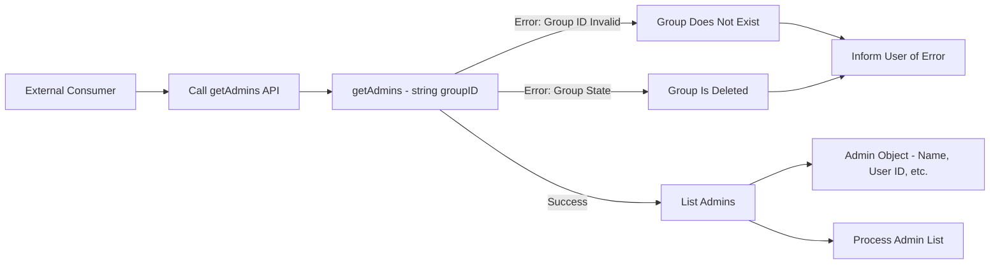

# What Is An Api And How Do You Design It？ 🗒️✅ (1080P25) - Part 1

# API Design

_screenshots/frame_00-00-00.jpg)

This lecture focuses on the principles of designing effective Application Programming Interfaces (APIs). By the end, you should understand what an API is, the characteristics of a good API, and practical methods for designing them, equipping you to be a proficient software engineer in this area.

## What is an API?

An API (Application Programming Interface) serves as a **documented contract** that defines how external consumers can interact with your code. It outlines **what** your code does and **how** others can request or provide information to it, without exposing the internal implementation details of **how** it works.

Consider an analogy: If you write a library to sort integers, an API provides the defined methods through which other developers can use your sorting functionality.

### Example: WhatsApp `getAdmins` API

Let's illustrate with a practical example: finding all administrators within a given WhatsApp group. WhatsApp would expose an API for this purpose.

_screenshots/frame_00-01-11.jpg)
_screenshots/frame_00-03-02.jpg)

The API can be conceptualized as a function with the following characteristics:

*   **Function Name:** `getAdmins`
*   **Parameters:** `string groupID` (a unique identifier for the group)
*   **Possible Errors:**
    *   The specified `groupID` does not exist.
    *   The group has been deleted (depending on the system's logic, this might be considered an error or a valid state).
*   **Response (if successful):** A `List<Admin>` object, where `Admin` is a complex object (e.g., a JSON structure) containing details like the admin's name, user ID, etc.

This structure is fundamentally similar to a standard function definition, specifying its name, parameters, potential error conditions, and the type of data it returns.



## Key Considerations for API Design

When designing an API, a structured approach helps ensure clarity, usability, and maintainability. Here's a checklist of questions to consider:

1.  **Where should this function be exposed? (Placement/Ownership)**
    *   In a microservice architecture, an API should reside within the service that owns the related domain logic. For instance, an API to find group admins would belong to a "Group Service" that manages all group-related operations. This ensures logical grouping and adheres to the principle of separation of concerns.

2.  **What does it do? (Function Naming)**
    *   The name of the API function should clearly and concisely describe its primary action or purpose. For example, `getAdmins` clearly indicates that its role is to retrieve administrators.

3.  **What do I need to pass it? (Parameters)**
    *   Identify the essential inputs required for the API to perform its function. In the `getAdmins` example, the `groupID` is a crucial parameter to specify which group's admins are being requested.

## Common API Design Pitfalls & Best Practices

Designing good APIs requires careful attention to detail, especially regarding naming and parameter scope.

### 1. Precise Naming

*   **Rule:** The API's name must accurately reflect **exactly what it returns or does**.
*   **Pitfall:** Naming an API `getAdmins` but having it return not only admins but also, for example, all groups those admins belong to. This violates the contract implied by the name.
*   **Best Practice:** If an API named `getAdmins` returns more than just administrators, its name should be changed to `getAdminsAndTheirGroups` or split into multiple, more focused APIs. The name should set clear expectations for the consumer.

### 2. Parameter Scope and Functionality

*   **Consideration:** Should an API allow additional parameters beyond the absolute minimum, especially if the caller might have more context or specific needs?
*   **Example:** A caller using `getAdmins(groupID)` might also have a local list of user IDs and wants to check if *their* list of admins matches the server's list.
    *   **Dilemma:** Should `getAdmins` be extended to `getAdmins(groupID, List<User> usersToCheck)`?
    *   **Impact:** If you add `usersToCheck` as a parameter, the API's primary action changes from simply "getting admins" to "checking admins against a provided list." This alters the fundamental purpose.
*   **Best Practice:** The **action** the API performs should define both its **name** and its **parameters**. If adding a parameter fundamentally changes the action, it might be better to create a new, distinct API (e.g., `checkAdminsForGroupAndUserList`) rather than overloading an existing one. This maintains clarity and avoids ambiguity.

---

### 3. Justifying Additional Parameters for Optimization

While generally it's best to keep API parameters minimal and focused, there's a specific scenario where additional parameters might be acceptable: **optimization**.

*   **Scenario:** If an API call (e.g., `getAdmins` on a Group Service) requires internal I/O calls to other services (e.g., for authentication or fetching data from another group), these calls can introduce latency.
*   **Optimization Justification:** Providing the API service with more information upfront (via additional parameters) can allow it to avoid making these internal I/O calls, thereby improving the speed and efficiency of the API.
*   **When it's forgivable:** This is typically acceptable only when the API is under significant load, and performance is a critical concern, leading to bottlenecks due to numerous internal service calls.
*   **Caveat:** Even in such cases, it's strongly recommended to change the API's name to reflect its expanded functionality more accurately. However, sometimes renaming isn't feasible due to existing integrations or established contracts.

### 4. Designing the Response Object

*   **Pitfall:** Overstuffing the response object with excessive information, hoping to future-proof it against potential future requests from callers.
*   **Consequences of Overstuffing:**
    *   **Increased Network Usage:** Sending more data than necessary consumes more bandwidth.
    *   **Confusion:** Callers might be confused about which parts of the response are relevant, and the purpose of the API becomes less clear.
    *   **Poor Extensibility:** Building a large, generic response object for future extensibility is often a bad design choice, as it can lead to a bloated and difficult-to-maintain API.
*   **Best Practice:** The response object should be lean and contain only the information directly related to the API's stated purpose. If more information is needed later, a new API or an updated version of the existing API should be considered.

### 5. Defining Errors

The approach to defining errors in an API can vary significantly and often reflects a designer's philosophy.

*   **Extreme 1: Excessive Error Definitions:** Defining every conceivable error, no matter how trivial or internal.
    *   **Example:** Defining an error "group is not integer" when the `groupID` parameter is explicitly typed as `string`. This type of validation should ideally be handled by the client or the API's input parsing, not as a specific business error.
    *   **Example:** Defining "group ID too long" when a database query fails due to string length. This is often an internal system constraint that the API consumer shouldn't necessarily need explicit error messages for; a generic query failure or bad request error might suffice.
*   **Extreme 2: Generic Error Handling (No Responsibility):** Returning only generic errors (e.g., a simple 404 HTTP status code) for all failures, even for expected scenarios.
    *   **Problem:** This approach provides insufficient information to the caller, making it difficult for them to diagnose and recover from issues.
*   **Balanced Approach:**
    *   **Define Expected Errors:** Clearly define and return specific error messages for **expected business logic failures**.
        *   **Example:** "Group Does Not Exist" (if a `groupID` is valid but refers to a non-existent group).
        *   **Example:** "Group Is Deleted" (if a `groupID` refers to a group that has been removed).
    *   **Delegate Input Validation:** For basic input validation (e.g., data type, basic format), rely on the API's parameter types or standard HTTP error codes (e.g., 400 Bad Request) rather than custom error messages, unless the validation is complex and domain-specific.
    *   **Avoid Over-Responsibility:** Do not define specific errors for internal system failures or edge cases that are typically handled by lower layers (e.g., database query failures due to internal constraints). A generic server error (e.g., 500 Internal Server Error) is often appropriate for these.

## Designing APIs for HTTP Endpoints

When exposing APIs via HTTP, it's crucial to align with standard HTTP request and response patterns.

_screenshots/frame_00-06-03.jpg)

Consider the `getAdmins` example when exposed as an HTTP endpoint:

### HTTP Request Structure

*   **HTTP Method:** Typically `POST` for actions that create or modify resources, or `GET` for retrieving them. For `getAdmins`, `GET` would often be more appropriate if the `groupID` can be passed in the URL, but `POST` can be used if the `groupID` is in the request body, especially for sensitive data or complex queries. The example shows `POST`.
*   **Endpoint URL (Routing - "Where"):**
    *   `www.gkcs.tech`: The base domain/address of the service.
    *   `/chat-messaging`: Often represents a service or module (e.g., a "Chat Messaging" service).
    *   `/getAdmins`: The specific function or resource being accessed. This answers "What does it do?".
    *   `/v1`: **Versioning**. Including a version number (e.g., `v1`) in the URL is a common practice. This allows for evolving the API over time. If significant changes are made to the `getAdmins` function (e.g., different parameters, response structure), a new version (e.g., `v2`) can be introduced without breaking existing clients using `v1`.
*   **Request Body (Parameters - "How"):**
    *   For `POST` requests, parameters are typically sent in the request body, often as JSON.
    *   **Example:**
        ```json
        {
            "groupID": "123"
        }
        ```

This structure defines the complete contract for how an external system would make a request to retrieve group administrators.

---

### HTTP Response Structure

_screenshots/frame_00-07-18.jpg)

The API's response, typically returned to the browser for HTTP requests, should also be clearly defined. For the `getAdmins` example:

*   **Response Body:** An array of JSON objects, where each object represents an `Admin` and contains relevant details like `ID` and `name`.
    *   **Example:**
        ```json
        {
            "admins": [
                {
                    "id": "user123",
                    "name": "Alice"
                },
                {
                    "id": "user456",
                    "name": "Bob"
                }
            ]
        }
        ```

This demonstrates how a traditional programming function's input and output map to the HTTP request and response model.

### GET vs. POST for Data Retrieval

While the previous example used a `POST` request for `getAdmins`, this operation could also be implemented using an `HTTP GET` request.

*   **`GET` Request Alternative:**
    *   The `groupID` could be passed as a query parameter in the URL.
    *   **Example:** `www.gkcs.tech/chat-messaging/getAdmins/v1?groupID=123`
*   **Advantages of `GET` for Retrieval:**
    *   No request payload is required, potentially making the request slightly shorter.
    *   `GET` is semantically correct for retrieving data without side effects.
*   **Consideration:** `GET` requests typically have URL length limitations, which might be a concern for very long or numerous parameters, but generally not for a single `groupID`.

### API Routing and Action Clarity

*   **Avoid Mixing Routing and Action:** Do not embed the primary action directly into the request payload while keeping the URL generic.
    *   **Incorrect Example:** `POST /chat-messaging/v1` with a request body like `{ "action": "getAdmins", "groupID": "123" }`.
    *   **Problem:** This approach makes the API highly ambiguous. The endpoint itself doesn't clearly state what it does, requiring the client to inspect the payload to determine the intended action. This leads to a "dirty API" design.
*   **Best Practice:** The URL path should clearly indicate the resource and the primary action. The `getAdmins` part of `/chat-messaging/getAdmins/v1` explicitly defines the action.

### Redundancy in API Naming with HTTP Methods

*   **HTTP Method Semantics:** HTTP verbs (GET, POST, PUT, DELETE, etc.) already convey specific actions.
*   **Potential Redundancy:** If an API uses the `GET` HTTP method, including "get" in the function name (e.g., `getAdmins`) can be redundant.
*   **Alternative Naming:** Consider simplifying the endpoint name to just the resource, letting the HTTP method define the action.
    *   **Example:** Instead of `GET /chat-messaging/getAdmins/v1?groupID=123`, use `GET /chat-messaging/admins/v1?groupID=123`. The `GET` method implicitly means "retrieve" or "get" the admins.

## Major Issues in API Design: Side Effects

_screenshots/frame_00-10-03.jpg)

A critical principle in good API design is avoiding **side effects**. An API should perform only the action explicitly stated by its name and contract, nothing more.

Let's consider a `setAdmins` API:
`setAdmins (List<Admin> admins, string groupId)`

This API is intended to set a given list of individuals as administrators for a specific group.

### Bad Cases and Unintended Side Effects

1.  **Admins not members of the group:**
    *   **Expected behavior:** The API should likely return an error indicating that some or all specified admins are not members of the group and thus cannot be made admins.
    *   **Side effect:** An API with side effects might implicitly add these individuals as members to the group *before* making them admins. This is an extra, unstated operation.
2.  **Group does not exist:**
    *   **Expected behavior:** The API should return an error stating that the group specified by `groupID` does not exist.
    *   **Side effect:** An API with side effects might implicitly create the group *before* setting the specified individuals as admins. This is also an unstated operation.

In both these "bad cases," the `setAdmins` API is doing **much more** than just setting admins; it's also potentially managing group members or even creating groups. This is a clear indication of an API with side effects.

### Reasons to Avoid Side Effects

There are two primary reasons why APIs should have no side effects:

1.  **"Doing Everything" (Lack of Single Responsibility):**
    *   **Problem:** When an API performs multiple implicit operations (e.g., `setAdmins` also adds members and creates groups), it violates the Single Responsibility Principle. Such APIs become complex, difficult to understand, and hard to maintain.
    *   **Indicators of Side Effects:**
        *   An API name that doesn't fully capture all its actions.
        *   The need for numerous flags or a complex configuration object to control its behavior, suggesting it's trying to do too many things.
    *   **Best Practice:** Break down such an API into multiple, smaller, and more focused APIs, each with a single, clearly defined responsibility. For example, separate `createGroup`, `addMembersToGroup`, and `setGroupAdmins` APIs.

2.  **Atomicity and Consistency:**
    *   **Problem:** When an API has side effects, it often involves multiple distinct operations. If one of these operations fails midway, the entire process might not be atomic. This can leave the system in an inconsistent or partially updated state.
    *   **Example:** If `setAdmins` first creates a group and then attempts to set admins, but the admin-setting step fails, the group is created but has no admins. This partial completion can lead to unexpected behavior or race conditions if other operations interact with the partially created group.
    *   **Importance:** For operations that modify state, atomicity (all or nothing) is crucial to maintain data integrity and system consistency. APIs with side effects often undermine atomicity.

Even if a use case might *seem* to benefit from an API doing "everything," the long-term implications for clarity, maintainability, and data consistency strongly argue against side effects.
</REFINEDNOTES>

---

### Mitigating Side Effects

While avoiding side effects is a core principle, real-world scenarios sometimes require complex workflows.

*   **Improved Naming:** There is absolutely no excuse for poor naming. Even if an API performs multiple actions, its name should reflect these actions as accurately as possible. For instance, `createGroupAndSetAdmins` is better than `setAdmins` if it also creates a group.
*   **Decomposition for Atomicity:** To achieve atomicity and avoid the "doing everything" problem, complex operations should be broken down into a series of smaller, atomic API calls.
    *   **Example:** Instead of a `setAdmins` API that implicitly creates a group, the client should first call a `createGroup` API. If that succeeds, then the client can call `addMembersToGroup` (if necessary) and finally `setAdmins`.
    *   **Workflow:**
        1.  Client attempts `setAdmins(List<Admin> admins, string groupID)`.
        2.  If the group (specified by `groupID`) does not exist, the API returns an error (e.g., a 404 "Group Not Found").
        3.  The client then makes a separate call to `createGroup(string groupID, List<Member> initialMembers)`.
        4.  Upon successful group creation, the client can then retry `setAdmins` or call `addMembersToGroup` and then `setAdmins`.
*   **Benefits of Decomposition:**
    *   **Clarity:** Each API's purpose is explicit.
    *   **Testability:** Individual, atomic APIs are easier to test.
    *   **Predictability:** Callers know exactly what action an API will perform.
    *   **Consistency:** Atomicity is maintained, preventing partial updates and inconsistent states.

_screenshots/frame_00-10-58.jpg)

A simple analogy for side effects: "A side effect is when you ask your brother to clear the trash and he throws the dustbin too." This highlights how an API doing more than expected can be problematic.

## Handling Large API Responses

When an API needs to return a large amount of data (e.g., retrieving 200 members, each with a detailed profile), the response size can become a performance bottleneck. Two primary techniques can mitigate this:

_screenshots/frame_00-12-09.jpg)

### 1. Pagination

*   **Concept:** Pagination delegates the responsibility of managing large result sets to the client. Instead of receiving all data at once, the client requests data in smaller, manageable chunks (pages).
*   **Mechanism:** The client typically provides parameters like `offset` (or `page number`) and `limit` (or `page size`).
    *   **Example:** For 200 members, the client might request `getMembers(groupID, offset=0, limit=10)` for the first 10 members, then `getMembers(groupID, offset=10, limit=10)` for the next 10, and so on.
*   **Benefit:** Reduces network load and memory consumption on both the client and server.

### 2. Fragmentation (Internal to Microservices)

*   **Context:** Fragmentation is more common for internal communication between microservices, where responses might be constrained by internal protocol limits (e.g., a 1KB or 10KB message size limit).
*   **Concept:** If an internal microservice-to-microservice response exceeds a predefined size limit, the sending service breaks the response into multiple fragments.
*   **Mechanism:** Each fragment is sent sequentially, often with a unique identifier or sequence number (e.g., TCP sequence numbers 10, 11, 12...). The receiving service reassembles these fragments to reconstruct the complete response.
*   **Benefit:** Allows large data transfers over protocols or systems with message size limitations, ensuring that the entire response is eventually received and understood by the consuming service.

Both pagination and fragmentation are crucial strategies when dealing with APIs that generate substantial responses, ensuring efficient and reliable data transfer.

## Data Consistency in API Design

_screenshots/frame_00-13-40.jpg)

A critical, often subjective, decision in API design is the level of data consistency required.

*   **Scenario:** Imagine calling `getAdmins` for a group. While the database is being read, a new admin is added. The API might return two admins, even though there are now three.
*   **The Question:** Does the client *always* need a perfectly consistent, up-to-the-millisecond view of the data?
*   **Trade-offs:**
    *   **Perfect Consistency:** Achieved through mechanisms like strong transactional guarantees (e.g., locking during reads).
        *   **Cost:** Significantly increases complexity and **slows down** the API.
        *   **Use Case:** Essential for financial transactions or critical data where even momentary inconsistencies are unacceptable.
    *   **Eventual Consistency (or Weaker Consistency Models):** The system guarantees that data will eventually be consistent, but a read might not immediately reflect the latest writes.
        *   **Benefit:** Faster and more scalable.
        *   **Use Case:** Acceptable for many user-facing applications (e.g., social media feeds, list of group members) where a slight delay in seeing the latest update is not critical. For instance, if a new admin is added to a WhatsApp group, most users won't immediately notice or care if the `getAdmins` call returns the old list for a few milliseconds.

When designing an API, it's vital to explicitly consider the consistency requirements for each operation. Over-specifying consistency (demanding perfect consistency for non-critical reads) can lead to unnecessary performance bottlenecks and architectural complexity.
</REFINEDNOTES>

---

### Consistency and Caching

Another aspect related to consistency is the use of caching.

*   **Scenario:** An API requests data (e.g., `getAdmins`). If the response is served from a cache, the information might be slightly older than the absolute latest data in the database.
*   **The Question:** Is this acceptable? Do users care if comments on a post are a few seconds old, or do they just need the general list of comments?
*   **Trade-off:**
    *   **No Cache / Fresh Data:** Always hitting the database ensures the freshest data but increases database load and potentially slows down responses.
    *   **Caching:** Serving from a cache reduces database load, improves response times, and enhances scalability, but at the cost of potentially serving slightly stale data.
*   **Decision Point:** When designing an API, determine if the application can tolerate eventually consistent data from a cache. For high-traffic APIs or those serving non-critical information, caching is a powerful tool to manage database load and improve user experience.

_screenshots/frame_00-14-23.jpg)

### Service Degradation

In situations of high load or system stress, API design can incorporate strategies for **service degradation** to maintain functionality without completely crashing.

*   **Concept:** Service degradation involves intentionally reducing the quality or completeness of an API's response to preserve core functionality during peak demand or system failures.
*   **Examples:**
    *   **Reduced Response Size:** Instead of returning a full profile with all details (e.g., profile picture, extensive bio), the API might only return essential information like a user's name. This reduces network bandwidth and processing overhead.
    *   **Serving from Cache (Aggressively):** During high database load, an API might prioritize serving *all* requests from a cache, even if the data is slightly older, to prevent the database from crashing.
*   **Goal:** To provide the "essentials" and continue responding to requests, albeit with a degraded level of service, rather than failing entirely. This is a crucial strategy for resilience in distributed systems.

_screenshots/frame_00-14-38.jpg)

## Conclusion of API Design Principles

Designing good APIs involves a careful balance of:

*   **Clarity:** Explicit naming, focused parameters, and clear error messages.
*   **Single Responsibility:** Each API should do one thing and do it well, avoiding side effects.
*   **Atomicity:** Ensuring operations are "all or nothing" to maintain data consistency.
*   **Efficiency:** Optimizing parameters and response sizes, and considering caching.
*   **Consistency:** Deciding on the appropriate level of data consistency based on application needs.
*   **Resilience:** Incorporating strategies like service degradation for robustness under stress.

By adhering to these principles, software engineers can design APIs that are easy to understand, use, maintain, and scale.

---

