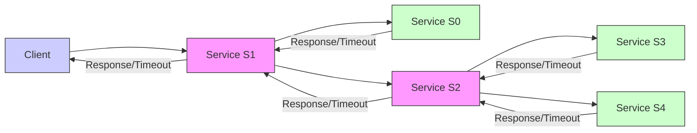
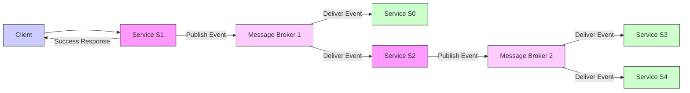

# What Is The Publisher Subscriber Model？ (720P60) - Part 1

# Event-Driven Services

This section introduces event-driven architectures, contrasting them with traditional request-response models in a microservices context.

## Microservice Architecture Overview

We begin with a typical microservice setup:
-   **Services:** S0, S1, S2, S3, S4.
-   **Client Interaction:** A client sends an initial request to S1.
-   **Inter-service Communication:**
    -   After S1 processes the request and makes necessary changes, it needs to send messages to S0 and S2. The order of these two messages does not matter.
    -   Similarly, after S2 completes its processing, it needs to send messages to S3 and S4. The order of these messages also does not matter.

_screenshots/frame_00-00-00.jpg)

## Traditional Request-Response Architecture

In a traditional request-response model, inter-service communication often involves direct synchronous or asynchronous calls.

### Communication Flow

1.  **S1 to S0 & S2:** S1 sends requests to S2 and S0. To improve performance, these requests would typically be sent asynchronously, allowing S1 to send both requests without waiting for the first one to complete before sending the second. S1 would then wait for successful responses from both S0 and S2.
2.  **S2 to S3 & S4:** Similarly, S2 sends requests to S3 and S4, ideally asynchronously, and waits for their responses.
3.  **Response Chain:** Once S2 receives responses from S3 and S4, it sends a response back to S1. S1 then sends a final response back to the client.

### Drawbacks of Request-Response Architecture

This architecture, while common, presents several significant challenges:

1.  **Tight Coupling and Waiting:**
    *   Services become dependent on the availability and responsiveness of other services.
    *   S2 might be waiting for responses from both S3 and S4.
    *   S1, in turn, might wait for responses from S0 and S2, delaying the overall client response.
    *   Even with asynchronous requests, the originating service (e.g., S1) often waits for all downstream responses before considering its task complete or responding to the client.

2.  **Failure Propagation and Latency:**
    *   **Scenario:** If a downstream service, such as S4, fails, S2 will wait for a response.
    *   **Timeout Chain:** After a timeout, S2 will report a failure (timeout) to S1. S1 will then report a timeout to the client.
    *   **Impact:** This process is slow, leading to a long delay before the client receives a failure notification.

3.  **Data Stale and Duplicate Processing:**
    *   **Partial Success:** If S1 successfully processes the initial request and makes changes to its database, but a downstream service (e.g., S2 or S4) fails, the client receives a timeout.
    *   **Client Retry:** The client will likely retry the request.
    *   **Problem:** S1 will process the request *again*, potentially making duplicate changes to its database. S2 might also process the request *again* and make duplicate changes. This leads to:
        *   **Stale Data:** The data processed by S1 in the first attempt might now be considered stale if the system assumes the entire operation failed.
        *   **Inconsistent State:** Multiple changes for the same logical request can lead to an inconsistent system state.

The diagram below illustrates the flow in a traditional request-response microservice architecture:

## Publisher-Subscriber Model (Event-Driven Architecture)

A more robust approach to handle inter-service communication, especially in scenarios where message order doesn't strictly matter and decoupling is desired, is the Publisher-Subscriber model, often implemented with a **Message Broker**.

_screenshots/frame_00-02-16.jpg)

### Core Concept: Message Brokers

Instead of direct requests, services communicate indirectly through a central component called a **Message Broker** (e.g., Kafka, RabbitMQ).

-   **Publishers:** Services that produce and send messages (events) to the message broker.
-   **Subscribers:** Services that consume messages (events) from the message broker.
-   **Message Broker Role:** It acts as an intermediary, receiving messages from publishers and reliably delivering them to interested subscribers. It abstracts away direct dependencies between services.

_screenshots/frame_00-02-27.jpg)

### Communication Flow with Message Brokers

1.  **S1 as Publisher:**
    *   After S1 processes the client request, it publishes a message (an "event") to a message broker.
    *   This message signifies that S1 has completed its part of the operation and signals downstream services (S0 and S2) that they might have work to do.
    *   **Immediate Client Response:** Crucially, S1 can immediately send a success response back to the client after publishing the message to the broker, without waiting for S0 or S2 to process anything.

2.  **Message Broker to S0 & S2:**
    *   The message broker takes responsibility for delivering S1's message to S0 and S2.
    *   **Persistence:** If S0 or S2 are temporarily down, the message broker persists the message until they become available.
    *   **Replay:** Once S0 or S2 come back online, the message broker replays the persisted messages to them, ensuring eventual delivery.

3.  **S2 as Publisher:**
    *   After S2 processes the message it received (originating from S1), it also publishes a new message to another message broker (or the same one, depending on design).
    *   This message signals to S3 and S4 that they might have work to do.

4.  **Message Broker to S3 & S4:**
    *   This second message broker takes responsibility for delivering S2's message to S3 and S4, handling persistence and replay similarly.

_screenshots/frame_00-03-35.jpg)

The diagram below illustrates the flow in an event-driven architecture using message brokers:

### Advantages of the Publisher-Subscriber Model

The event-driven architecture using message brokers offers significant advantages:

1.  **Decoupling:**
    *   **Reduced Dependencies:** Services become highly decoupled. S1 no longer has a direct dependency on S0 or S2; it only depends on the message broker.
    *   **Independent Operation:** S1 can complete its work and respond to the client without needing S0 or S2 to be online or responsive at that exact moment.
    *   **Flexibility:** New subscribers can be added to consume messages from a broker without requiring changes to the publisher.

2.  **Improved Responsiveness:**
    *   S1 can send an immediate success response to the client, greatly reducing perceived latency from the client's perspective, even if downstream processing takes time.

3.  **Resilience and Fault Tolerance:**
    *   **Message Persistence:** Message brokers persist messages. If a subscriber (e.g., S2) is down, the broker holds the message until S2 comes back online.
    *   **Automatic Replay:** Once the subscriber recovers, the message broker automatically replays the messages, ensuring that no events are lost and eventually processed. This prevents the timeout chain seen in request-response models.
    *   **Isolation of Failures:** A failure in S4 will not directly cause S2, S1, or the client to time out. S4 simply stops consuming messages, and the broker will retry or hold messages for it.

4.  **Scalability:**
    *   Publishers and subscribers can scale independently. More instances of a subscriber can be added to handle increased message load without impacting the publisher.

5.  **Asynchronous Communication:**
    *   All communication between services via the broker is inherently asynchronous, which is well-suited for distributed systems and allows for better resource utilization.

---

### Advantages of the Publisher-Subscriber Model (Continued)

Expanding on the benefits of using an event-driven architecture with message brokers:

1.  **Simplified System Understanding and Management:**
    *   Instead of multiple direct dependencies and potential points of failure, the message broker acts as a single, central communication point. This consolidates complexity, making the overall system easier to reason about and manage.
    *   Dealing with a single point of failure (the message broker) is often more straightforward than managing failures across many direct service-to-service connections.

2.  **Simplified Developer Interface:**
    *   From a developer's perspective, S1 (the publisher) only needs to know how to send a generic message to the message broker. It doesn't need to be aware of the specific interfaces or requirements of S0 or S2.
    *   The message broker sends these generic messages, and S0 and S2 consume them, extracting the data relevant to their specific tasks. This reduces the burden on developers to manage complex, point-to-point integration logic.

3.  **Transaction Guarantees (At-Least-Once Delivery):**
    *   Message brokers provide a form of transaction guarantee, typically "at-least-once" delivery.
    *   If S1 successfully publishes a message to the message broker, the broker guarantees that the message will eventually be delivered to all interested subscribers (e.g., S0, S2, S3, S4, S6) at some point in the future.
    *   This is because message brokers are designed for persistence; they do not lose messages. If a subscriber is temporarily unavailable, the broker will store the message and retry delivery once the subscriber is back online.
    *   This ensures that no event is permanently lost, even if processing is delayed.

4.  **Enhanced Scalability:**
    *   The model is highly scalable. If a new service, such as S6, becomes interested in messages produced by S1, it only needs to register as a subscriber with the message broker.
    *   S1 does not need to be modified or even aware of S6's existence. The message broker will automatically start sending S1's messages to S6.
    *   This allows for easy expansion of the system by adding new consumers without impacting existing publishers or consumers.

_screenshots/frame_00-05-18.jpg)

The image above illustrates how a new service S6 can easily subscribe to messages from the broker, demonstrating the scalability advantage.

### Disadvantages of the Publisher-Subscriber Model

While offering many benefits, event-driven architectures also introduce challenges, particularly concerning strong consistency requirements.

Consider a **financial system** scenario to highlight these disadvantages:

#### Scenario: Fund Transfer with Commission

*   **Context:**
    *   S1 acts as a **Gateway** service.
    *   S0 handles **commission deduction** and sends email notifications.
    *   S2 is the **Fund Transfer** service.
*   **Transaction Goal:** Transfer funds from Account A to Account B.
    *   Initial state: Account A = 1000, Account B = 0.
    *   Transfer amount: 950.
    *   Bank commission: 50.
    *   **Expected Final State:** Account A = 0, Account B = 950.

_screenshots/frame_00-06-39.jpg)

The diagram above visually represents the financial transaction details and service roles.

#### Problem with Eventual Consistency

1.  **Client Request:** A client sends a request to S1 (Gateway) to transfer 950 from Account A to Account B.
2.  **S1 Processes:** S1 receives the request and publishes a message to the message broker.
3.  **S0 Consumes:**
    *   S0 consumes the message from the broker.
    *   It deducts the 50 commission from Account A (Account A is now 950).
    *   It sends an email to the client confirming the transaction details and showing Account A's new balance (950).
4.  **S2 Failure/Delay:**
    *   Simultaneously, the message broker attempts to send the message to S2 (Fund Transfer service).
    *   However, S2 is currently down or experiencing a significant delay.
    *   The message broker, adhering to its persistence guarantee, queues the message for S2.
5.  **Inconsistent State:**
    *   From the client's perspective, they have received an email confirming a deduction from their account. They might assume the entire transaction (including transfer to B) is complete or in progress.
    *   However, the actual fund transfer to Account B has *not yet occurred* because S2 is down.
    *   The system is in an **inconsistent state**: Account A has been debited, but Account B has not been credited. The client's view (via email) does not match the actual state of the system until S2 recovers and processes the message.

This example highlights that while eventual consistency (messages *will* eventually be delivered) is a strength for resilience, it can be a significant drawback for systems requiring strong, immediate consistency, such as financial transactions, where all parts of a logical operation must succeed or fail together (atomicity).

---

### Disadvantages of the Publisher-Subscriber Model (Continued)

Continuing the financial system scenario, the problem of eventual consistency can lead to severe issues:

#### Scenario: Fund Transfer - Second Request

1.  **First Request State:** After the first request (transfer 950, commission 50), Account A is 950. Account B is still 0 because S2 (Fund Transfer) was down. The client has an email confirming a 950 balance in A.
2.  **Second Client Request:** The client sends *another* request, this time to transfer 800.
    *   Expected commission: 50.
    *   Total deduction from A: 850.
3.  **S1 Processes Second Request:** S1 (Gateway) receives the second request and publishes another message to the message broker.
4.  **S0 Processes Second Request:**
    *   S0 consumes this new message.
    *   It checks Account A's current balance: 950.
    *   It determines that 850 (800 transfer + 50 commission) can be deducted.
    *   S0 deducts 50 commission from Account A, leaving Account A with 900 (950 - 50).
    *   The client receives an email about this second transaction, showing Account A's balance is now 900.
5.  **S2 Recovers and Processes Messages:**
    *   Eventually, S2 (Fund Transfer) comes back online.
    *   The message broker replays the *first* message (transfer 950) to S2.
    *   S2 attempts to transfer 950 from Account A. **This transaction fails** because Account A now only has 900 (due to the commission from the second request).
    *   The message broker then replays the *second* message (transfer 800) to S2.
    *   S2 attempts to transfer 800 from Account A. **This transaction succeeds** because Account A still has 900.
    *   After this, Account A is 100 (900 - 800), and Account B is 800. The bank has received 100 in commission (50 from each request).

_screenshots/frame_00-07-10.jpg)

The image above helps visualize the state changes and the sequence of events.

#### Consequences of Inconsistency

*   **Unexpected Final State:**
    *   Initial expectation for the first request (transfer 950): Account A = 0, Account B = 950, Bank Commission = 50.
    *   Actual final state after both requests: Account A = 100, Account B = 800, Bank Commission = 100.
    *   The first transfer of 950 failed entirely, but the client was charged commission for it and received an email indicating a deduction.
    *   The second transfer of 800 succeeded, but the initial expected state of Account A (0) was not met.
*   **Customer Confusion:** The client receives emails indicating deductions and transfers, but the final balances do not align with the original transfer requests in a clear, atomic way.
*   **Lack of Atomicity:** This scenario clearly demonstrates the lack of atomicity. Operations that *should* be a single, indivisible unit (transfer 950 + commission 50) are broken up and processed independently, leading to an inconsistent and confusing outcome.
*   **Unsuitability for Mission-Critical Systems:** This architecture is generally unsuitable for mission-critical systems like financial services where strong transactional consistency (all-or-nothing atomicity) is paramount.

_screenshots/frame_00-07-21.jpg)

The image above highlights the calculations and the resulting incorrect final balances.

#### Other Drawbacks: Idempotency Issues

1.  **Problem Description:** The "at-least-once" delivery guarantee of message brokers means a message might be delivered multiple times. If a consumer service (e.g., S2) is not designed to handle duplicate messages, it can lead to incorrect state changes.
    *   **Example:** S2 receives a message to "debit 50 rupees." It processes it, debits the account, but then fails *before* acknowledging the message to the broker.
    *   The message broker, unaware of S2's partial success, replays the message.
    *   S2 receives the *same* message again and debits another 50 rupees, leading to a double debit.
2.  **Solution: Application-Level Idempotency:**
    *   To prevent this, messages should include a unique **request ID**.
    *   Consumer services (like S2) must implement logic to check this request ID. If a message with the same ID has already been processed and its changes committed to the database, the service should ignore subsequent deliveries of that message.
    *   **Developer Responsibility:** This idempotency logic is not handled by the message broker; it must be explicitly implemented by the developers in the application code of each consumer service. This adds complexity to development.

_screenshots/frame_00-09-51.jpg)

The image above illustrates the concept of idempotency and the need for request IDs.

### Conclusion on Event-Driven Services

The publisher-subscriber model, forming the basis of event-driven services, is a powerful architectural pattern for building complex, scalable, and resilient systems.

**Key Takeaways:**

*   **Advantages:** Decoupling, improved responsiveness, resilience (due to persistence and replay), scalability, and simplified developer interfaces.
*   **Disadvantages:** Challenges with strong consistency (eventual consistency) and the need for careful application-level idempotency to handle "at-least-once" delivery.

**Appropriate Use Cases:**

*   **Not suitable for:** Mission-critical systems requiring strong transactional guarantees and immediate consistency (e.g., financial transfers where atomicity is a must).
*   **Highly suitable for:** Systems where eventual consistency is acceptable and high scalability, resilience, and decoupling are priorities. Examples include:
    *   **Gaming Services:** For analytics, activity feeds, in-game events, and notifications.
    *   **Data Processing Pipelines:** Where data events trigger transformations, reporting, or machine learning model updates.
    *   **User Activity Tracking:** Logging user actions for analytics or personalization.
    *   **IoT Data Ingestion:** Handling streams of sensor data.

Understanding these trade-offs is crucial for choosing the right architectural pattern for a given system. The next session will likely delve into strategies for achieving consistency in distributed systems.

---

### Conclusion on Event-Driven Services

The discussion on event-driven services, built upon the publisher-subscriber model, concludes with a summary of its core principles and a prominent real-world example.

*   **Core Principle:** Event-driven services operate by publishing events (messages) to a central message broker, which then delivers these events to interested subscribers. This fundamental pattern allows for highly decoupled and asynchronous communication between services.
*   **Architectural Basis:** The publisher-subscriber model is the foundational concept for designing and implementing event-driven architectures.

#### Real-World Application: Twitter

One of the most well-known organizations that effectively utilizes this architecture is Twitter.

*   **Business Requirement:** The core functionality of Twitter involves a user posting a tweet (an event) and a vast number of other users (subscribers) consuming that tweet.
*   **Suitability:** The publisher-subscriber model is perfectly suited for this business requirement:
    *   When a user publishes a tweet, it's treated as an event.
    *   This event is published to a message broker.
    *   Numerous subscribers (other users' timelines, notification services, analytics services, etc.) consume this event.
    *   The publisher (the user who tweeted) does not need to know or directly interact with every single subscriber. The message broker handles the fan-out and delivery.
    *   This enables immense scalability and resilience, allowing Twitter to handle billions of tweets and deliveries efficiently.

_screenshots/frame_00-10-47.jpg)

The image above visually reiterates the overall event-driven services architecture, which is the basis for such systems.

#### Summary

While event-driven services offer significant advantages in terms of decoupling, scalability, and resilience, it is crucial to be aware of their disadvantages, particularly regarding immediate transactional consistency and the need for careful application-level idempotency. They are ideal for systems where eventual consistency is acceptable and high throughput with distributed processing is required, such as analytics platforms or social media feeds. However, for mission-critical systems demanding strong atomicity and immediate consistency (like financial transactions), alternative or hybrid approaches, which will be discussed in future sessions on consistency, are necessary.

---

