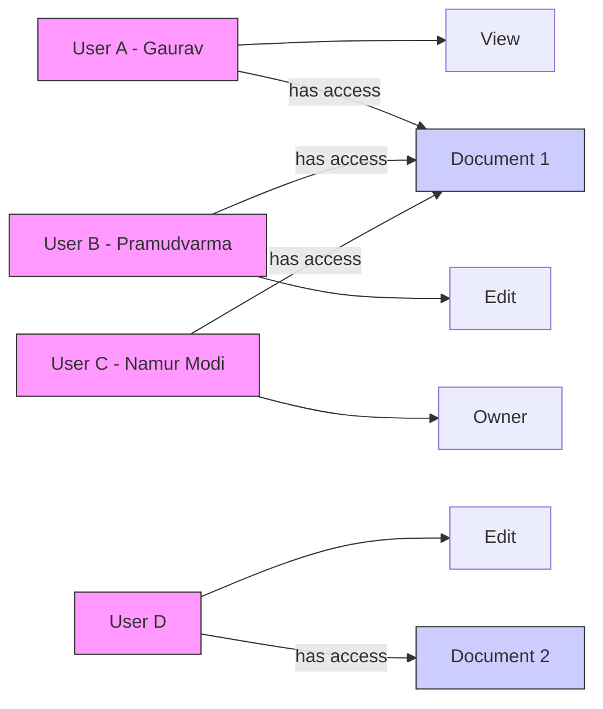
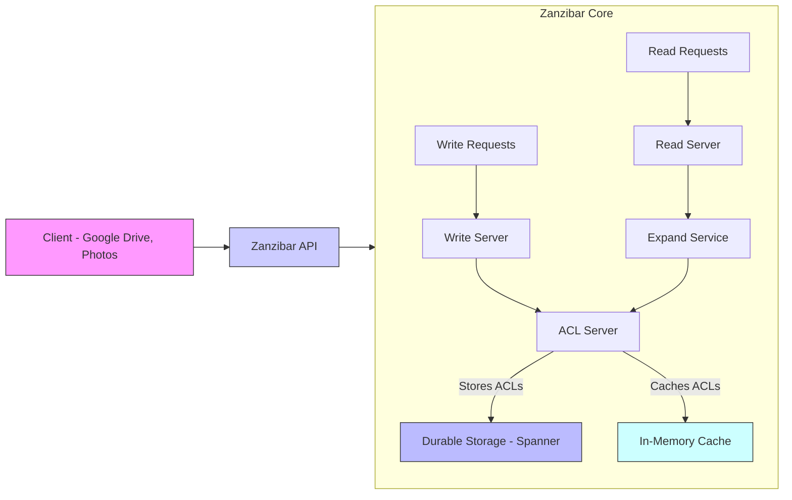

# Zanzibar： Google’S Consistent, Global Authorization System (1080P25) - Part 1

# Google Zanzibar: A Global Authorization System

_screenshots/frame_00-00-00.jpg)

## Introduction

Google Zanzibar is a globally distributed authorization system developed at Google. While it was initially written in 2012, the comprehensive paper detailing its design, optimizations, and challenges was published in 2019.

### Purpose

Zanzibar's primary function is to manage and enforce access control policies across Google's vast ecosystem, enabling secure sharing and access to resources at an unprecedented scale.

### Real-world Application

A common example of Zanzibar's operation is seen when sharing documents in Google Drive or Google Docs. Users can specify different levels of access for others, such as "viewer" or "editor," when sharing via a link.

_screenshots/frame_00-00-45.jpg)

## Permission Hierarchy

Zanzibar employs a hierarchical permission model, where higher-level permissions implicitly include lower-level ones.

_screenshots/frame_00-01-08.jpg)

### Access Levels and Operations

The core permission levels demonstrated are:

*   **Viewer:** Can perform 1 operation (e.g., view the file).
*   **Editor:** Can perform 2 operations (e.g., view and edit the file).
*   **Owner:** Can perform 3 operations (e.g., view, edit, and delete the file). This is the maximum permission level.

The benefit of this stack-like structure is that if a person is granted "owner" access to a document, they automatically inherit "editor" and "viewer" permissions for that document.

_screenshots/frame_00-02-27.jpg)

### Permission Levels Table

| Permission Level | Operations                               | Implied Permissions |
| :--------------- | :--------------------------------------- | :------------------ |
| Owner            | View, Edit, Delete                       | Editor, Viewer      |
| Editor           | View, Edit                               | Viewer              |
| Viewer           | View                                     | -                   |

## Why Zanzibar is a "Big Deal" - The Challenges of Scale

While a simple database table mapping users to documents and their permissions might seem sufficient for authorization, Google's operational scale presents unique and significant challenges that necessitate a sophisticated system like Zanzibar.

### 1. Massive Data Volume

*   **Trillions of Records:** Google needs to store trillions of Access Control List (ACL) records. Each record specifies a user's permission for a particular document or resource (e.g., "Gaurav has view access to Document 1," "Pramudvarma has edit access to Document 1," "Namur Modi has owner access to Document 1").
*   **Terabytes of Data:** This translates into terabytes of data that must be stored and quickly accessible.

### 2. Extreme Query Volume

*   **Millions of Queries Per Second (QPS):** The system must handle millions of authorization queries every second. This scale of query throughput is comparable to systems like Facebook Tau, which also processes millions of graph queries per second.
*   **Graph Hint:** The nature of permissions (e.g., "Person A owns Document 1," "Person B edits Document 2") suggests an underlying graph structure, where entities (users, documents) are nodes and permissions are edges.

### 3. Enormous Number of Distinct Entities

*   **Billions of Users:** Google serves billions of users globally.
*   **Trillions of Documents/Objects:** This includes not only user-created documents but also auto-generated content and objects created by scripts.
*   **Complex Graph:** The combination of billions of nodes (users, objects), trillions of edges (permissions/relationships), and millions of queries per second forms an extremely large and dynamic graph.

### 4. Stringent Performance Requirements

*   **Sub-second Overall Response:** When a user requests a document, the total time to fetch it (including authorization) must be very fast, typically within 500 milliseconds.
*   **Tens of Milliseconds for Authorization:** Given the overall response time constraint, the authorization component must respond within tens of milliseconds to avoid becoming a bottleneck for millions of queries per second.

### 5. High Reliability

*   The authorization system is a critical component for all Google services. Any failure or inconsistency could lead to security breaches or service disruptions, demanding extremely high reliability and availability.

### Conceptual Graph Representation

This diagram illustrates the basic graph concept where users and documents are nodes, and permissions are edges connecting them.

---

### 5. High Reliability (Continued)

*   **Criticality:** Zanzibar is an indispensable system for Google. If it fails, all Google documents become inaccessible, effectively rendering Google services "down."
*   **Availability Target:** Google aims for an extremely high level of availability for Zanzibar: 99.999% (five nines) availability. This translates to approximately 10 minutes of downtime per year.

_screenshots/frame_00-03-48.jpg)
_screenshots/frame_00-04-01.jpg)

### Predominantly Read-Heavy Workload

*   **Query Distribution:** Over 99% of all authorization queries are read queries.
*   **Implication:** Permissions for a document are typically set at creation and remain largely static. While changes do occur, the frequency of permission checks (reads) far outweighs the frequency of permission modifications (writes). This read-heavy pattern significantly influences the system's design, prioritizing fast read operations.

## Representing Authorization Permissions

In a large-scale system like Google, individual user-to-document permissions are insufficient. Permissions often apply to groups of users.

### Group-Based Permissions

*   Instead of individually granting access to each user, documents can be shared with entire groups (e.g., an "engineering team").
*   Example: A "UPI technical document" can be shared with "all people who are part of the engineering team."

### Single-Line Relation Syntax

To efficiently represent these complex, potentially transitive, permissions, Zanzibar uses a concise, single-line textual relation syntax. This syntax defines an edge in the authorization graph.

_screenshots/frame_00-05-33.jpg)

The general format is: `destination#relation@source`

*   **`destination`**: The object or resource being accessed (e.g., `UPI_TechDoc`).
*   **`relation`**: The type of access or relationship (e.g., `edit`, `owner`, `member`).
*   **`source`**: The subject or entity granting/having the permission. This can be an individual user, a group, or even another object (e.g., `EngTeam` for the engineering group).

**Examples:**

1.  `UPI_TechDoc#edit@EngTeam`
    *   **Meaning:** The `UPI_TechDoc` has an `edit` relation with everyone in the `EngTeam`.
    *   Here, `UPI_TechDoc` is the destination, `edit` is the relation, and `EngTeam` is the source.

2.  `org_engineering#member@Gaurav`
    *   **Meaning:** `Gaurav` is a `member` of the `org_engineering` group.
    *   Here, `org_engineering` is the destination (the group), `member` is the relation, and `Gaurav` is the source (the individual).

This flexible syntax allows for defining complex relationships and expanding groups as needed to represent the entire authorization graph at Google.

### Authorization Query Processing

When a person requests access (e.g., "Who can edit this document?" or "Can Gaurav view this document?"):

1.  The system identifies all incoming edges to the requested document.
2.  If an incoming edge directly points from an individual, their permission is retrieved.
3.  If an incoming edge points from a group, that group must be **expanded** (i.e., its members are identified recursively) to determine if the requesting individual is part of that group, either directly or indirectly through nested groups.
4.  This process involves traversing the authorization graph like a tree search, spreading out from the document or group until the requesting user (or their specific permission) is found.

## High-Level Design of Google Zanzibar

_screenshots/frame_00-07-06.jpg)

Zanzibar's architecture is designed to meet its stringent requirements for scale, performance, and reliability.

_screenshots/frame_00-07-32.jpg)

*Note: This diagram provides a simplified overview. Refer to the original material for detailed architectural diagrams.*

### Client Interaction

*   **Clients:** Various Google products like Google Drive, Google Photos, etc., act as clients.
*   **APIs:** Engineers from these client teams use specific APIs (Application Programming Interfaces) to interact with the Zanzibar system.

### Core Zanzibar System

*   **API Types:** Zanzibar exposes two primary API types:
    1.  **Read API:** For querying authorization permissions (e.g., "Can user X access document Y?").
    2.  **Write API:** For modifying authorization permissions (e.g., "Grant user X edit access to document Y.").
*   **Internal Servers:** The system comprises many internal servers responsible for processing these requests.
*   **ACL Storage:** Access Control Lists (ACLs) are stored across these servers.
    *   **Memory vs. Durable Storage:**
        *   Storing petabytes of ACLs entirely in memory is impractical.
        *   **In-memory Cache:** The most recent and frequently accessed ACLs are kept in memory for low-latency access. This acts as a distributed cache.
        *   **Durable Storage:** The complete set of ACLs resides in a durable storage system (likely Google Spanner, given Google's infrastructure).
    *   **Consistent Hashing:** Zanzibar utilizes consistent hashing to distribute and locate ACLs across its many servers and manage the in-memory cache effectively.

---

### Zanzibar APIs

Zanzibar exposes a set of APIs for clients to interact with the authorization system. These APIs handle both read and write operations.

#### Read API

_screenshots/frame_00-08-12.jpg)

The `read` API is highly flexible, allowing clients to query authorization relationships based on various parameters. Its signature is `read (source*, relation*, destination*, timestamp)`.

*   The asterisk `*` indicates that `source`, `relation`, and `destination` are optional parameters, providing versatility in query patterns.

**Read API Query Patterns:**

1.  **Specific Relation Check:**
    *   **Parameters:** `source`, `relation`, `destination`, `timestamp`
    *   **Function:** Checks for the existence of a specific relationship.
    *   **Example:** "Does User A have `edit` access to Document D?"
    *   **Output:** `true` or `false`.

2.  **All Relations between Two Entities:**
    *   **Parameters:** `source`, `destination`, `timestamp` (omitting `relation`)
    *   **Function:** Retrieves all relations that exist between the specified source and destination.
    *   **Example:** "Get all relations between User A and Document D."
    *   **Process:** Zanzibar will traverse the graph, expanding groups if necessary, to find all direct and indirect relationships.
    *   **Output:** A list of all relation tuples (e.g., (User A, viewer, Doc D), (User A, editor, Doc D via Group X)).

3.  **All Relations for a Source:**
    *   **Parameters:** `source`, `timestamp` (omitting `relation` and `destination`)
    *   **Function:** Finds all relations originating from a given source object.
    *   **Example:** "Who has access to Document D?" (If `source` is a document, this query would typically be structured as `destination` being the document and `source` being omitted, to find all subjects that have relations to it. The lecture's example here is slightly ambiguous, but implies finding all incoming relations to a document or all outgoing relations from a user/group to various documents).
    *   **Example (clarified):** If `source` is a user, "List all documents User A has access to."

4.  **All Relations for a Destination:**
    *   **Parameters:** `destination`, `timestamp` (omitting `source` and `relation`)
    *   **Function:** Finds all relations pointing to a given destination object.
    *   **Example:** "List all documents that a specific user or group has access to." (Again, this example from the transcript seems to reverse source/destination based on common usage, but the intent is clear: find all related entities based on one known entity).

These flexible `read` API patterns cover most common authorization lookup needs.

#### Write API

The `write` API is straightforward:
*   **Parameters:** `source`, `relation`, `destination`
*   **Function:** Creates a new authorization relationship.
*   **Example:** Adding `edit` access for User A to Document D is a single API call.

#### Data Consistency with Timestamps

Both `read` and `write` APIs incorporate a `timestamp` parameter, which is crucial for Zanzibar's data consistency model.

*   **Causal Consistency Guarantee:** Zanzibar guarantees causal consistency using these timestamps.
    *   If a `write` operation occurs at `timestamp_W` (e.g., 100) and a subsequent `read` operation is made with a `timestamp_R` *greater than* `timestamp_W` (e.g., >100), then the effects of `write` operation are guaranteed to be reflected in the `read`.
    *   If a `read` operation is made with a `timestamp_R` *less than* `timestamp_W` (e.g., <100), there is *no guarantee* that the `write` operation will be reflected. This allows for eventual consistency in cases where strict real-time reflection is not required or performance is prioritized.
*   **Timestamp Source:** This `timestamp` is a globally ordered timestamp provided by Google Spanner, enabling precise ordering of operations across a distributed system.
*   **Client Management:** The management of these timestamps is largely handled by the client applications, allowing them to specify their desired consistency guarantees.

_screenshots/frame_00-08-31.jpg)

### Data Store: Google Spanner

_screenshots/frame_00-08-58.jpg)
_screenshots/frame_00-10-48.jpg)

The core data store for Zanzibar is Google Spanner.

*   **Spanner's Role:** Spanner is a globally distributed, highly consistent, and highly available relational database system developed by Google. Its properties are fundamental to Zanzibar's own consistency and availability guarantees.
*   **Persisted Data:** Zanzibar persists several types of data in Spanner:
    1.  **Relation Tuples (ACLs):** The core authorization data, representing the `source#relation@destination` relationships. These are organized into different logical "databases" or namespaces within Spanner, such as `doc`, `org`, and `folder` (for documents, organizations, and folders, respectively).
    2.  **Namespace Configurations:** For each application or "namespace" (e.g., Google Docs, Google Photos), Zanzibar stores specific configurations and rules in Spanner.
        *   **Example:** A configuration rule like "one document can have at most 5,000 editors" would be stored here.
        *   Spanner is well-suited for storing these kinds of application-specific rules and metadata due to its strong consistency and reliability.
    3.  **Change Log:** Spanner is also used to store a `Change Log`, which records all modifications to the authorization data. This log is crucial for replication, auditing, and maintaining consistency across the distributed system.

---

### Data Store: Google Spanner (Continued)

*   **Change Log for Recovery:** The `Change Log` in Spanner stores all state changes and write operations. In case of a database crash, a new instance can be hydrated (repopulated) with data by applying the changes from the log, ensuring system resilience and recovery.

### Zanzibar as an In-Memory Cache

While backed by Spanner for durability, Zanzibar operates internally much like a sharded in-memory cache to achieve its low-latency requirements.

#### Sharding Strategy

*   **Shard Key Importance:** A good shard key is crucial for efficient data access, especially given the read-heavy nature of authorization queries (reads are ~100x more frequent than writes).
*   **Initial Thought Process for Shard Key:**
    *   Consider `object` and `relation` as primary components, as `user` (source) is optional in many queries and `timestamp` is for consistency, not routing.
    *   Initially, one might combine `object ID` and `relation` to hash and route requests to specific ACL servers.
    *   **Challenge:** If `relation` is part of the shard key, different relations for the same object (e.g., `viewer`, `editor`, `owner` for `Doc1`) might end up on different shards. This would necessitate multiple shard lookups to retrieve all relations for a single object, which is inefficient for common queries like "get me all relations for an object."

*   **Optimized Shard Key: Object ID**
    *   **Rationale:** The most common access pattern is to retrieve all relations associated with a specific object (e.g., "who has view access on this document?").
    *   By making the `object ID` the sole shard key, all relations pertaining to that object (regardless of the specific relation type like `viewer`, `editor`, `owner`) are co-located on the same shard.
    *   **Benefit:** This allows for a single shard lookup to fetch all relevant relations for an object, significantly optimizing read performance. Once on the correct shard, the system can then filter for specific relation types (e.g., `viewer`).

#### Query Flow with Object ID Sharding

1.  A query like "Get all people who have view access on `Doc1`" arrives.
2.  The `Doc1` ID is used as the shard key to locate the correct shard.
3.  The shard is queried for all relations associated with `Doc1`.
4.  The results are then filtered to include only `viewer` relations.

This optimized sharding strategy addresses the core read performance requirements of Zanzibar.

### Background Services and Data Pipelines

_screenshots/frame_00-11-16.jpg)
_screenshots/frame_00-11-38.jpg)
_screenshots/frame_00-12-00.jpg)
_screenshots/frame_00-14-26.jpg)

Beyond serving real-time read/write requests, Zanzibar leverages its `Change Log` and Spanner for several critical background operations.

#### 1. Watch Service

*   **Purpose:** The `Watch Service` allows clients to subscribe to and receive real-time (eventually consistent) notifications about changes to authorization data.
*   **Mechanism:** It pulls event streams from the `Change Log` in Spanner.
*   **Client Subscriptions:** Clients can subscribe to events for specific `object ID`s. Any relevant changes for that object will be pushed to the subscribed watchers.
*   **Use Cases:**
    *   **Group Membership:** Automatically adding users to a document's access list when they join a relevant group.
    *   **Notifications:** Sending fire alarm notifications to all users in the "Mumbai" group if a `fire_alarm#notification@Mumbai` relation changes.
*   **Consistency:** The watch service operates outside the critical path (hot path) of authorization checks. It provides *eventual consistency*, meaning updates might not be instantaneous but will eventually be reflected. This is acceptable for many notification and synchronization tasks.

#### 2. Snapshotting and Batch Jobs

*   **Purpose:** To prevent the need for replaying the entire `Change Log` from the system's inception (e.g., 2012) during recovery or for analytical purposes, Zanzibar employs background jobs to create periodic snapshots of the authorization data.
*   **Mechanism:** Data from Spanner (including the `Change Log`) is piped to background batch jobs. These jobs process the data and generate snapshots.
*   **Benefits:**
    *   **Faster Recovery:** If a database needs to be rebuilt, it can start from a recent snapshot (e.g., from September 2024) and only apply changes from the `Change Log` that occurred *after* that snapshot. This significantly reduces recovery time.
    *   **Analytical Use:** Snapshots can be used for offline analysis, auditing, or migration without impacting the live system.

This comprehensive architecture, combining a highly performant in-memory cache with a robust, consistent, and durable backend (Spanner) and asynchronous background services, enables Zanzibar to meet Google's extreme authorization demands.

---

#### 3. Indexing with Leopard

_screenshots/frame_00-15-00.jpg)
_screenshots/frame_00-15-48.jpg)

*   **Problem:** Some authorization queries involve complex set operations (e.g., "share this document with everyone in Group A, *except* those in Group B"). While these operations can be performed in memory, they are computationally intensive and can exceed the strict 10-millisecond latency requirement for authorization checks.
*   **Solution: Leopard (Indexing Service):** Zanzibar employs a system called Leopard to pre-compute and cache the results of these complex authorization queries.
    *   **Mechanism:** Leopard uses the snapshots generated by background batch jobs to pre-compute frequently accessed user sets and group expansions.
    *   **Real-time Updates:** Leopard also partly uses the `Watch Service` to receive real-time updates from the `Change Log`, ensuring its pre-computed indices are relatively fresh.
    *   **Operation:** Leopard runs as a background job (like a cron job for periodic computations) and also leverages real-time updates for freshness.
    *   **Integration with Zanzibar:** Leopard sends these pre-computed results (indexed user sets) back to Zanzibar, likely to be stored in its in-memory cache or a specialized index store, so that complex queries can be answered quickly.

### Overall Request Flow and Latency Optimization

The entire Zanzibar system functions as a multi-level caching hierarchy designed to minimize latency for the vast majority of requests.

1.  **Level 1: Local Cache/Client-Side Caching (Implied)**: Not explicitly mentioned in this section, but typically, clients might cache recent authorization decisions.
2.  **Level 2: Zanzibar In-Memory Cache (ACL Servers)**
    *   **Coverage:** Serves a significant portion of read requests.
    *   **Latency:** Aims for single-digit millisecond responses.
3.  **Level 3: Leopard (Pre-computed Indexes)**
    *   **Coverage:** Handles complex queries by providing pre-computed user sets.
    *   **Latency:** Reduces the computational overhead for complex queries, allowing them to meet latency targets.
4.  **Level 4: Spanner (Durable Storage)**
    *   **Coverage:** The ultimate source of truth for all ACLs and configurations.
    *   **Latency:** Higher latency than in-memory caches, but provides strong consistency and durability. It serves as the fallback for cache misses and the primary storage for writes.

This multi-tiered approach ensures that:
*   Approximately **99%** of requests are served quickly from the in-memory cache or pre-computed indices.
*   Only a small fraction (e.g., **1%**) of requests, requiring deeper lookups or involving less frequently accessed data, hit the durable storage layer.
*   This architecture is critical for achieving the sub-10ms authorization response times required at Google's scale.

### Further Optimizations

The speaker mentions additional optimizations not covered in detail in this lecture but available in linked resources (blogs):

*   **Request Collapsing:** A technique to reduce redundant requests.
*   **Request Hedging:** Sending duplicate requests to multiple servers to mitigate latency spikes and improve reliability.

These further optimizations contribute to Zanzibar's overall performance and resilience.

---

